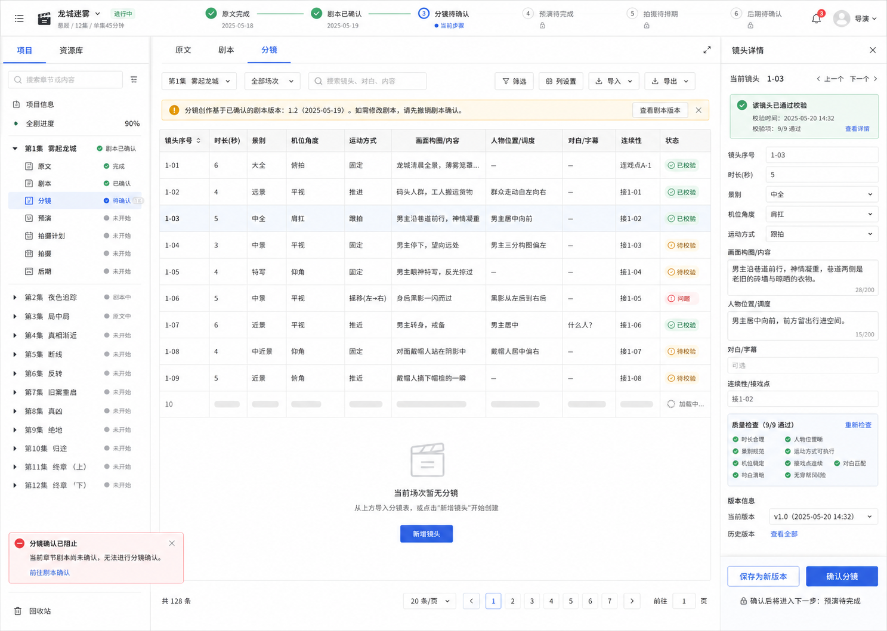

# Selected Direction

## Direction

**Storyboard Command Table**

This direction prioritizes Canonical Storyboard editing and confirmation. It treats M1 as a production workbench rather than a document viewer or marketing dashboard.

## Why This Direction

- It fits the most structured M1 surface: the storyboard editor.
- It keeps gate state visible while the user edits.
- It supports dense Canonical Storyboard fields without hiding them behind modals.
- It gives the right inspector enough room for shot details, QC, revision metadata, and `确认分镜`.

## Reference



## Prototype

Open:

```text
docs/product-design/m1/assets/prototype.html
```

The prototype is static and frontend-only. It uses local mock data, inline CSS, and plain JavaScript. It does not call backend APIs or modify production frontend code.

## Deferred

The following are intentionally not designed beyond locked navigation labels:

- production profiles;
- assets;
- Shot Prompt;
- Agnes generation;
- video results;
- rerun workflows;
- LibTV;
- post-production.
