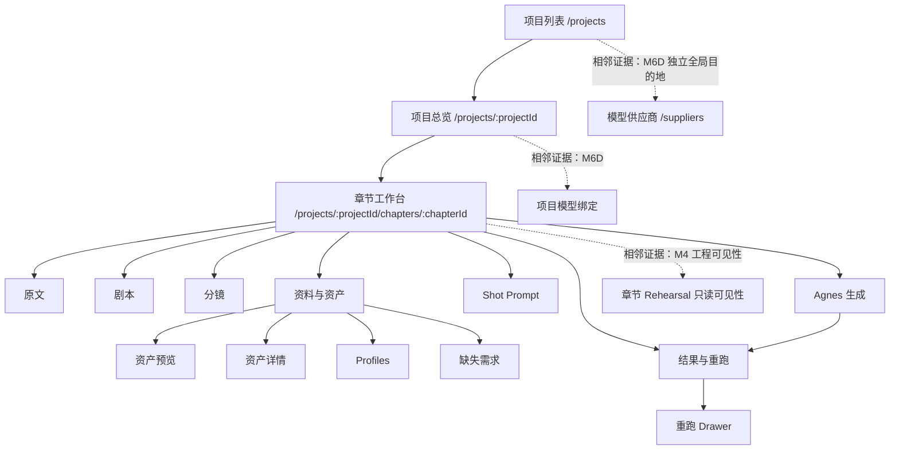

# 当前信息架构

## 1. 信息架构结论

M1–M3 形成的核心不是多个独立工具，而是一条固定在“项目 → 章节工作台”中的制作链。M2、M3 都明确声明不增加新的全局导航或替换产品 Shell；新增能力通过章节 Tab、局部 Subnav、右侧 Inspector 和 Drawer 延展。

## 2. 已设计的核心路由

| 路由 | 来源阶段 | 设计用途 | 基线状态 |
| --- | --- | --- | --- |
| `/projects` | M1 | 项目列表，选择或概念上创建项目 | 已设计、静态原型有列表态 |
| `/projects/:projectId` | M1 | 项目总览/项目看板与章节入口 | 已设计、静态原型有看板态 |
| `/projects/:projectId/chapters/:chapterId` | M1–M3 | 完成章节内原文到结果与重跑的主工作区 | 三阶段持续扩展 |
| `/projects/:projectId/chapters/:chapterId?tab=assets&view=asset-list` | M2 | 资产预览 | 已设计 |
| `/projects/:projectId/chapters/:chapterId/assets/:assetId` | M2 | 嵌套在章节 Shell 内的资产详情 | 已设计并 QA |
| `/projects/:projectId/chapters/:chapterId?tab=assets&view=profiles` | M2 | Profiles | 已设计 |
| `/projects/:projectId/chapters/:chapterId?tab=assets&view=requirements` | M2 | 缺失需求 | 已设计 |
| `/projects/:projectId/chapters/:chapterId?tab=shot-prompt` | M2 | Shot Prompt Studio | 已设计 |
| `/settings/agnes` | M3 | Agnes 设置入口 | 仅列为现有路由，M3 产品设计未展开该页内部视觉 |

较新的生产仓库还存在 `/suppliers`、`/suppliers/:supplierId` 和 `/projects/:projectId/model-bindings`。这些属于相邻扩展 M6D Supplier Operations Workbench，不应反向改写 M1–M3 的章节生产信息架构。M6D 是独立的全局供应商、模型与项目绑定管理工作台，不属于章节主流程，也不等同于多 Provider 生成执行体验。

## 3. 页面层级

### 项目层

1. **项目列表**：项目名称、描述、章节数、更新时间、整体进度和下一步。
2. **项目总览/项目看板**：项目元数据、制作简述、章节表、章节状态、阻断原因和下一步。
3. **章节列表**：在项目看板和左侧 Rail 中呈现；不是单独锁定的全局 Dashboard。

### 章节层

章节 Tabs 的最终 M3 基线顺序为：

```text
原文
剧本
分镜
资料与资产
Shot Prompt
Agnes 生成
结果与重跑
```

### M2 局部层级

`资料与资产`：

```text
资产预览
资产详情
Profiles
缺失需求
生成记录
```

`Shot Prompt`：

```text
视觉引用
Prompt 编辑
Revision 历史
Agnes 参数预览
```

### M3 局部层级

`Agnes 生成` 负责提交和监控，`结果与重跑` 负责结果审查、采用、失败说明和新建重跑。两者共享同一章节上下文，不拆成全局任务中心或视频编辑器。

## 4. 章节工作台 Shell

| 区域 | 是否存在 | 主要职责 | 证据阶段 |
| --- | --- | --- | --- |
| 顶部应用栏 | 是 | 品牌、当前项目、少量全局入口 | M1 起，M2/M3 继承 |
| 项目/章节 Rail | 是 | 项目上下文、章节切换、章节状态 | M1 起，M2/M3 继承 |
| Workflow Rail | 是 | 展示生产 Gate、当前步骤和阻断 | M1 起，M2/M3 扩展步骤 |
| Chapter Tabs | 是 | 承载章节生产阶段 | M1 三 Tab，M2/M3 逐步解锁 |
| 主工作区 | 是 | 编辑器、密集表格、资产大图或结果预览 | 全阶段 |
| 右侧 Inspector | 是 | 当前选择的详情、QC、状态和决策动作 | M1 起，M2/M3 复用 |
| 底部操作区 | 部分 | M1 方向图含分页/确认动作，M3 Drawer 有 footer | 分散存在，未形成所有页面统一固定 Footer |
| Drawer | 是 | M3 显式重跑；桌面模态、窄屏堆叠 Region | M3，已 QA |
| Notice 区域 | 是 | Gate、轮询、RPM、恢复、错误和成功 | M1 起，M3 最完整 |

## 5. M1 → M2 → M3 演进

| 阶段 | 继承 | 新增/解锁 | 明确排除 |
| --- | --- | --- | --- |
| M1 | 无 | 项目列表、项目看板、原文、剧本、分镜、确认 Gate | 资产、Shot Prompt、生成、结果、重跑、LibTV、后期 |
| M2 | M1 Shell、Rail、Tab、表格、Inspector、状态语言 | Profiles、视觉资产、资产详情、缺失需求、Shot Prompt | Agnes 视频、结果/重跑、LibTV、后期、专业图片编辑 |
| M3 | M1/M2 Shell、表格、Inspector、资产选择、Prompt 语言 | Agnes 生成、持久任务状态、结果版本、当前采用、显式重跑、恢复 Notice | LibTV、配音、字幕、BGM、时间线、剪辑、导出、协作 |

M2 的 `Agnes 生成` 与 `结果与重跑` 只显示锁定标签；M3 在已有 current Shot Prompt revision 和 GenerationJob 条件下解锁。M3 没有解锁后期和发布。

## 6. 当前页面结构图



图中的实线部分是 M1–M3 核心 UI 基线。虚线部分仅表示相邻继承与扩展证据：M4 rehearsal 可见性不是连续性审核，M6D 供应商管理也不是章节内 Provider 生成中心。

## 7. 当前未形成的信息架构

- 登录、注册、账户中心。
- 新建项目向导；M1 只有“选择或创建”的信息架构和空态，没有完整表单流程。
- 全局 Dashboard 和跨项目任务中心。
- 项目级跨章节资产库、世界观/风格总控和服装状态时间线。
- Provider 对比型生成中心；M6D 只覆盖供应商/模型配置和项目绑定。
- 连续性审核工作台、后期时间线和发布中心。

## 8. 主要证据

- [M1 信息架构](../m1/information-architecture.md)
- [M2 信息架构](../m2/information-architecture.md)
- [M3 信息架构](../m3/information-architecture.md)
- [M2 实现交接](../m2/implementation-handoff.md)
- [M3 实现交接](../m3/implementation-handoff.md)
- [M6D 视觉设计补充](../../superpowers/specs/2026-07-12-m6d-management-ui-visual-design.md)
