# 交互与状态基线

## 1. 状态词汇总览

### 1.1 M1 章节流程状态

| 状态 | 含义/页面 | 解锁或进入条件 | 用户操作 | 典型下一状态 | Gate |
| --- | --- | --- | --- | --- | --- |
| `source_empty` | 项目看板/原文：无原文 | 新章节未保存正文 | 粘贴/编辑并保存 | `source_ready` | 阻断剧本生成 |
| `source_ready` | 原文已保存 | 有可用原文 revision | 生成/进入剧本 | `script_draft` | 解锁剧本工作 |
| `script_draft` | 剧本草稿 | 已生成或编辑未确认 | 编辑、保存 revision、校验、确认/拒绝 | `script_approved` 或保持 draft | 阻断分镜生成/确认 |
| `script_approved` | 剧本已确认 | 校验通过并确认 | 生成分镜 | `storyboard_draft` | 解锁分镜 |
| `storyboard_draft` | 分镜草稿 | 已生成但未确认 | 选行、编辑 Inspector、保存、校验、确认/拒绝 | `storyboard_approved` | 阻断 M2/M3 |
| `storyboard_approved` | 分镜已确认 | Canonical 字段校验并确认 | 进入资料与资产 | M2 状态 | 解锁后续生产 |
| `blocked` | 项目/章节/具体操作 | 上游 Gate 未满足或校验失败 | 回到阻断源修复 | 取决于上游状态 | 是 |
| `error` | 任意加载/操作面 | 加载或请求失败 | 重试，不默认破坏性重置 | 原状态或成功态 | 可能 |

M1 还定义跨页面表现状态 `loading`、`empty`、`error`、`blocked`、`success`。Success 更新 Workflow Rail、章节状态、Tab 状态 Chip 和 Inspector，不需要成功 Modal。

### 1.2 M2 Profile 与资产状态

| 状态 | 含义/页面 | 用户操作 | 典型下一状态 | Gate |
| --- | --- | --- | --- | --- |
| `empty` | Profiles/资产无数据 | 创建 Profile、上传或生成图片 | `normal`/`generating` | 资产缺失阻断 Prompt ready |
| `loading` | Profile 表、资产网格、Inspector | 等待/重试 | `normal`/`error` | 不隐藏 Shell/Gate |
| `normal` | 可浏览/编辑 Profile 或资产 | 选中、编辑、保存、打开详情 | `editing`/审查态 | 视资产状态 |
| `editing` | Profile 有未保存修改 | 保存或确认丢弃 | `saved`/`normal` | 阻止静默切换对象 |
| `validation_error` | Profile 字段/绑定不合法 | 修正字段 | `editing`/`saved` | 是 |
| `saved` | Profile 保存成功 | 继续工作 | `normal` | 否 |
| `delete_confirmation` | 删除 Profile Inspector | 取消/确认删除 | `normal` | 删除后需求回到 missing |
| `generating` | 图片任务未完成 | 查看参数/等待 | `usable` 或 `generation_failed` | 禁用可用/拒绝/采用 |
| `generation_failed` | 图片生成失败 | 保留参数并重试 | `generating` | 是 |
| `usable` | 资产可参与 asset_refs/需求 | 设为当前采用、查看绑定 | `current adopted asset` | 可满足需求 |
| `rejected` | 资产被拒绝但保留历史 | 查看原因/新建版本 | 新版本 generating/usable | 不能满足需求 |
| `current adopted asset` | 某 binding role 当前采用版本 | 显式切换采用 | 另一 usable 版本成为当前 | 每角色只有一个当前采用 |

### 1.3 M2 需求与 Prompt 状态

| 状态 | 含义/页面 | 用户操作 | 下一状态 | Gate |
| --- | --- | --- | --- | --- |
| `ready`（Requirement） | 必要资产均 usable/current | 打开 Shot Prompt | Prompt draft/ready | 解锁 Prompt ready |
| `missing_assets` | 缺人物/服装/场景/道具/关键帧 | 创建、上传、生成或打开详情 | `asset_generation_in_progress`/`asset_review_required`/`ready` | 是 |
| `asset_generation_in_progress` | 需求对应资产仍生成中 | 查看任务/等待 | `asset_review_required` | 是 |
| `asset_review_required` | 已有结果但未审查采用 | 打开资产详情审查 | `ready` 或 `missing_assets` | 是 |
| `draft`（Prompt） | Prompt 存在但未 ready | 编辑、保存、校验 | `ready`/`needs_revision` | 不可提交视频 |
| `blocked_by_assets` | 依赖资产未就绪 | 跳转缺失需求/资产详情 | `draft`/`ready` | 是 |
| `ready`（Prompt） | Prompt 校验且资产满足 | M3 可使用 | 下游 Job | 解锁镜头提交资格 |
| `needs_revision` | Prompt 需修改 | 编辑/单镜重生成 | `draft`/`ready` | 是 |

### 1.4 M3 GenerationJob 与恢复状态

| UI 状态 | 后端映射/含义 | 用户操作 | 典型下一状态 | Gate/约束 |
| --- | --- | --- | --- | --- |
| `waiting` | draft/尚未提交 | 提交 ready 镜头 | `queued` | blocked 镜头不可提交 |
| `queued` | 已持久化、等待 Poller | 查看任务/自动刷新 | `submitting` | 禁止重复提交 |
| `submitting` | 网络提交进行中 | 查看状态 | `generating` 或 `submission_outcome_unknown` | 不得二次提交 |
| `generating` | submitted/polling，已有 provider job | 自动轮询/手动刷新 | `completed`/`failed` | Polling Notice 可见 |
| `completed` | 任务完成并有结果 | 打开结果、设为当前采用 | 结果审查/显式重跑 | 终态 |
| `failed` | 稳定失败分类 | 看源输入、创建重跑 | 新 Job `waiting/queued` | 保留失败历史 |
| `cancelled` | 取消终态 | API 允许时显式重跑 | 新 Job | 不自动重提 |
| `restart_recovery_in_progress` | 启动扫描持久 queued/submitted/polling | 等待；不可关闭为成功 | `recovered_after_restart` | 与 recovered 互斥 |
| `recovered_after_restart` | 扫描完成并回收可恢复任务 | 可关闭 Notice | `recovered_after_restart.dismissed`（仅 UI） | 关闭不影响 Poller/Job |
| `submission_outcome_unknown` | submitting 且无 provider job id | 人工检查/按 API 状态处理 | 待明确 | 不计为恢复成功，不与 recovered 合并 |

### 1.5 M3 结果状态

| 状态 | 含义 | 用户操作 | 约束 |
| --- | --- | --- | --- |
| `no_results` | 尚无 Job 时结果 Tab 锁定 | 返回生成 | 至少一个 Job 才解锁 |
| `preview_available` | 有可预览视频 | 手动播放、看元数据 | 永不 autoplay |
| `multiple_versions` | 有多个结果/尝试 | 横向选择版本 | 历史不删除 |
| `result_selected` / `current_selected` | 当前采用结果 | 显式选择其他版本 | 每镜头恰好一个当前采用 |
| `not_selected` | 历史候选/失败/过期版本 | 查看/比较/重跑 | 始终保留 |
| `source_url_expired + local_result_available` | Provider URL 过期但本地文件存在 | 播放本地文件、重跑 | 分离标注 URL 与本地可用性 |
| `source_url_expired + local_result_missing` | Provider URL 过期且本地缺失 | 查看源 Prompt/资产/Job，重跑 | 不显示破损播放器 |
| `rerun_drawer_open` | 从失败、过期或不满意结果打开 | 修改允许字段、取消、创建新任务 | 不覆盖源 Job/结果 |

## 2. Gate 顺序

```mermaid
flowchart LR
    Source["原文存在"] --> Script["剧本 approved"]
    Script --> Storyboard["分镜 approved"]
    Storyboard --> Assets["资料与资产 unlocked"]
    Assets --> Requirements["必要资产 usable"]
    Requirements --> Prompt["Shot Prompt ready"]
    Prompt --> Generation["Agnes 生成 unlocked"]
    Generation --> Job["GenerationJob exists"]
    Job --> Results["结果与重跑 unlocked"]
```

重要区别：`Agnes 生成` 的 Tab 解锁只要求 current Shot Prompt revision 存在；镜头是否 ready 是行级资格。Blocked 镜头仍展示，但不可选择/提交。

## 3. 关键交互规则

### 可见性与纠错

- Blocked 镜头继续出现在生成表中，显示具体 Prompt/资产原因和返回修复入口。
- 缺失需求直接链接最小纠正动作，不把阻断藏进 Modal。
- 错误显示短信息、稳定错误码/类别及可用恢复动作；破坏性重置不是首选。

### 提交与重复保护

- 批量提交仅包含已选 ready 镜头；单镜提交仅对当前 ready 镜头开放。
- Mutation pending 或已有等价 active job 时禁用重复提交；重复点击展示既有 Job 上下文。
- Rerun 是创建新尝试的唯一 UI 路径；源 Job 和源结果保留。

### 结果与版本

- 结果 Tab 在至少一个 GenerationJob 存在后解锁，不要求先成功完成。
- 视频不自动播放，使用 poster/首帧和显式播放控件。
- 所有完成、失败、过期版本保持可见；选择只改变 current adopted 标记。
- Provider URL 过期与本地结果是否存在分别呈现。

### 重跑 Drawer

- 从失败、取消、过期或不满意结果显式打开。
- 永远显示源 Job、源结果（若有）、attempt、Prompt、资产和参数。
- 只允许后端 capability/API schema 支持的 Prompt、negative Prompt、资产、mode、duration 覆盖。
- 资产覆盖复用 M2 Asset Picker，只列 usable 资产，保存精确 asset ID，并在提交前验证 Provider 可达性。
- 空覆盖字段表示复用源值；创建新任务不会修改源记录。

### 轮询与恢复

- 非终态 Job 存在时自动轮询，手动刷新保持次级。
- Polling、RPM、恢复检查、恢复完成和未知提交结果是独立 Notice。
- 关闭 `recovered_after_restart` 只改变本地 Notice 可见性，不停止 Poller、React Query，不修改 Job，也不隐藏 RPM 或 unknown 警告。

### 资产与版本

- 资产详情以大图和版本条为主；Inspector 中做可用、拒绝、当前采用决策。
- 拒绝资产仍留在历史中，但不能满足需求。
- 每个 binding role 仅一个当前采用资产；切换必须显式。

## 4. Drawer 与响应式行为

| 条件 | 语义 | 布局 | 焦点 |
| --- | --- | --- | --- |
| 桌面 >1180px | `role=dialog`、`aria-modal=true` | 右侧 360px，settled 状态不覆盖预览 | 打开进入首字段，Tab/Shift+Tab 循环，Esc 关闭，回到触发器 |
| ≤1180px | `role=region`、无 `aria-modal` | 堆叠在预览下方 | 无 Focus Trap，打开后滚入视图，Esc 关闭并回焦 |
| ≤768px | `role=region` | 全宽，Footer 操作换行 | 保持文档阅读顺序和可见焦点 |

## 5. 可访问性证据

M3 Design QA 明确验证：

- Drawer 的 ARIA role、`aria-modal`、label/description。
- 真实触发按钮打开、焦点进入、桌面 Focus Trap、Esc、焦点回归。
- 恢复完成关闭按钮可通过 Tab、Enter、Space 和指针触发，名称为“关闭恢复完成提示”。
- 关闭 Notice 后焦点落到 GenerationNoticeBar，不跳到页面顶部或 Drawer。
- 每个选择框/重跑按钮有镜头级可访问名称；Blocked checkbox 禁用。
- 行级 Enter 只选择，嵌套交互控件不会触发行选择。
- Polling/Recovery 使用分离 polite live region，更新不重读整条 Notice Bar。

M2 主要有图片 `alt` 和文档化的响应式/状态要求，但没有像 M3 那样留下完整键盘与 ARIA QA。M1 没有独立 Design QA。因此不能从现有资料声称全产品已完成可访问性合规。

## 6. 来源

- [M1 Interaction Spec](../m1/interaction-spec.md)
- [M1 Screen States](../m1/screen-states.md)
- [M2 Interaction Spec](../m2/interaction-spec.md)
- [M2 Screen States](../m2/screen-states.md)
- [M3 Interaction Spec](../m3/interaction-spec.md)
- [M3 Screen States](../m3/screen-states.md)
- [M3 Design QA](../m3/design-qa.md)
