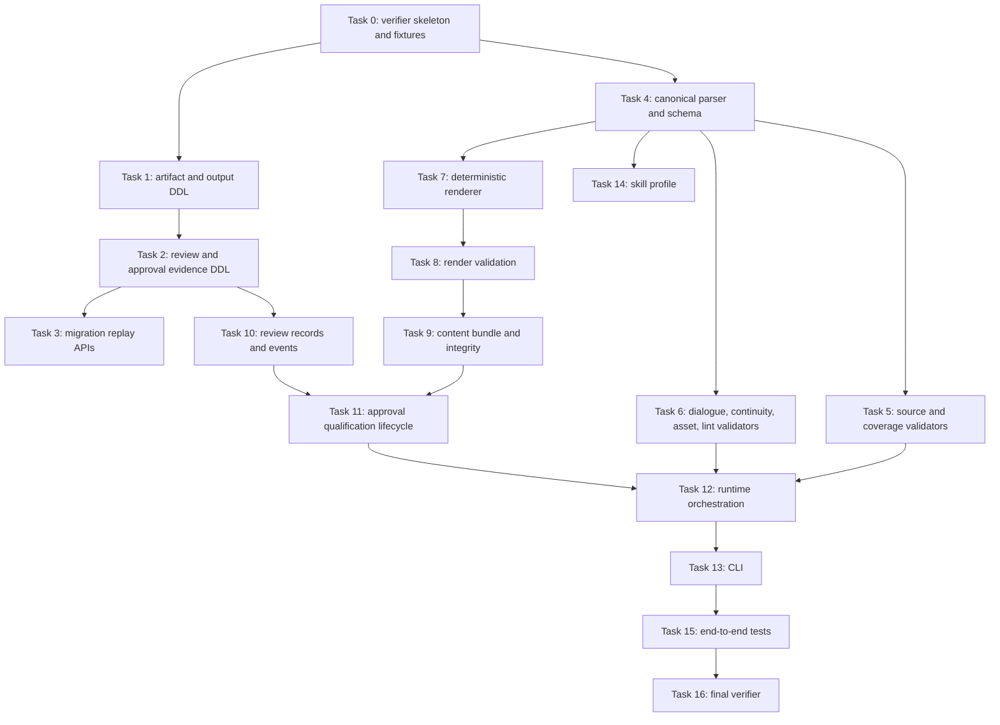

# Phase 3 Shot Prompt Canonical Foundation Implementation Plan

> **For agentic workers:** REQUIRED SUB-SKILL: Use superpowers:subagent-driven-development (recommended) or superpowers:executing-plans to implement this plan task-by-task. Steps use checkbox (`- [ ]`) syntax for tracking.

**Goal:** Build the Phase 3 Shot Prompt Canonical Foundation from an approved and fresh Storyboard Revision through deterministic prompt rendering, bundle integrity, review, qualification, approval, and Phase 4 eligibility.

**Architecture:** Extend the existing Phase 0-2 Artifact, Revision, Dependency, Validation, Bundle, Approval, Gate, and Export infrastructure. Keep Storyboard facts authoritative, Shot Prompt Canonical as the generation-intent authority, all formal prompt artifacts deterministic, Qualification Evidence outside the Content Bundle, and Phase 4 asset binding outside Phase 3.

**Tech Stack:** Python, SQLite, pytest, existing ai_drama_runtime Store/Runtime/CLI architecture, deterministic JSON serialization, SHA-256 object storage and bundle integrity.

---

Plan Status: IMPLEMENTATION_PLAN_PENDING_USER_REVIEW
Implementation: IMPLEMENTATION_NOT_AUTHORIZED
Phase 4: PHASE4_NOT_AUTHORIZED

## Source Baseline

- Branch: `test/phase2-minimal-bundle-foundation`
- Planning start commit: `b178f8eabe4a0e7474e27d7225f76355e743b373`
- Approved Design Spec: `docs/superpowers/specs/2026-07-01-phase3-shot-prompt-canonical-design.md`
- Design status verified: `Document Status: DESIGN_SPEC_APPROVED`
- Planning authorization verified: `Implementation Planning: IMPLEMENTATION_PLANNING_AUTHORIZED`
- This plan does not implement code, database changes, migrations, tests, skill changes, generation, asset binding, Phase 4 work, or push.

## Repository Evidence Read

- Runtime and Store: `ai_drama_runtime/store.py`, `ai_drama_runtime/services.py`, `ai_drama_runtime/validators.py`, `ai_drama_runtime/cli.py`
- Storyboard foundation: `ai_drama_runtime/storyboard_canonical.py`, `ai_drama_runtime/storyboard_renderer.py`, `ai_drama_runtime/storyboard_migration.py`
- Tests: `tests/test_storyboard_canonical_serialization.py`, `tests/test_storyboard_canonical_workflow.py`, `tests/test_storyboard_legacy_migration.py`, `tests/test_storyboard_renderer.py`, `tests/test_storyboard_workflow.py`, `tests/test_validators_approval_export.py`, `tests/test_cli.py`, `tests/test_phase1_verifier.py`, `tests/test_phase2_verifier.py`, `tests/test_runtime_lifecycle.py`, `tests/acceptance/test_storyboard_workflow_acceptance.py`
- Verification pattern: `tools/verify_phase2_minimal_bundle_foundation.py`
- Skill integration point: `skills/ai-drama-storyboard-design-skill/v0.2.1/skill.json`

## File Map

Create:

- `ai_drama_runtime/shot_prompt_canonical.py`: parser, schema constants, normalization, deterministic serialization, canonical hash, `append_dedup`, and runtime-derived `slot_id`.
- `ai_drama_runtime/shot_prompt_renderer.py`: exact renderer registry, set-default merge, positive and negative prompt rendering, asset requirements rendering, render provenance, and review markdown candidate rendering.
- `ai_drama_runtime/shot_prompt_migration.py`: Phase 3 Store migration preview and apply helpers for local SQLite databases.
- `tools/verify_phase3_shot_prompt_canonical_foundation.py`: Phase 3 verifier modeled on `tools/verify_phase2_minimal_bundle_foundation.py`.
- `tests/fixtures/shot_prompt_canonical/minimal_storyboard.json`: minimal approved Storyboard canonical fixture used as Phase 3 source.
- `tests/fixtures/shot_prompt_canonical/valid_draft_shared_only.json`: Draft Shot Prompt fixture with `shared_intent` only.
- `tests/fixtures/shot_prompt_canonical/valid_formal_mixed_modalities.json`: Formal Shot Prompt fixture with image-only, video-only, and dual-modality shots.
- `tests/fixtures/shot_prompt_canonical/invalid_duplicate_key.json`: duplicate-key fixture.
- `tests/fixtures/shot_prompt_canonical/invalid_slot_id_authored.json`: fixture proving authored `slot_id` is rejected.
- `tests/golden/shot_prompt_renderer/rendered-positive-prompts.json`: deterministic positive prompt golden.
- `tests/golden/shot_prompt_renderer/rendered-negative-prompts.json`: deterministic negative prompt golden.
- `tests/golden/shot_prompt_renderer/asset-requirements.json`: deterministic asset requirement golden with derived `slot_id`.
- `tests/golden/shot_prompt_renderer/render-provenance.json`: minimal provenance golden.
- `tests/golden/shot_prompt_renderer/review.md`: deterministic review surface golden.
- `tests/test_shot_prompt_store_migration.py`: Store DDL, legacy migration, CHECK, FK, unique index, and rollback tests.
- `tests/test_shot_prompt_canonical_serialization.py`: parser, schema, normalization, hash, Draft/Formal, and field boundary tests.
- `tests/test_shot_prompt_validators.py`: source binding, coverage, modality, dialogue, continuity, asset slot, forbidden field, platform neutrality, warning, and lint tests.
- `tests/test_shot_prompt_renderer.py`: renderer registry, merge, prompt, asset, provenance, golden, and deterministic render tests.
- `tests/test_shot_prompt_bundle.py`: render validation, validation report, bundle materialization, manifest, logical type, and integrity tests.
- `tests/test_shot_prompt_review_records.py`: review records and append-only event lifecycle tests.
- `tests/test_shot_prompt_approval_lifecycle.py`: qualification evidence, approval, rejection, revocation, supersession, and live eligibility tests.
- `tests/test_shot_prompt_cli.py`: CLI command, JSON output, exit code, and rejected option tests.
- `tests/test_phase3_verifier.py`: verifier branch, allowlist, protected file, and portable/final mode tests.
- `skills/ai-drama-shot-prompt-canonical-skill/v0.1.0/skill.json`: new Phase 3 profile declaration.
- `skills/ai-drama-shot-prompt-canonical-skill/v0.1.0/SKILL.md`: agent-facing Phase 3 authoring instructions.
- `skills/ai-drama-shot-prompt-canonical-skill/v0.1.0/README.md`: package README.
- `skills/ai-drama-shot-prompt-canonical-skill/v0.1.0/contracts/shot-prompt-canonical-contract-v1.md`: canonical authoring contract.
- `skills/ai-drama-shot-prompt-canonical-skill/v0.1.0/schemas/shot-prompt-canonical.schema.json`: Draft/Formal authoring schema.

Modify:

- `ai_drama_runtime/store.py`: extend DDL, migration replay, Store records, insert/read APIs, and transactions.
- `ai_drama_runtime/services.py`: add Shot Prompt orchestration, render candidate flow, content bundle, review, qualification, lifecycle, eligibility, and export blocking.
- `ai_drama_runtime/validators.py`: add runtime-native validator dispatch for `shot_prompt_set` revisions and recursive freshness coverage.
- `ai_drama_runtime/cli.py`: add explicit `shot-prompts` command surface and preserve current exit code style.

Test:

- Existing Phase 0-2 regression tests remain in place: `tests/test_cli.py`, `tests/test_storyboard_canonical_workflow.py`, `tests/test_storyboard_legacy_migration.py`, `tests/test_storyboard_renderer.py`, `tests/test_storyboard_workflow.py`, `tests/test_validators_approval_export.py`, `tests/test_phase1_verifier.py`, `tests/test_phase2_verifier.py`
- New Phase 3 tests are the `tests/test_shot_prompt_*.py` files listed above.

Verify:

- `tools/verify_phase3_shot_prompt_canonical_foundation.py`
- `python3 -m pytest -q`
- `python3 tools/verify_phase3_shot_prompt_canonical_foundation.py --mode final --execution-start-commit b178f8eabe4a0e7474e27d7225f76355e743b373`

Skill/Profile:

- Add one new Phase 3 package under `skills/ai-drama-shot-prompt-canonical-skill/v0.1.0`.
- Do not edit `skills/ai-drama-storyboard-design-skill/v0.2.1/skill.json`.

Split:

- Keep new Phase 3 logic in `shot_prompt_canonical.py`, `shot_prompt_renderer.py`, and `shot_prompt_migration.py`.
- Keep `services.py`, `store.py`, `validators.py`, and `cli.py` as existing integration boundaries instead of moving Phase 0-2 code.

Dependency direction:

```text
store.py <- services.py <- cli.py
shot_prompt_canonical.py <- shot_prompt_renderer.py <- services.py
shot_prompt_migration.py <- store.py tests
validators.py -> services.py only for runtime-native integrity checks, matching existing storyboard pattern
skills/ai-drama-shot-prompt-canonical-skill/v0.1.0/skill.json -> validators.py declarations
tools/verify_phase3_shot_prompt_canonical_foundation.py -> git, pytest, repository files
```

## Workflow Covered

```text
Approved + Fresh Storyboard Revision
-> Shot Prompt Set Artifact
-> Shot Prompt Set Revision
-> Draft Canonical Validation
-> Formal Canonical Validation
-> Deterministic Rendering
-> Render Validation
-> Content Bundle Materialization
-> Bundle Integrity
-> Human Review Records
-> Approval Qualification
-> Immutable Qualification Evidence
-> Approval / Rejection / Revoke / Supersede
-> Live Phase 4 Eligibility
```

## Task Dependency Graph



Parallelism:

- Task 5 and Task 6 can run in parallel after Task 4 because they modify `tests/test_shot_prompt_validators.py` in separate test functions and one shared implementation file, so only one writer should own `ai_drama_runtime/validators.py`.
- Task 7 and Task 14 can run in parallel after Task 4 because they do not modify the same files.
- Task 10 can run after Task 2 without waiting for renderer work.
- Task 13 waits for Task 12 to keep CLI tests tied to stable service names.

## Commit Strategy

- Task 0: `test: add phase 3 verifier skeleton and fixtures`
- Task 1: `feat: add shot prompt store identity and output schema`
- Task 2: `feat: add shot prompt review and approval evidence schema`
- Task 3: `feat: add shot prompt migration replay support`
- Task 4: `feat: add shot prompt canonical contract parser`
- Task 5: `feat: add shot prompt source validators`
- Task 6: `feat: add shot prompt intent validators`
- Task 7: `feat: add deterministic shot prompt renderer`
- Task 8: `feat: add shot prompt render validation`
- Task 9: `feat: materialize shot prompt content bundle`
- Task 10: `feat: add shot prompt review records`
- Task 11: `feat: add shot prompt approval qualification`
- Task 12: `feat: orchestrate shot prompt runtime workflow`
- Task 13: `feat: add shot prompt cli commands`
- Task 14: `feat: add shot prompt canonical skill profile`
- Task 15: `test: add phase 3 end to end coverage`
- Task 16: `test: add phase 3 verification baseline`

Rules:

- Each task commit includes its failing test and matching implementation.
- Schema, migration, renderer, bundle, review, approval, CLI, and verifier commits stay separate.
- No commit mixes Phase 3 and Phase 4 behavior.
- No implementation commit rewrites this plan.
- The release baseline commit is Task 16 only.

## Tasks

### Task 0: Phase 3 Verifier Skeleton And Fixtures

**Depends on:** None

**Files:**
- Create: `tools/verify_phase3_shot_prompt_canonical_foundation.py`
- Create: `tests/test_phase3_verifier.py`
- Create: `tests/fixtures/shot_prompt_canonical/minimal_storyboard.json`
- Create: `tests/fixtures/shot_prompt_canonical/valid_draft_shared_only.json`
- Create: `tests/fixtures/shot_prompt_canonical/valid_formal_mixed_modalities.json`
- Modify: none
- Test: `tests/test_phase3_verifier.py`
- Verify: `tools/verify_phase3_shot_prompt_canonical_foundation.py`

**Design requirements covered:**
- Design Section 17 acceptance criteria setup
- Wave 0 baseline, fixtures, verifier skeleton, Phase 0-2 regression protection

- [ ] **Step 1: Write the failing test**

```python
def test_phase3_verifier_preflight_branch_head_and_clean_tree(monkeypatch):
    verifier = _load_verifier_module()

    def fake_run(args, **kwargs):
        command = " ".join(args)
        if command == "git branch --show-current":
            return subprocess.CompletedProcess(args, 0, "test/phase2-minimal-bundle-foundation\n", "")
        if command == "git rev-parse HEAD":
            return subprocess.CompletedProcess(args, 0, verifier.EXECUTION_START_COMMIT + "\n", "")
        if command == "git status --short":
            return subprocess.CompletedProcess(args, 0, "", "")
        if command.startswith("git diff --name-only"):
            return subprocess.CompletedProcess(args, 0, "\n".join(sorted(verifier.ALLOWED_CHANGED_FILES)) + "\n", "")
        if command.startswith("git merge-base --is-ancestor"):
            return subprocess.CompletedProcess(args, 0, "", "")
        raise AssertionError(command)

    monkeypatch.setattr(verifier, "_run", fake_run)
    monkeypatch.setattr(verifier, "_pytest_check", lambda name: verifier.CheckResult(name, True, "ok", "ok", "ok"))

    results = verifier.final_checks(verifier.EXECUTION_START_COMMIT)

    assert {item.name for item in results} >= {
        "branch",
        "execution_start_ancestor",
        "working_tree_clean",
        "changed_file_allowlist",
        "protected_files_unchanged",
        "final_pytest",
    }
```

- [ ] **Step 2: Run the focused test and verify failure**

Run:

```bash
python3 -m pytest tests/test_phase3_verifier.py::test_phase3_verifier_preflight_branch_head_and_clean_tree -q
```

Expected:

```text
FAIL because tools/verify_phase3_shot_prompt_canonical_foundation.py does not exist
```

- [ ] **Step 3: Implement the minimal production change**

```python
EXPECTED_BRANCH = "test/phase2-minimal-bundle-foundation"
EXECUTION_START_COMMIT = "b178f8eabe4a0e7474e27d7225f76355e743b373"
ALLOWED_CHANGED_FILES = {
    "ai_drama_runtime/cli.py",
    "ai_drama_runtime/services.py",
    "ai_drama_runtime/store.py",
    "ai_drama_runtime/validators.py",
    "ai_drama_runtime/shot_prompt_canonical.py",
    "ai_drama_runtime/shot_prompt_renderer.py",
    "ai_drama_runtime/shot_prompt_migration.py",
    "tools/verify_phase3_shot_prompt_canonical_foundation.py",
}
PROTECTED_FILES = (
    "docs/superpowers/specs/2026-07-01-phase3-shot-prompt-canonical-design.md",
    "skills/ai-drama-storyboard-design-skill/v0.2.1/skill.json",
)
```

- [ ] **Step 4: Run the focused test**

Run:

```bash
python3 -m pytest tests/test_phase3_verifier.py::test_phase3_verifier_preflight_branch_head_and_clean_tree -q
```

Expected:

```text
1 passed
```

- [ ] **Step 5: Run related regression tests**

Run:

```bash
python3 -m pytest tests/test_phase1_verifier.py tests/test_phase2_verifier.py tests/test_phase3_verifier.py -q
```

Expected:

```text
all selected verifier tests pass
```

- [ ] **Step 6: Commit**

```bash
git add tools/verify_phase3_shot_prompt_canonical_foundation.py tests/test_phase3_verifier.py tests/fixtures/shot_prompt_canonical/minimal_storyboard.json tests/fixtures/shot_prompt_canonical/valid_draft_shared_only.json tests/fixtures/shot_prompt_canonical/valid_formal_mixed_modalities.json
git commit -m "test: add phase 3 verifier skeleton and fixtures"
```

### Task 1: Store Artifact Identity And Revision Output Schema

**Depends on:** Task 0

**Files:**
- Create: none
- Modify: `ai_drama_runtime/store.py:RuntimeStore._init_schema`
- Modify: `ai_drama_runtime/store.py:RuntimeStore._ensure_columns`
- Test: `tests/test_shot_prompt_store_migration.py`
- Verify: `tools/verify_phase3_shot_prompt_canonical_foundation.py`

**Design requirements covered:**
- Section 3 artifact identity
- Section 10 logical type expansion
- Section 15 Store and migration requirements
- Acceptance criteria 1, 2, 29, 30

- [ ] **Step 1: Write the failing test**

```python
def test_shot_prompt_store_schema_has_business_key_and_logical_types(tmp_path):
    with RuntimeStore(tmp_path / "runtime.db", tmp_path / "objects") as store:
        artifacts_sql = store.conn.execute(
            "SELECT sql FROM sqlite_master WHERE type = 'table' AND name = 'artifacts'"
        ).fetchone()["sql"]
        outputs_sql = store.conn.execute(
            "SELECT sql FROM sqlite_master WHERE type = 'table' AND name = 'revision_outputs'"
        ).fetchone()["sql"]
        index_names = {
            row["name"]
            for row in store.conn.execute("SELECT name FROM sqlite_master WHERE type = 'index' AND tbl_name = 'artifacts'")
        }

    assert "business_key_type TEXT NOT NULL DEFAULT ''" in artifacts_sql
    assert "business_key_value TEXT NOT NULL DEFAULT ''" in artifacts_sql
    assert "one_shot_prompt_set_per_source_storyboard_revision" in index_names
    for logical_type in {
        "shot_prompt_positive_prompts",
        "shot_prompt_negative_prompts",
        "shot_prompt_asset_requirements",
        "shot_prompt_render_provenance",
        "shot_prompt_review_markdown",
        "shot_prompt_validation_report",
        "bundle_manifest",
        "rendered_markdown",
    }:
        assert logical_type in outputs_sql
```

- [ ] **Step 2: Run the focused test and verify failure**

Run:

```bash
python3 -m pytest tests/test_shot_prompt_store_migration.py::test_shot_prompt_store_schema_has_business_key_and_logical_types -q
```

Expected:

```text
FAIL because artifacts has no business_key_type column and revision_outputs lacks Phase 3 logical types
```

- [ ] **Step 3: Implement the minimal production change**

```sql
CREATE TABLE IF NOT EXISTS artifacts (
  artifact_id TEXT PRIMARY KEY,
  artifact_type TEXT NOT NULL,
  project_id TEXT NOT NULL,
  chapter_id TEXT NOT NULL,
  created_at TEXT NOT NULL,
  business_key_type TEXT NOT NULL DEFAULT '',
  business_key_value TEXT NOT NULL DEFAULT ''
);

CREATE UNIQUE INDEX IF NOT EXISTS one_shot_prompt_set_per_source_storyboard_revision
  ON artifacts(artifact_type, business_key_type, business_key_value)
  WHERE artifact_type = 'shot_prompt_set'
    AND business_key_type = 'source_storyboard_revision_id';

CREATE TABLE IF NOT EXISTS revision_outputs (
  revision_output_id TEXT PRIMARY KEY,
  revision_id TEXT NOT NULL REFERENCES revisions(revision_id) ON DELETE RESTRICT,
  logical_type TEXT NOT NULL CHECK (logical_type IN (
    'rendered_positive_prompt',
    'rendered_negative_prompt',
    'rendered_markdown',
    'shot_prompt_positive_prompts',
    'shot_prompt_negative_prompts',
    'shot_prompt_asset_requirements',
    'shot_prompt_render_provenance',
    'shot_prompt_review_markdown',
    'shot_prompt_validation_report',
    'bundle_manifest'
  )),
  object_id TEXT NOT NULL,
  content_hash TEXT NOT NULL,
  media_type TEXT NOT NULL,
  generator TEXT NOT NULL,
  generator_version TEXT NOT NULL,
  created_at TEXT NOT NULL,
  UNIQUE(revision_id, logical_type)
);
```

- [ ] **Step 4: Run the focused test**

Run:

```bash
python3 -m pytest tests/test_shot_prompt_store_migration.py::test_shot_prompt_store_schema_has_business_key_and_logical_types -q
```

Expected:

```text
1 passed
```

- [ ] **Step 5: Run related regression tests**

Run:

```bash
python3 -m pytest tests/test_storyboard_legacy_migration.py tests/test_validators_approval_export.py -q
```

Expected:

```text
all selected Store and bundle regression tests pass
```

- [ ] **Step 6: Commit**

```bash
git add ai_drama_runtime/store.py tests/test_shot_prompt_store_migration.py
git commit -m "feat: add shot prompt store identity and output schema"
```

### Task 2: Review Records And Approval Evidence Schema

**Depends on:** Task 1

**Files:**
- Create: none
- Modify: `ai_drama_runtime/store.py:RuntimeStore._init_schema`
- Modify: `ai_drama_runtime/store.py:RuntimeStore._ensure_columns`
- Test: `tests/test_shot_prompt_store_migration.py`
- Verify: `tools/verify_phase3_shot_prompt_canonical_foundation.py`

**Design requirements covered:**
- Section 13 review records and approval evidence
- Section 15 approval record migration and review table migration
- Acceptance criteria 33, 34, 37

- [ ] **Step 1: Write the failing test**

```python
def test_review_records_and_approval_evidence_schema(tmp_path):
    with RuntimeStore(tmp_path / "runtime.db", tmp_path / "objects") as store:
        review_sql = store.conn.execute(
            "SELECT sql FROM sqlite_master WHERE type = 'table' AND name = 'review_records'"
        ).fetchone()["sql"]
        event_sql = store.conn.execute(
            "SELECT sql FROM sqlite_master WHERE type = 'table' AND name = 'review_record_events'"
        ).fetchone()["sql"]
        approval_columns = {
            row["name"]
            for row in store.conn.execute("PRAGMA table_info(approval_records)").fetchall()
        }

    assert "scope TEXT NOT NULL CHECK (scope IN ('set','shot'))" in review_sql
    assert "CHECK ((scope = 'set' AND shot_id IS NULL) OR (scope = 'shot' AND shot_id IS NOT NULL))" in review_sql
    assert "event_type TEXT NOT NULL CHECK (event_type IN ('opened','resolved','reopened','voided'))" in event_sql
    assert {
        "source_storyboard_revision_id",
        "canonical_content_hash",
        "bundle_manifest_hash",
        "qualification_report_hash",
        "qualification_report_object_id",
        "renderer_profile_id",
        "renderer_profile_version",
        "qualification_profile_id",
        "qualification_profile_version",
    } <= approval_columns
```

- [ ] **Step 2: Run the focused test and verify failure**

Run:

```bash
python3 -m pytest tests/test_shot_prompt_store_migration.py::test_review_records_and_approval_evidence_schema -q
```

Expected:

```text
FAIL because review_records does not exist and approval_records lacks evidence columns
```

- [ ] **Step 3: Implement the minimal production change**

```sql
CREATE TABLE IF NOT EXISTS review_records (
  review_id TEXT PRIMARY KEY,
  artifact_id TEXT NOT NULL,
  revision_id TEXT NOT NULL,
  scope TEXT NOT NULL CHECK (scope IN ('set','shot')),
  shot_id TEXT,
  body TEXT NOT NULL,
  body_hash TEXT NOT NULL,
  blocking INTEGER NOT NULL CHECK (blocking IN (0,1)),
  created_by TEXT NOT NULL,
  created_at TEXT NOT NULL,
  CHECK ((scope = 'set' AND shot_id IS NULL) OR (scope = 'shot' AND shot_id IS NOT NULL)),
  FOREIGN KEY(revision_id) REFERENCES revisions(revision_id)
);

CREATE TABLE IF NOT EXISTS review_record_events (
  event_id TEXT PRIMARY KEY,
  review_id TEXT NOT NULL,
  event_type TEXT NOT NULL CHECK (event_type IN ('opened','resolved','reopened','voided')),
  actor TEXT NOT NULL,
  note TEXT NOT NULL DEFAULT '',
  created_at TEXT NOT NULL,
  FOREIGN KEY(review_id) REFERENCES review_records(review_id)
);

CREATE INDEX IF NOT EXISTS review_records_revision_shot_idx ON review_records(revision_id, shot_id);
CREATE INDEX IF NOT EXISTS review_records_artifact_revision_idx ON review_records(artifact_id, revision_id);
CREATE INDEX IF NOT EXISTS review_record_events_review_id_created_event_idx
  ON review_record_events(review_id, created_at, event_id);
```

- [ ] **Step 4: Run the focused test**

Run:

```bash
python3 -m pytest tests/test_shot_prompt_store_migration.py::test_review_records_and_approval_evidence_schema -q
```

Expected:

```text
1 passed
```

- [ ] **Step 5: Run related regression tests**

Run:

```bash
python3 -m pytest tests/test_storyboard_workflow.py::test_storyboard_rejection_action_is_recorded tests/test_validators_approval_export.py::test_validator_statuses_and_required_approval_block -q
```

Expected:

```text
2 passed
```

- [ ] **Step 6: Commit**

```bash
git add ai_drama_runtime/store.py tests/test_shot_prompt_store_migration.py
git commit -m "feat: add shot prompt review and approval evidence schema"
```

### Task 3: Migration Replay And Store APIs

**Depends on:** Task 2

**Files:**
- Create: `ai_drama_runtime/shot_prompt_migration.py`
- Modify: `ai_drama_runtime/store.py:RuntimeStore`
- Test: `tests/test_shot_prompt_store_migration.py`
- Verify: `tools/verify_phase3_shot_prompt_canonical_foundation.py`

**Design requirements covered:**
- Section 15 migration preview, apply, legacy compatibility, idempotency, rollback
- Acceptance criteria 1, 27, 28, 35, 36

- [ ] **Step 1: Write the failing test**

```python
def test_phase3_migration_replay_preserves_legacy_rows(tmp_path):
    db_path = tmp_path / "runtime.db"
    objects_root = tmp_path / "objects"
    _create_phase2_legacy_db(db_path)

    with RuntimeStore(db_path, objects_root) as store:
        first = store.get_revision("legacy-revision")
        assert first.approval_status == "pending"
        assert store.find_artifact_by_business_key("shot_prompt_set", "source_storyboard_revision_id", "missing") is None

    with RuntimeStore(db_path, objects_root) as store:
        second = store.get_revision("legacy-revision")
        assert second == first
        assert store.conn.execute("PRAGMA foreign_key_check").fetchall() == []
```

- [ ] **Step 2: Run the focused test and verify failure**

Run:

```bash
python3 -m pytest tests/test_shot_prompt_store_migration.py::test_phase3_migration_replay_preserves_legacy_rows -q
```

Expected:

```text
FAIL because find_artifact_by_business_key is not defined
```

- [ ] **Step 3: Implement the minimal production change**

```python
def find_artifact_by_business_key(self, artifact_type, business_key_type, business_key_value):
    row = self.conn.execute(
        """
        SELECT * FROM artifacts
        WHERE artifact_type = ?
          AND business_key_type = ?
          AND business_key_value = ?
        """,
        (artifact_type, business_key_type, business_key_value),
    ).fetchone()
    return None if row is None else dict(row)

def ensure_artifact_with_business_key(self, artifact_type, project_id, chapter_id, business_key_type, business_key_value):
    existing = self.find_artifact_by_business_key(artifact_type, business_key_type, business_key_value)
    if existing:
        return existing
    artifact_id = uuid.uuid4().hex
    self.conn.execute(
        """
        INSERT INTO artifacts
        (artifact_id, artifact_type, project_id, chapter_id, created_at, business_key_type, business_key_value)
        VALUES (?, ?, ?, ?, ?, ?, ?)
        """,
        (artifact_id, artifact_type, project_id, chapter_id, now_iso(), business_key_type, business_key_value),
    )
    self.conn.commit()
    return self.find_artifact_by_business_key(artifact_type, business_key_type, business_key_value)
```

- [ ] **Step 4: Run the focused test**

Run:

```bash
python3 -m pytest tests/test_shot_prompt_store_migration.py::test_phase3_migration_replay_preserves_legacy_rows -q
```

Expected:

```text
1 passed
```

- [ ] **Step 5: Run related regression tests**

Run:

```bash
python3 -m pytest tests/test_storyboard_legacy_migration.py tests/test_shot_prompt_store_migration.py -q
```

Expected:

```text
all selected migration tests pass
```

- [ ] **Step 6: Commit**

```bash
git add ai_drama_runtime/store.py ai_drama_runtime/shot_prompt_migration.py tests/test_shot_prompt_store_migration.py
git commit -m "feat: add shot prompt migration replay support"
```

### Task 4: Shot Prompt Canonical Parser And Schema

**Depends on:** Task 0

**Files:**
- Create: `ai_drama_runtime/shot_prompt_canonical.py`
- Create: `tests/test_shot_prompt_canonical_serialization.py`
- Modify: none
- Test: `tests/test_shot_prompt_canonical_serialization.py`
- Verify: `tools/verify_phase3_shot_prompt_canonical_foundation.py`

**Design requirements covered:**
- Section 4 canonical content contract
- Section 6 Draft/Formal modality semantics
- Section 8 merge semantics and `append_dedup`
- Acceptance criteria 3 through 21 and 38

- [ ] **Step 1: Write the failing test**

```python
def test_formal_shared_only_fails_but_draft_passes():
    data = parse_shot_prompt_json(_fixture_text("valid_draft_shared_only.json"))

    validate_shot_prompt_canonical(data, profile="draft")

    with pytest.raises(ShotPromptCanonicalError, match="FORMAL_MODALITY_REQUIRED"):
        validate_shot_prompt_canonical(data, profile="formal")
```

- [ ] **Step 2: Run the focused test and verify failure**

Run:

```bash
python3 -m pytest tests/test_shot_prompt_canonical_serialization.py::test_formal_shared_only_fails_but_draft_passes -q
```

Expected:

```text
FAIL because ai_drama_runtime.shot_prompt_canonical is not defined
```

- [ ] **Step 3: Implement the minimal production change**

```python
SCHEMA_VERSION = "shot-prompt-canonical-v1"
CONTENT_PROFILE = "shot-prompt-canonical-v1"
CANONICAL_PARSER_VERSION = "shot-prompt-canonical-json-v1"
RENDERER_PROFILE_ID = "shot_prompt_standard"
RENDERER_PROFILE_VERSION = "1.0.0"

def validate_shot_prompt_canonical(data, *, profile):
    _require_object(data, "shot_prompt")
    _reject_extra(data, {
        "schema_version",
        "content_profile",
        "scope",
        "source_storyboard_revision_id",
        "render_language",
        "renderer",
        "shots",
        "set_defaults",
    }, "shot_prompt")
    if data["scope"] != "set":
        raise ShotPromptCanonicalError("SCOPE_UNSUPPORTED", "scope must be set")
    for shot in data["shots"]:
        if "slot_id" in json.dumps(shot, ensure_ascii=False):
            raise ShotPromptCanonicalError("CANONICAL_FIELD_FORBIDDEN", "slot_id is derived output only")
        has_modality = "image_intent" in shot or "video_intent" in shot
        if profile == "formal" and not has_modality:
            raise ShotPromptCanonicalError("FORMAL_MODALITY_REQUIRED", "formal shots require image_intent or video_intent")
```

- [ ] **Step 4: Run the focused test**

Run:

```bash
python3 -m pytest tests/test_shot_prompt_canonical_serialization.py::test_formal_shared_only_fails_but_draft_passes -q
```

Expected:

```text
1 passed
```

- [ ] **Step 5: Run related regression tests**

Run:

```bash
python3 -m pytest tests/test_storyboard_canonical_serialization.py tests/test_shot_prompt_canonical_serialization.py -q
```

Expected:

```text
all canonical serialization tests pass
```

- [ ] **Step 6: Commit**

```bash
git add ai_drama_runtime/shot_prompt_canonical.py tests/test_shot_prompt_canonical_serialization.py tests/fixtures/shot_prompt_canonical/invalid_duplicate_key.json tests/fixtures/shot_prompt_canonical/invalid_slot_id_authored.json
git commit -m "feat: add shot prompt canonical contract parser"
```

### Task 5: Source Binding And Coverage Validators

**Depends on:** Task 4

**Files:**
- Create: none
- Modify: `ai_drama_runtime/validators.py:_run_native_canonical_validator`
- Modify: `ai_drama_runtime/validators.py:_validator_applies_to_revision`
- Test: `tests/test_shot_prompt_validators.py`
- Verify: `tools/verify_phase3_shot_prompt_canonical_foundation.py`

**Design requirements covered:**
- Section 5 Storyboard fact binding
- Section 11.1 Canonical Validation
- Acceptance criteria 1, 3, 9, 23, 32, 39

- [ ] **Step 1: Write the failing test**

```python
def test_source_storyboard_revision_must_be_current_approved_and_fresh(tmp_path):
    with _service(tmp_path) as service:
        storyboard = _approved_storyboard_revision(service)
        shot_prompt = _insert_shot_prompt_revision(service, storyboard.revision_id, "valid_formal_mixed_modalities.json")

        result = run_shot_prompt_validator(service.store, shot_prompt, "shot_prompt_source_storyboard_eligibility")

        assert result.status == "PASS"

        service.store.conn.execute(
            "UPDATE revision_dependencies SET parent_content_hash = ? WHERE child_revision_id = ?",
            ("0" * 64, shot_prompt.revision_id),
        )
        service.store.conn.commit()

        result = run_shot_prompt_validator(service.store, shot_prompt, "shot_prompt_source_storyboard_eligibility")
        assert result.status == "FAIL"
        assert result.error_code == "SOURCE_STALE"
```

- [ ] **Step 2: Run the focused test and verify failure**

Run:

```bash
python3 -m pytest tests/test_shot_prompt_validators.py::test_source_storyboard_revision_must_be_current_approved_and_fresh -q
```

Expected:

```text
FAIL because shot_prompt_source_storyboard_eligibility is not registered
```

- [ ] **Step 3: Implement the minimal production change**

```python
SHOT_PROMPT_NATIVE_VALIDATORS = {
    "shot_prompt_source_storyboard_eligibility",
    "shot_prompt_dependency_binding",
    "shot_prompt_full_shot_coverage",
    "shot_prompt_shot_order",
}

def _validator_applies_to_revision(validator, revision):
    revision_type = _current_artifact_type(revision)
    if revision_type == "shot_prompt_set":
        accepted = {"shot_prompt_set_revision"}
    elif revision_type == "storyboard":
        accepted = {"storyboard_revision"}
    elif revision_type == "drama_script":
        accepted = {"drama_script_revision"}
    else:
        accepted = set()
    return bool(set(validator.applies_to) & accepted)
```

- [ ] **Step 4: Run the focused test**

Run:

```bash
python3 -m pytest tests/test_shot_prompt_validators.py::test_source_storyboard_revision_must_be_current_approved_and_fresh -q
```

Expected:

```text
1 passed
```

- [ ] **Step 5: Run related regression tests**

Run:

```bash
python3 -m pytest tests/test_shot_prompt_validators.py tests/test_storyboard_canonical_workflow.py -q
```

Expected:

```text
all selected validator tests pass
```

- [ ] **Step 6: Commit**

```bash
git add ai_drama_runtime/validators.py tests/test_shot_prompt_validators.py
git commit -m "feat: add shot prompt source validators"
```

### Task 6: Intent Validators For Modality, Dialogue, Continuity, Assets, And Lint

**Depends on:** Task 4, Task 5

**Files:**
- Create: none
- Modify: `ai_drama_runtime/shot_prompt_canonical.py`
- Modify: `ai_drama_runtime/validators.py`
- Test: `tests/test_shot_prompt_validators.py`
- Verify: `tools/verify_phase3_shot_prompt_canonical_foundation.py`

**Design requirements covered:**
- Sections 4.4, 4.5, 4.6, 4.7
- Section 11.1 Draft vs Formal validation profile
- Acceptance criteria 6 through 23 and 38

- [ ] **Step 1: Write the failing test**

```python
def test_dialogue_asset_continuity_and_language_lint_are_separate_severities(tmp_path):
    with _service(tmp_path) as service:
        storyboard = _approved_storyboard_revision(service)
        revision = _insert_shot_prompt_revision(service, storyboard.revision_id, "valid_formal_mixed_modalities.json")

        results = run_shot_prompt_canonical_validation(service.store, revision, profile="formal")
        by_id = {item.validator_id: item for item in results}

    assert by_id["shot_prompt_dialogue_coverage"].status == "PASS"
    assert by_id["shot_prompt_continuity_scope"].status == "PASS"
    assert by_id["shot_prompt_asset_reference_slots"].status == "PASS"
    assert by_id["shot_prompt_language_consistency_lint"].required is False
```

- [ ] **Step 2: Run the focused test and verify failure**

Run:

```bash
python3 -m pytest tests/test_shot_prompt_validators.py::test_dialogue_asset_continuity_and_language_lint_are_separate_severities -q
```

Expected:

```text
FAIL because run_shot_prompt_canonical_validation is not defined
```

- [ ] **Step 3: Implement the minimal production change**

```python
SHOT_PROMPT_VALIDATOR_PROFILES = {
    "draft": [
        ("shot_prompt_canonical_schema_draft", True),
        ("shot_prompt_source_storyboard_eligibility", True),
        ("shot_prompt_language_consistency_lint", False),
    ],
    "formal": [
        ("shot_prompt_canonical_schema_formal", True),
        ("shot_prompt_source_storyboard_eligibility", True),
        ("shot_prompt_full_shot_coverage", True),
        ("shot_prompt_modality_completeness", True),
        ("shot_prompt_dialogue_coverage", True),
        ("shot_prompt_continuity_scope", True),
        ("shot_prompt_asset_reference_slots", True),
        ("shot_prompt_platform_neutrality", True),
        ("shot_prompt_language_consistency_lint", False),
    ],
}
```

- [ ] **Step 4: Run the focused test**

Run:

```bash
python3 -m pytest tests/test_shot_prompt_validators.py::test_dialogue_asset_continuity_and_language_lint_are_separate_severities -q
```

Expected:

```text
1 passed
```

- [ ] **Step 5: Run related regression tests**

Run:

```bash
python3 -m pytest tests/test_shot_prompt_canonical_serialization.py tests/test_shot_prompt_validators.py -q
```

Expected:

```text
all selected canonical and validator tests pass
```

- [ ] **Step 6: Commit**

```bash
git add ai_drama_runtime/shot_prompt_canonical.py ai_drama_runtime/validators.py tests/test_shot_prompt_validators.py
git commit -m "feat: add shot prompt intent validators"
```

### Task 7: Deterministic Renderer And Golden Outputs

**Depends on:** Task 4

**Files:**
- Create: `ai_drama_runtime/shot_prompt_renderer.py`
- Create: `tests/test_shot_prompt_renderer.py`
- Create: `tests/golden/shot_prompt_renderer/rendered-positive-prompts.json`
- Create: `tests/golden/shot_prompt_renderer/rendered-negative-prompts.json`
- Create: `tests/golden/shot_prompt_renderer/asset-requirements.json`
- Create: `tests/golden/shot_prompt_renderer/render-provenance.json`
- Create: `tests/golden/shot_prompt_renderer/review.md`
- Modify: none
- Test: `tests/test_shot_prompt_renderer.py`
- Verify: `tools/verify_phase3_shot_prompt_canonical_foundation.py`

**Design requirements covered:**
- Section 7 renderer fact invariants
- Section 8 set-default merge
- Section 9 rendering contract
- Acceptance criteria 8, 20, 21, 22, 24

- [ ] **Step 1: Write the failing test**

```python
def test_renderer_outputs_match_golden_and_provenance_excludes_forbidden_hashes():
    canonical = parse_shot_prompt_json(_fixture_text("valid_formal_mixed_modalities.json"))

    first = render_shot_prompt_set(canonical, shot_prompt_revision_id="revision-1")
    second = render_shot_prompt_set(canonical, shot_prompt_revision_id="revision-1")

    assert first == second
    assert first["rendered-positive-prompts.json"] == _golden_bytes("rendered-positive-prompts.json")
    provenance = json.loads(first["render-provenance.json"].decode("utf-8"))
    assert "render_provenance_hash" not in provenance
    assert "bundle_manifest_hash" not in provenance
    assert "qualification_report_hash" not in provenance
```

- [ ] **Step 2: Run the focused test and verify failure**

Run:

```bash
python3 -m pytest tests/test_shot_prompt_renderer.py::test_renderer_outputs_match_golden_and_provenance_excludes_forbidden_hashes -q
```

Expected:

```text
FAIL because render_shot_prompt_set is not defined
```

- [ ] **Step 3: Implement the minimal production change**

```python
RENDERER_ID = "shot-prompt-renderer"
RENDERER_VERSION = "1.0.0"
INVARIANT_SET_ID = "shot_prompt_fact_invariants"
INVARIANT_SET_VERSION = "1.0.0"

def render_shot_prompt_set(canonical, *, shot_prompt_revision_id):
    validate_shot_prompt_canonical(canonical, profile="formal")
    merged = merge_set_defaults(canonical)
    positive = render_positive_prompts(merged)
    negative = render_negative_prompts(merged)
    assets = render_asset_requirements(merged)
    provenance = render_provenance(canonical, shot_prompt_revision_id, positive, negative, assets)
    review = render_review_markdown(merged)
    return {
        "rendered-positive-prompts.json": canonical_json_bytes(positive),
        "rendered-negative-prompts.json": canonical_json_bytes(negative),
        "asset-requirements.json": canonical_json_bytes(assets),
        "render-provenance.json": canonical_json_bytes(provenance),
        "review.md": review.encode("utf-8"),
    }
```

- [ ] **Step 4: Run the focused test**

Run:

```bash
python3 -m pytest tests/test_shot_prompt_renderer.py::test_renderer_outputs_match_golden_and_provenance_excludes_forbidden_hashes -q
```

Expected:

```text
1 passed
```

- [ ] **Step 5: Run related regression tests**

Run:

```bash
python3 -m pytest tests/test_shot_prompt_renderer.py tests/test_storyboard_renderer.py -q
```

Expected:

```text
all selected renderer tests pass
```

- [ ] **Step 6: Commit**

```bash
git add ai_drama_runtime/shot_prompt_renderer.py tests/test_shot_prompt_renderer.py tests/golden/shot_prompt_renderer
git commit -m "feat: add deterministic shot prompt renderer"
```

### Task 8: Render Validation And Validation Report Candidate

**Depends on:** Task 7

**Files:**
- Create: none
- Modify: `ai_drama_runtime/services.py:RuntimeService`
- Modify: `ai_drama_runtime/validators.py`
- Test: `tests/test_shot_prompt_bundle.py`
- Verify: `tools/verify_phase3_shot_prompt_canonical_foundation.py`

**Design requirements covered:**
- Section 11.2 Render Validation
- Section 9 Validation Orchestrator ownership of `validation-report.json`
- Acceptance criteria 25, 26, 32

- [ ] **Step 1: Write the failing test**

```python
def test_render_validation_creates_candidate_report_without_revision_outputs(tmp_path):
    with _service(tmp_path) as service:
        revision = _formal_shot_prompt_revision(service)

        render_result = service.render_shot_prompt_revision(revision.revision_id)
        validation = service.validate_shot_prompt_render(revision.revision_id, render_result["candidate_object_ids"])

        assert validation["status"] == "PASS"
        assert validation["validation_report_object_id"]
        assert service.store.revision_outputs(revision.revision_id) == []
```

- [ ] **Step 2: Run the focused test and verify failure**

Run:

```bash
python3 -m pytest tests/test_shot_prompt_bundle.py::test_render_validation_creates_candidate_report_without_revision_outputs -q
```

Expected:

```text
FAIL because RuntimeService.render_shot_prompt_revision is not defined
```

- [ ] **Step 3: Implement the minimal production change**

```python
def validate_shot_prompt_render(self, revision_id, candidate_object_ids):
    revision = self._revision_or_raise(revision_id)
    candidates = {
        name: self.store.read_bytes_object(object_id)
        for name, object_id in candidate_object_ids.items()
    }
    report = {
        "schema_version": "shot-prompt-validation-report-v1",
        "revision_id": revision.revision_id,
        "validator_id": "shot_prompt_render_validation",
        "status": "PASS",
        "candidate_members": sorted(candidates),
    }
    report_bytes = self._canonical_json_v1_bytes(report)
    return {
        "status": "PASS",
        "validation_report_object_id": self.store.write_bytes_object(report_bytes),
    }
```

- [ ] **Step 4: Run the focused test**

Run:

```bash
python3 -m pytest tests/test_shot_prompt_bundle.py::test_render_validation_creates_candidate_report_without_revision_outputs -q
```

Expected:

```text
1 passed
```

- [ ] **Step 5: Run related regression tests**

Run:

```bash
python3 -m pytest tests/test_shot_prompt_bundle.py tests/test_validators_approval_export.py::test_approval_does_not_implicitly_materialize_bundle -q
```

Expected:

```text
all selected render validation tests pass
```

- [ ] **Step 6: Commit**

```bash
git add ai_drama_runtime/services.py ai_drama_runtime/validators.py tests/test_shot_prompt_bundle.py
git commit -m "feat: add shot prompt render validation"
```

### Task 9: Content Bundle Materialization And Integrity

**Depends on:** Task 8

**Files:**
- Create: none
- Modify: `ai_drama_runtime/services.py:RuntimeService`
- Modify: `ai_drama_runtime/store.py:RuntimeStore`
- Test: `tests/test_shot_prompt_bundle.py`
- Verify: `tools/verify_phase3_shot_prompt_canonical_foundation.py`

**Design requirements covered:**
- Section 10 Content Bundle and Revision Outputs
- Section 11.3 Bundle Integrity
- Acceptance criteria 27 through 32

- [ ] **Step 1: Write the failing test**

```python
def test_bundle_materialization_is_atomic_and_excludes_qualification(tmp_path):
    with _service(tmp_path) as service:
        revision = _render_validated_shot_prompt_revision(service)

        result = service.materialize_shot_prompt_bundle(revision.revision_id)
        outputs = service.store.revision_outputs(revision.revision_id)
        logical_types = {item.logical_type for item in outputs}

    assert result["status"] == "MATERIALIZED"
    assert logical_types == {
        "shot_prompt_positive_prompts",
        "shot_prompt_negative_prompts",
        "shot_prompt_asset_requirements",
        "shot_prompt_render_provenance",
        "shot_prompt_review_markdown",
        "shot_prompt_validation_report",
        "bundle_manifest",
    }
    assert "qualification-report.json" not in result["manifest"]["members"]
    assert "canonical-content.json" in result["manifest"]["members"]
```

- [ ] **Step 2: Run the focused test and verify failure**

Run:

```bash
python3 -m pytest tests/test_shot_prompt_bundle.py::test_bundle_materialization_is_atomic_and_excludes_qualification -q
```

Expected:

```text
FAIL because materialize_shot_prompt_bundle is not defined
```

- [ ] **Step 3: Implement the minimal production change**

```python
SHOT_PROMPT_BUNDLE_LOGICAL_TYPES = {
    "rendered-positive-prompts.json": "shot_prompt_positive_prompts",
    "rendered-negative-prompts.json": "shot_prompt_negative_prompts",
    "asset-requirements.json": "shot_prompt_asset_requirements",
    "render-provenance.json": "shot_prompt_render_provenance",
    "review.md": "shot_prompt_review_markdown",
    "validation-report.json": "shot_prompt_validation_report",
    "bundle-manifest.json": "bundle_manifest",
}

def materialize_shot_prompt_bundle(self, revision_id):
    revision = self._revision_or_raise(revision_id)
    if self.store.revision_outputs(revision.revision_id):
        raise BundleError("BUNDLE_OUTPUT_CONFLICT", "revision outputs are partial or conflicting")
    rows = self._shot_prompt_bundle_rows(revision)
    with self.store.conn:
        outputs = self.store.insert_revision_outputs_transaction(rows)
    return self._shot_prompt_bundle_response(revision, "MATERIALIZED", outputs)
```

- [ ] **Step 4: Run the focused test**

Run:

```bash
python3 -m pytest tests/test_shot_prompt_bundle.py::test_bundle_materialization_is_atomic_and_excludes_qualification -q
```

Expected:

```text
1 passed
```

- [ ] **Step 5: Run related regression tests**

Run:

```bash
python3 -m pytest tests/test_shot_prompt_bundle.py tests/test_validators_approval_export.py tests/test_storyboard_renderer.py -q
```

Expected:

```text
all selected bundle and integrity tests pass
```

- [ ] **Step 6: Commit**

```bash
git add ai_drama_runtime/services.py ai_drama_runtime/store.py tests/test_shot_prompt_bundle.py
git commit -m "feat: materialize shot prompt content bundle"
```

### Task 10: Review Records And Append-Only Events

**Depends on:** Task 2

**Files:**
- Create: none
- Modify: `ai_drama_runtime/store.py:RuntimeStore`
- Modify: `ai_drama_runtime/services.py:RuntimeService`
- Test: `tests/test_shot_prompt_review_records.py`
- Verify: `tools/verify_phase3_shot_prompt_canonical_foundation.py`

**Design requirements covered:**
- Section 13 review records
- Acceptance criteria 33, 34

- [ ] **Step 1: Write the failing test**

```python
def test_set_and_shot_review_status_uses_created_at_then_event_id(tmp_path):
    with _service(tmp_path) as service:
        revision = _bundle_ready_shot_prompt_revision(service)

        set_review = service.open_shot_prompt_review(
            revision.revision_id,
            scope="set",
            shot_id=None,
            body="Review the full set",
            blocking=True,
            actor="reviewer",
        )
        service.append_shot_prompt_review_event(set_review["review_id"], "resolved", actor="reviewer", note="done", created_at="2026-07-02T00:00:00Z")
        service.append_shot_prompt_review_event(set_review["review_id"], "reopened", actor="reviewer", note="again", created_at="2026-07-02T00:00:00Z")

        status = service.shot_prompt_review_status(revision.revision_id)

    assert status["open_blocking_review_count"] == 1
    assert status["reviews"][0]["current_status"] == "open"
```

- [ ] **Step 2: Run the focused test and verify failure**

Run:

```bash
python3 -m pytest tests/test_shot_prompt_review_records.py::test_set_and_shot_review_status_uses_created_at_then_event_id -q
```

Expected:

```text
FAIL because open_shot_prompt_review is not defined
```

- [ ] **Step 3: Implement the minimal production change**

```python
def review_status_for_revision(self, revision_id):
    rows = self.conn.execute(
        """
        SELECT r.*, e.event_type AS current_event
        FROM review_records r
        JOIN review_record_events e ON e.review_id = r.review_id
        WHERE r.revision_id = ?
          AND e.event_id = (
            SELECT event_id
            FROM review_record_events
            WHERE review_id = r.review_id
            ORDER BY created_at DESC, event_id DESC
            LIMIT 1
          )
        ORDER BY r.created_at, r.review_id
        """,
        (revision_id,),
    ).fetchall()
    return [dict(row) for row in rows]
```

- [ ] **Step 4: Run the focused test**

Run:

```bash
python3 -m pytest tests/test_shot_prompt_review_records.py::test_set_and_shot_review_status_uses_created_at_then_event_id -q
```

Expected:

```text
1 passed
```

- [ ] **Step 5: Run related regression tests**

Run:

```bash
python3 -m pytest tests/test_shot_prompt_review_records.py tests/test_shot_prompt_approval_lifecycle.py -q
```

Expected:

```text
all selected review and approval tests pass
```

- [ ] **Step 6: Commit**

```bash
git add ai_drama_runtime/store.py ai_drama_runtime/services.py tests/test_shot_prompt_review_records.py
git commit -m "feat: add shot prompt review records"
```

### Task 11: Approval Qualification, Evidence, Supersession, Rejection, Revocation, And Eligibility

**Depends on:** Task 9, Task 10

**Files:**
- Create: none
- Modify: `ai_drama_runtime/store.py:RuntimeStore`
- Modify: `ai_drama_runtime/services.py:RuntimeService`
- Test: `tests/test_shot_prompt_approval_lifecycle.py`
- Verify: `tools/verify_phase3_shot_prompt_canonical_foundation.py`

**Design requirements covered:**
- Sections 12, 13, 14 lifecycle, approval evidence, live eligibility
- Acceptance criteria 35 through 39

- [ ] **Step 1: Write the failing test**

```python
def test_approval_binds_qualification_report_and_revocation_does_not_reactivate_old_revision(tmp_path):
    with _service(tmp_path) as service:
        first = _qualified_shot_prompt_revision(service)
        service.approve_shot_prompt_revision(first.revision_id, reviewer="reviewer", note="approve")
        second = _qualified_shot_prompt_revision(service, source_revision_id=service.revision_source_revision_id(first.revision_id))
        service.approve_shot_prompt_revision(second.revision_id, reviewer="reviewer", note="replace")

        assert service.store.get_revision(first.revision_id).approval_status == "superseded"
        service.revoke_shot_prompt_approval(second.revision_id, reviewer="reviewer", note="revoke")

        assert service.store.get_revision(second.revision_id).approval_status == "revoked"
        assert service.store.current_approved(second.artifact_id) is None
        record = service.store.latest_approval(second.revision_id)
        assert record.action == "shot_prompt_approval_revoked"
        assert record.qualification_report_hash
```

- [ ] **Step 2: Run the focused test and verify failure**

Run:

```bash
python3 -m pytest tests/test_shot_prompt_approval_lifecycle.py::test_approval_binds_qualification_report_and_revocation_does_not_reactivate_old_revision -q
```

Expected:

```text
FAIL because approve_shot_prompt_revision is not defined
```

- [ ] **Step 3: Implement the minimal production change**

```python
def approve_shot_prompt_in_transaction(self, revision, reviewer, note, evidence):
    record_id = uuid.uuid4().hex
    with self.conn:
        self.conn.execute(
            "UPDATE revisions SET approval_status = 'superseded' WHERE artifact_id = ? AND approval_status = 'approved'",
            (revision.artifact_id,),
        )
        self.conn.execute("UPDATE revisions SET approval_status = 'approved' WHERE revision_id = ?", (revision.revision_id,))
        self.conn.execute(
            """
            INSERT INTO approval_records
            (record_id, revision_id, artifact_id, action, reviewer, note, created_at,
             source_storyboard_revision_id, canonical_content_hash, bundle_manifest_hash,
             qualification_report_hash, qualification_report_object_id,
             renderer_profile_id, renderer_profile_version,
             qualification_profile_id, qualification_profile_version)
            VALUES (?, ?, ?, 'shot_prompt_approved', ?, ?, ?, ?, ?, ?, ?, ?, ?, ?, ?, ?)
            """,
            (
                record_id,
                revision.revision_id,
                revision.artifact_id,
                reviewer,
                note or "",
                now_iso(),
                evidence["source_storyboard_revision_id"],
                evidence["canonical_content_hash"],
                evidence["bundle_manifest_hash"],
                evidence["qualification_report_hash"],
                evidence["qualification_report_object_id"],
                evidence["renderer_profile_id"],
                evidence["renderer_profile_version"],
                evidence["qualification_profile_id"],
                evidence["qualification_profile_version"],
            ),
        )
    return self.approval_record(record_id)
```

- [ ] **Step 4: Run the focused test**

Run:

```bash
python3 -m pytest tests/test_shot_prompt_approval_lifecycle.py::test_approval_binds_qualification_report_and_revocation_does_not_reactivate_old_revision -q
```

Expected:

```text
1 passed
```

- [ ] **Step 5: Run related regression tests**

Run:

```bash
python3 -m pytest tests/test_shot_prompt_approval_lifecycle.py tests/test_validators_approval_export.py tests/test_storyboard_workflow.py::test_storyboard_run_uses_current_approved_script_and_becomes_stale_when_script_changes -q
```

Expected:

```text
all selected lifecycle tests pass
```

- [ ] **Step 6: Commit**

```bash
git add ai_drama_runtime/store.py ai_drama_runtime/services.py tests/test_shot_prompt_approval_lifecycle.py
git commit -m "feat: add shot prompt approval qualification"
```

### Task 12: Runtime Service Orchestration

**Depends on:** Task 5, Task 6, Task 9, Task 11

**Files:**
- Create: none
- Modify: `ai_drama_runtime/services.py:RuntimeService`
- Modify: `ai_drama_runtime/store.py:RuntimeStore`
- Test: `tests/test_shot_prompt_approval_lifecycle.py`
- Test: `tests/test_shot_prompt_bundle.py`
- Test: `tests/test_shot_prompt_validators.py`
- Verify: `tools/verify_phase3_shot_prompt_canonical_foundation.py`

**Design requirements covered:**
- Section 16 service surface
- Complete workflow from approved Storyboard Revision to live eligibility
- Acceptance criteria 1, 2, 6, 7, 26, 31, 32, 39

- [ ] **Step 1: Write the failing test**

```python
def test_service_creates_one_artifact_with_multiple_revisions_for_source_storyboard(tmp_path):
    with _service(tmp_path) as service:
        storyboard = _approved_storyboard_revision(service)
        first = service.create_shot_prompt_revision(storyboard.revision_id, _fixture_text("valid_formal_mixed_modalities.json"))
        second = service.create_shot_prompt_revision(storyboard.revision_id, _fixture_text("valid_formal_mixed_modalities.json"))

        assert first.artifact_id == second.artifact_id
        assert first.revision_id != second.revision_id
        assert service.store.revisions_for_artifact(first.artifact_id)[-2:] == [first, second]
```

- [ ] **Step 2: Run the focused test and verify failure**

Run:

```bash
python3 -m pytest tests/test_shot_prompt_approval_lifecycle.py::test_service_creates_one_artifact_with_multiple_revisions_for_source_storyboard -q
```

Expected:

```text
FAIL because create_shot_prompt_revision is not defined
```

- [ ] **Step 3: Implement the minimal production change**

```python
def create_shot_prompt_revision(self, source_storyboard_revision_id, canonical_text):
    source = self._revision_or_raise(source_storyboard_revision_id)
    if source.artifact_type != "storyboard" or source.approval_status != "approved":
        raise WorkflowGateError("SOURCE_STORYBOARD_NOT_APPROVED", "source storyboard revision is not approved", source.artifact_id, source.revision_id, source.revision_id)
    if recursive_freshness_status(self.store, source.revision_id) != "FRESH":
        raise WorkflowGateError("SOURCE_STORYBOARD_STALE", "source storyboard revision is stale", source.artifact_id, source.revision_id, source.revision_id)
    artifact = self.store.ensure_artifact_with_business_key(
        "shot_prompt_set",
        source.project_id,
        source.chapter_id,
        "source_storyboard_revision_id",
        source.revision_id,
    )
    canonical = parse_shot_prompt_json(canonical_text)
    validate_shot_prompt_canonical(canonical, profile="draft")
    content_object_id = self.store.write_text_object(canonical_text)
    revision = self.store.insert_revision(
        artifact_id=artifact["artifact_id"],
        artifact_type="shot_prompt_set",
        project_id=source.project_id,
        chapter_id=source.chapter_id,
        run_id=self._create_system_run("shot_prompt_create", artifact["artifact_id"]),
        skill_id="ai-drama-shot-prompt-canonical-skill",
        skill_version="v0.1.0",
        skill_package_hash="",
        runtime_provider="manual",
        runtime_model="",
        content_object_id=content_object_id,
        content_hash=canonical_shot_prompt_hash(canonical),
        raw_response_object_id=content_object_id,
        parser_version=CANONICAL_PARSER_VERSION,
        content_profile=CONTENT_PROFILE,
    )
    self.store.insert_revision_dependency(
        child_revision_id=revision.revision_id,
        parent_revision_id=source.revision_id,
        relation_type="derived_from",
        parent_content_hash=source.content_hash,
        parent_approval_record_id=self.store.latest_approval(source.revision_id).record_id,
    )
    return revision
```

- [ ] **Step 4: Run the focused test**

Run:

```bash
python3 -m pytest tests/test_shot_prompt_approval_lifecycle.py::test_service_creates_one_artifact_with_multiple_revisions_for_source_storyboard -q
```

Expected:

```text
1 passed
```

- [ ] **Step 5: Run related regression tests**

Run:

```bash
python3 -m pytest tests/test_shot_prompt_approval_lifecycle.py tests/test_shot_prompt_bundle.py tests/test_shot_prompt_validators.py -q
```

Expected:

```text
all selected service orchestration tests pass
```

- [ ] **Step 6: Commit**

```bash
git add ai_drama_runtime/services.py ai_drama_runtime/store.py tests/test_shot_prompt_approval_lifecycle.py tests/test_shot_prompt_bundle.py tests/test_shot_prompt_validators.py
git commit -m "feat: orchestrate shot prompt runtime workflow"
```

### Task 13: CLI Surface

**Depends on:** Task 12

**Files:**
- Create: none
- Modify: `ai_drama_runtime/cli.py`
- Test: `tests/test_shot_prompt_cli.py`
- Verify: `tools/verify_phase3_shot_prompt_canonical_foundation.py`

**Design requirements covered:**
- Section 16 CLI surface
- Wave 8 CLI exit codes, stdout/stderr, Store effects, rejected Phase 4 inputs

- [ ] **Step 1: Write the failing test**

```python
def test_cli_shot_prompt_flow_and_rejected_phase4_options(tmp_path):
    storyboard_revision_id = _approved_storyboard_revision_via_cli(tmp_path)
    plan = _fixture_path("valid_formal_mixed_modalities.json")

    created = json.loads(_cli(
        tmp_path,
        "shot-prompts",
        "create-revision",
        "--source-storyboard-revision",
        storyboard_revision_id,
        "--canonical",
        plan,
    ).stdout)

    assert created["artifact_type"] == "shot_prompt_set"
    assert created["revision_id"]

    rejected = _cli(
        tmp_path,
        "shot-prompts",
        "create-revision",
        "--source-storyboard-revision",
        storyboard_revision_id,
        "--canonical",
        plan,
        "--asset-id",
        "asset-1",
        check=False,
    )
    assert rejected.returncode == 2
    assert "unrecognized arguments" in rejected.stderr
```

- [ ] **Step 2: Run the focused test and verify failure**

Run:

```bash
python3 -m pytest tests/test_shot_prompt_cli.py::test_cli_shot_prompt_flow_and_rejected_phase4_options -q
```

Expected:

```text
FAIL because the shot-prompts command group does not exist
```

- [ ] **Step 3: Implement the minimal production change**

```python
shot_prompts = sub.add_parser("shot-prompts")
shot_prompts_sub = shot_prompts.add_subparsers(dest="shot_prompts_command", required=True)

p = shot_prompts_sub.add_parser("create-revision")
p.add_argument("--source-storyboard-revision", required=True)
p.add_argument("--canonical", required=True)
p.set_defaults(func=_shot_prompts_create_revision)

p = shot_prompts_sub.add_parser("validate")
p.add_argument("--revision", required=True)
p.add_argument("--profile", choices=["draft", "formal"], required=True)
p.set_defaults(func=_shot_prompts_validate)

p = shot_prompts_sub.add_parser("render")
p.add_argument("--revision", required=True)
p.set_defaults(func=_shot_prompts_render)
```

- [ ] **Step 4: Run the focused test**

Run:

```bash
python3 -m pytest tests/test_shot_prompt_cli.py::test_cli_shot_prompt_flow_and_rejected_phase4_options -q
```

Expected:

```text
1 passed
```

- [ ] **Step 5: Run related regression tests**

Run:

```bash
python3 -m pytest tests/test_cli.py tests/test_shot_prompt_cli.py -q
```

Expected:

```text
all CLI tests pass
```

- [ ] **Step 6: Commit**

```bash
git add ai_drama_runtime/cli.py tests/test_shot_prompt_cli.py
git commit -m "feat: add shot prompt cli commands"
```

### Task 14: Skill And Profile Integration

**Depends on:** Task 4, Task 7

**Files:**
- Create: `skills/ai-drama-shot-prompt-canonical-skill/v0.1.0/skill.json`
- Create: `skills/ai-drama-shot-prompt-canonical-skill/v0.1.0/SKILL.md`
- Create: `skills/ai-drama-shot-prompt-canonical-skill/v0.1.0/README.md`
- Create: `skills/ai-drama-shot-prompt-canonical-skill/v0.1.0/contracts/shot-prompt-canonical-contract-v1.md`
- Create: `skills/ai-drama-shot-prompt-canonical-skill/v0.1.0/schemas/shot-prompt-canonical.schema.json`
- Modify: none
- Test: `tests/test_shot_prompt_validators.py`
- Test: `tests/test_validator_inventory.py`
- Verify: `tools/verify_phase3_shot_prompt_canonical_foundation.py`

**Design requirements covered:**
- Section 2 integration with existing skill pattern
- Section 16 service responsibilities
- Wave 9 Skill/Profile integration

- [ ] **Step 1: Write the failing test**

```python
def test_shot_prompt_skill_package_declares_runtime_native_profiles():
    package = load_skill_package(REPO_ROOT / "skills" / "ai-drama-shot-prompt-canonical-skill" / "v0.1.0")
    validators = {item.validator_id: item for item in package.validators}

    assert package.skill_id == "ai-drama-shot-prompt-canonical-skill"
    assert package.version == "v0.1.0"
    assert package.metadata["execution_profiles"][0]["profile_id"] == "shot-prompt-canonical-v1"
    assert validators["shot_prompt_bundle_integrity"].expected_exit_behavior == "runtime_native"
    assert package.metadata["execution_profiles"][0]["phase4_handoff"] == "PHASE4_NOT_AUTHORIZED"
```

- [ ] **Step 2: Run the focused test and verify failure**

Run:

```bash
python3 -m pytest tests/test_shot_prompt_validators.py::test_shot_prompt_skill_package_declares_runtime_native_profiles -q
```

Expected:

```text
FAIL because skills/ai-drama-shot-prompt-canonical-skill/v0.1.0/skill.json does not exist
```

- [ ] **Step 3: Implement the minimal production change**

```json
{
  "package_format_version": "1",
  "skill_id": "ai-drama-shot-prompt-canonical-skill",
  "version": "v0.1.0",
  "input_types": ["approved_storyboard_revision"],
  "output_types": ["shot_prompt_set_revision"],
  "validators": [
    {
      "validator_id": "shot_prompt_canonical_schema_formal",
      "entrypoint": "validators/native_shot_prompt_canonical.py",
      "required": true,
      "applies_to": ["shot_prompt_set_revision"],
      "command": [],
      "dependencies": [],
      "timeout_seconds": 10,
      "expected_exit_behavior": "runtime_native",
      "validator_origin": "runtime_native",
      "required_artifacts": ["shot_prompt_canonical_json"],
      "current_profile_status": "APPLICABLE",
      "current_profile_reason": "validates formal shot prompt canonical content"
    }
  ],
  "execution_profiles": [
    {
      "profile_id": "shot-prompt-canonical-v1",
      "renderer_profile_id": "shot_prompt_standard",
      "renderer_profile_version": "1.0.0",
      "qualification_profile_id": "shot_prompt_approval_qualification",
      "qualification_profile_version": "1.0.0",
      "phase4_handoff": "PHASE4_NOT_AUTHORIZED"
    }
  ]
}
```

- [ ] **Step 4: Run the focused test**

Run:

```bash
python3 -m pytest tests/test_shot_prompt_validators.py::test_shot_prompt_skill_package_declares_runtime_native_profiles -q
```

Expected:

```text
1 passed
```

- [ ] **Step 5: Run related regression tests**

Run:

```bash
python3 -m pytest tests/test_validator_inventory.py tests/test_shot_prompt_validators.py -q
```

Expected:

```text
all selected skill inventory tests pass
```

- [ ] **Step 6: Commit**

```bash
git add skills/ai-drama-shot-prompt-canonical-skill/v0.1.0 tests/test_shot_prompt_validators.py tests/test_validator_inventory.py
git commit -m "feat: add shot prompt canonical skill profile"
```

### Task 15: End-To-End Phase 3 Flow

**Depends on:** Task 13, Task 14

**Files:**
- Create: none
- Modify: `tests/test_shot_prompt_approval_lifecycle.py`
- Modify: `tests/test_shot_prompt_cli.py`
- Test: `tests/test_shot_prompt_approval_lifecycle.py`
- Test: `tests/test_shot_prompt_cli.py`
- Verify: `tools/verify_phase3_shot_prompt_canonical_foundation.py`

**Design requirements covered:**
- Complete Phase 3 workflow
- Wave 10 end-to-end verification
- Acceptance criteria 1 through 39

- [ ] **Step 1: Write the failing test**

```python
def test_phase3_end_to_end_approval_revoke_supersede_and_live_eligibility(tmp_path):
    with _service(tmp_path) as service:
        storyboard = _approved_storyboard_revision(service)
        revision = service.create_shot_prompt_revision(storyboard.revision_id, _fixture_text("valid_formal_mixed_modalities.json"))

        service.validate_shot_prompt_revision(revision.revision_id, profile="formal")
        candidates = service.render_shot_prompt_revision(revision.revision_id)["candidate_object_ids"]
        service.validate_shot_prompt_render(revision.revision_id, candidates)
        service.materialize_shot_prompt_bundle(revision.revision_id)
        service.open_shot_prompt_review(revision.revision_id, scope="set", shot_id=None, body="ready", blocking=False, actor="reviewer")
        qualification = service.qualify_shot_prompt_revision(revision.revision_id)
        service.approve_shot_prompt_revision(revision.revision_id, reviewer="reviewer", note="approved")

        assert qualification["status"] == "PASS"
        assert service.shot_prompt_phase4_eligibility(revision.revision_id)["status"] == "ELIGIBLE"

        service.store.conn.execute(
            "UPDATE revision_dependencies SET parent_content_hash = ? WHERE child_revision_id = ?",
            ("0" * 64, revision.revision_id),
        )
        service.store.conn.commit()

        assert service.shot_prompt_phase4_eligibility(revision.revision_id)["status"] == "NOT_ELIGIBLE"
```

- [ ] **Step 2: Run the focused test and verify failure**

Run:

```bash
python3 -m pytest tests/test_shot_prompt_approval_lifecycle.py::test_phase3_end_to_end_approval_revoke_supersede_and_live_eligibility -q
```

Expected:

```text
FAIL until the preceding Phase 3 services are connected end to end
```

- [ ] **Step 3: Implement the minimal production change**

```python
def shot_prompt_phase4_eligibility(self, revision_id):
    revision = self._revision_or_raise(revision_id)
    checks = {
        "approved": revision.approval_status == "approved",
        "freshness": recursive_freshness_status(self.store, revision.revision_id) == "FRESH",
        "bundle_integrity": self.check_shot_prompt_bundle_integrity(revision.revision_id)["status"] == "PASS",
        "approval_evidence": self._shot_prompt_approval_evidence_matches(revision),
        "reviews": self.shot_prompt_review_status(revision.revision_id)["open_blocking_review_count"] == 0,
        "outputs": self._shot_prompt_required_outputs_exist(revision.revision_id),
    }
    return {
        "revision_id": revision.revision_id,
        "status": "ELIGIBLE" if all(checks.values()) else "NOT_ELIGIBLE",
        "checks": checks,
    }
```

- [ ] **Step 4: Run the focused test**

Run:

```bash
python3 -m pytest tests/test_shot_prompt_approval_lifecycle.py::test_phase3_end_to_end_approval_revoke_supersede_and_live_eligibility -q
```

Expected:

```text
1 passed
```

- [ ] **Step 5: Run related regression tests**

Run:

```bash
python3 -m pytest tests/test_shot_prompt_approval_lifecycle.py tests/test_shot_prompt_cli.py tests/test_shot_prompt_bundle.py -q
```

Expected:

```text
all selected end-to-end Phase 3 tests pass
```

- [ ] **Step 6: Commit**

```bash
git add tests/test_shot_prompt_approval_lifecycle.py tests/test_shot_prompt_cli.py ai_drama_runtime/services.py
git commit -m "test: add phase 3 end to end coverage"
```

### Task 16: Final Verification Baseline

**Depends on:** Task 15

**Files:**
- Create: none
- Modify: `tools/verify_phase3_shot_prompt_canonical_foundation.py`
- Modify: `tests/test_phase3_verifier.py`
- Test: `tests/test_phase3_verifier.py`
- Verify: `tools/verify_phase3_shot_prompt_canonical_foundation.py`

**Design requirements covered:**
- Wave 10 verification report and release baseline
- Acceptance criteria 1 through 39

- [ ] **Step 1: Write the failing test**

```python
def test_phase3_verifier_final_checks_include_acceptance_matrix(monkeypatch):
    verifier = _load_verifier_module()

    monkeypatch.setattr(verifier, "_run", _fake_clean_git(verifier))
    monkeypatch.setattr(verifier, "_pytest_check", lambda name: verifier.CheckResult(name, True, "ok", "ok", "ok"))

    names = {item.name for item in verifier.final_checks(verifier.EXECUTION_START_COMMIT)}

    assert "phase3_acceptance_matrix" in names
    assert "phase4_not_authorized" in names
    assert "protected_storyboard_skill_unchanged" in names
```

- [ ] **Step 2: Run the focused test and verify failure**

Run:

```bash
python3 -m pytest tests/test_phase3_verifier.py::test_phase3_verifier_final_checks_include_acceptance_matrix -q
```

Expected:

```text
FAIL because phase3_acceptance_matrix is not implemented in the verifier
```

- [ ] **Step 3: Implement the minimal production change**

```python
def _phase3_acceptance_matrix() -> CheckResult:
    required_tests = {
        "tests/test_shot_prompt_store_migration.py",
        "tests/test_shot_prompt_canonical_serialization.py",
        "tests/test_shot_prompt_validators.py",
        "tests/test_shot_prompt_renderer.py",
        "tests/test_shot_prompt_bundle.py",
        "tests/test_shot_prompt_review_records.py",
        "tests/test_shot_prompt_approval_lifecycle.py",
        "tests/test_shot_prompt_cli.py",
    }
    missing = sorted(path for path in required_tests if not (REPO_ROOT / path).exists())
    return _check("phase3_acceptance_matrix", not missing, ",".join(required_tests), "all required tests exist", ",".join(missing))
```

- [ ] **Step 4: Run the focused test**

Run:

```bash
python3 -m pytest tests/test_phase3_verifier.py::test_phase3_verifier_final_checks_include_acceptance_matrix -q
```

Expected:

```text
1 passed
```

- [ ] **Step 5: Run related regression tests**

Run:

```bash
python3 -m pytest -q
python3 tools/verify_phase3_shot_prompt_canonical_foundation.py --mode final --execution-start-commit b178f8eabe4a0e7474e27d7225f76355e743b373
```

Expected:

```text
pytest returncode 0
PHASE3_SHOT_PROMPT_CANONICAL_FOUNDATION: PASS
```

- [ ] **Step 6: Commit**

```bash
git add tools/verify_phase3_shot_prompt_canonical_foundation.py tests/test_phase3_verifier.py
git commit -m "test: add phase 3 verification baseline"
```

## Verification Matrix

| Acceptance | Task | Test | Validator | Command | Expected evidence |
| --- | --- | --- | --- | --- | --- |
| Artifact identity | Task 1, Task 12 | `test_service_creates_one_artifact_with_multiple_revisions_for_source_storyboard` | `shot_prompt_source_storyboard_eligibility` | `python3 -m pytest tests/test_shot_prompt_approval_lifecycle.py -q` | one artifact per source Storyboard revision |
| Multiple revisions | Task 12 | `test_service_creates_one_artifact_with_multiple_revisions_for_source_storyboard` | none | `python3 -m pytest tests/test_shot_prompt_approval_lifecycle.py -q` | two revisions share one artifact |
| Scope set | Task 4 | `test_scope_must_be_set` | `shot_prompt_canonical_schema_formal` | `python3 -m pytest tests/test_shot_prompt_canonical_serialization.py -q` | non-`set` scope fails |
| Draft/Formal | Task 4 | `test_formal_shared_only_fails_but_draft_passes` | `shot_prompt_canonical_schema_draft`, `shot_prompt_canonical_schema_formal` | `python3 -m pytest tests/test_shot_prompt_canonical_serialization.py -q` | Draft passes shared-only, Formal fails |
| Modality | Task 6, Task 7 | `test_image_only_and_video_only_render_outputs_by_modality` | `shot_prompt_modality_completeness` | `python3 -m pytest tests/test_shot_prompt_renderer.py -q` | image/video outputs match intent coverage |
| Source binding | Task 5 | `test_source_storyboard_revision_must_be_current_approved_and_fresh` | `shot_prompt_source_storyboard_eligibility` | `python3 -m pytest tests/test_shot_prompt_validators.py -q` | stale source fails |
| Asset Slot | Task 6 | `test_asset_slot_one_per_entity_with_multiple_purposes` | `shot_prompt_asset_reference_slots` | `python3 -m pytest tests/test_shot_prompt_validators.py -q` | duplicate entity slot fails |
| Slot ID | Task 4, Task 7 | `test_authored_slot_id_is_rejected_and_derived_slot_id_excludes_purpose` | `shot_prompt_asset_reference_slots` | `python3 -m pytest tests/test_shot_prompt_canonical_serialization.py tests/test_shot_prompt_renderer.py -q` | authored `slot_id` rejected; derived ID stable |
| Purpose | Task 6 | `test_purpose_enum_and_other_usage_note` | `shot_prompt_asset_reference_slots` | `python3 -m pytest tests/test_shot_prompt_validators.py -q` | only v1 purpose enum accepted |
| Continuity | Task 6 | `test_continuity_scope_and_previous_occurrence_rules` | `shot_prompt_continuity_scope` | `python3 -m pytest tests/test_shot_prompt_validators.py -q` | future and current shot references fail |
| Merge | Task 4, Task 7 | `test_append_dedup_merge_is_nfc_trim_case_sensitive_and_ordered` | `shot_prompt_canonical_schema_formal` | `python3 -m pytest tests/test_shot_prompt_renderer.py -q` | merged output preserves default-before-shot order |
| Negative | Task 7 | `test_negative_output_uses_explicit_constraints_and_invariants` | `shot_prompt_render_validation` | `python3 -m pytest tests/test_shot_prompt_renderer.py -q` | negative prompts include explicit constraints and invariant set |
| Language lint | Task 6 | `test_language_consistency_lint_is_non_blocking` | `shot_prompt_language_consistency_lint` | `python3 -m pytest tests/test_shot_prompt_validators.py -q` | lint result is not required |
| Output mapping | Task 9 | `test_bundle_materialization_is_atomic_and_excludes_qualification` | `shot_prompt_bundle_integrity` | `python3 -m pytest tests/test_shot_prompt_bundle.py -q` | exact logical types inserted |
| Canonical virtual member | Task 9 | `test_canonical_content_is_manifest_member_without_revision_output` | `shot_prompt_bundle_integrity` | `python3 -m pytest tests/test_shot_prompt_bundle.py -q` | no output row for canonical content |
| Qualification outside Bundle | Task 11 | `test_qualification_report_is_not_bundle_member` | `shot_prompt_approval_qualification` | `python3 -m pytest tests/test_shot_prompt_approval_lifecycle.py -q` | report hash bound only in approval evidence |
| Four layers | Task 8, Task 9, Task 11 | `test_four_gate_layers_fail_independently` | canonical, render, bundle, qualification validators | `python3 -m pytest tests/test_shot_prompt_bundle.py tests/test_shot_prompt_approval_lifecycle.py -q` | independent failure codes |
| Review | Task 10 | `test_set_and_shot_review_status_uses_created_at_then_event_id` | `shot_prompt_approval_qualification` | `python3 -m pytest tests/test_shot_prompt_review_records.py -q` | open blocking review blocks qualification |
| Supersession | Task 11 | `test_approval_binds_qualification_report_and_revocation_does_not_reactivate_old_revision` | `shot_prompt_approval_qualification` | `python3 -m pytest tests/test_shot_prompt_approval_lifecycle.py -q` | old approved row becomes superseded |
| Revocation | Task 11 | `test_approval_binds_qualification_report_and_revocation_does_not_reactivate_old_revision` | `shot_prompt_approval_qualification` | `python3 -m pytest tests/test_shot_prompt_approval_lifecycle.py -q` | revoked row has revoke approval record |
| Approval Evidence | Task 11 | `test_approval_binds_qualification_report_and_revocation_does_not_reactivate_old_revision` | `shot_prompt_approval_qualification` | `python3 -m pytest tests/test_shot_prompt_approval_lifecycle.py -q` | approval record stores qualification evidence |
| Live Eligibility | Task 15 | `test_phase3_end_to_end_approval_revoke_supersede_and_live_eligibility` | `shot_prompt_phase4_eligibility` | `python3 -m pytest tests/test_shot_prompt_approval_lifecycle.py -q` | source staleness flips eligibility to not eligible |

## Boundary Check

This plan does not authorize these capabilities:

- Phase 4 Asset Binding
- Phase 5 Execution DAG
- Phase 6 Adapter
- Hard/Soft Rule Registry
- Waiver
- Cross-Revision Review Resolution
- exact timecode segmentation
- platform parameters
- external upload binding by `asset_id`, URL, filesystem path, or upload ID

References to those terms only occur as boundary, validator, CLI rejection, or deferred-scope checks.

## Plan Self-Review

Spec coverage:

- Sections 1-3 are covered by Tasks 1, 3, 12, and 16.
- Sections 4-8 are covered by Tasks 4, 5, 6, and 7.
- Sections 9-11 are covered by Tasks 7, 8, and 9.
- Sections 12-14 are covered by Tasks 10, 11, and 15.
- Sections 15-16 are covered by Tasks 1, 2, 3, 12, 13, and 14.
- Section 17 is covered by the Verification Matrix and Task 16.
- Section 18 is enforced by Boundary Check, CLI rejection tests, and verifier protected checks.

Placeholder scan:

- The plan contains no placeholder markers.
- The plan avoids the red-flag placeholder phrases listed in the prompt.

Type consistency:

- Artifact type: `shot_prompt_set`
- Content profile: `shot-prompt-canonical-v1`
- Parser version: `shot-prompt-canonical-json-v1`
- Renderer profile ID: `shot_prompt_standard`
- Renderer profile version: `1.0.0`
- Renderer ID: `shot-prompt-renderer`
- Renderer version: `1.0.0`
- Qualification profile ID: `shot_prompt_approval_qualification`
- Qualification profile version: `1.0.0`
- Approval actions: `shot_prompt_approved`, `shot_prompt_rejected`, `shot_prompt_approval_revoked`
- Review event types: `opened`, `resolved`, `reopened`, `voided`
- Output logical types: `shot_prompt_positive_prompts`, `shot_prompt_negative_prompts`, `shot_prompt_asset_requirements`, `shot_prompt_render_provenance`, `shot_prompt_review_markdown`, `shot_prompt_validation_report`, `bundle_manifest`

TDD check:

- Every production task begins with a failing test step.
- Every production task includes the focused failing command, minimal implementation, focused passing command, related regression command, and commit command.

## Execution Handoff

Plan complete and saved to:
docs/superpowers/plans/2026-07-02-phase3-shot-prompt-canonical-implementation.md

Implementation has not started.

After user approval, execution must use one of:

1. superpowers:subagent-driven-development
2. superpowers:executing-plans

No implementation is authorized until the user explicitly approves the plan.
