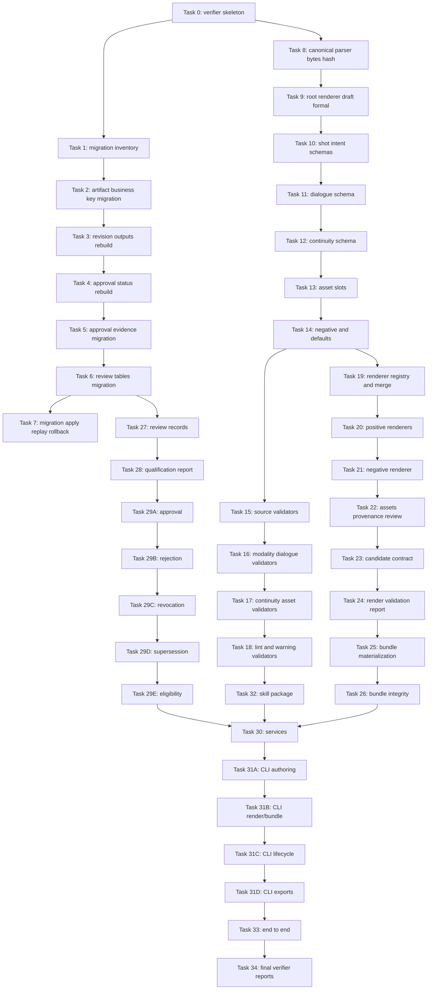

# Phase 3 Shot Prompt Canonical Foundation Implementation Plan

> **For agentic workers:** REQUIRED SUB-SKILL: Use superpowers:subagent-driven-development (recommended) or superpowers:executing-plans to implement this plan task-by-task. Steps use checkbox (`- [ ]`) syntax for tracking.

**Goal:** Build the Phase 3 Shot Prompt Canonical Foundation from an approved and fresh Storyboard Revision through deterministic prompt rendering, bundle integrity, review, qualification, approval, and live Phase 4 eligibility checks.

**Architecture:** Extend the current Phase 0-2 Artifact, Revision, Dependency, Validation, Bundle, Approval, Gate, Export, and Skill package patterns. Keep `revisions.content_object_id` as canonical authority, candidate render objects outside formal `revision_outputs`, Approval Qualification outside the Content Bundle, and Phase 4 execution outside this phase. Dependency direction is `store -> canonical/renderer/integrity -> validators -> services -> cli`; validators do not import `RuntimeService`.

**Tech Stack:** Python, SQLite, pytest, argparse CLI, existing `ai_drama_runtime` Store/Runtime/Skill architecture, deterministic JSON serialization, SHA-256 content-addressed object storage, repository-local verifier scripts.

---

Plan Status: IMPLEMENTATION_PLAN_PENDING_USER_REVIEW
Implementation: IMPLEMENTATION_NOT_AUTHORIZED
Phase 4: PHASE4_NOT_AUTHORIZED

## Source Baseline

- Branch: `test/phase2-minimal-bundle-foundation`
- Design Approval Baseline: `b178f8eabe4a0e7474e27d7225f76355e743b373`
- Implementation Plan Baseline: `d2df5b615e4a291f9b81128df101c8dd15ebb512`
- Future Implementation Start Commit: supplied at execution time through `--execution-start-commit <IMPLEMENTATION_AUTHORIZATION_COMMIT>`
- Approved Design Spec: `docs/superpowers/specs/2026-07-01-phase3-shot-prompt-canonical-design.md`
- Design status verified: `Document Status: DESIGN_SPEC_APPROVED`
- Planning authorization verified: `Implementation Planning: IMPLEMENTATION_PLANNING_AUTHORIZED`
- Implementation state verified: `Implementation: IMPLEMENTATION_NOT_AUTHORIZED`
- This plan does not implement code, database changes, migrations, tests, skill changes, generation, asset binding, Phase 4 work, or push.

The Design Approval Commit, this Implementation Plan Commit, and the future Implementation Start Commit are distinct. The Phase 3 verifier final mode must require the future Implementation Start Commit as a runtime argument. It must not hard-code the implementation authorization point in source.

## Repository Evidence Read

- Runtime and Store: `ai_drama_runtime/store.py`, `ai_drama_runtime/services.py`, `ai_drama_runtime/validators.py`, `ai_drama_runtime/cli.py`
- Storyboard foundation: `ai_drama_runtime/storyboard_canonical.py`, `ai_drama_runtime/storyboard_renderer.py`, `ai_drama_runtime/storyboard_migration.py`
- Skill loader and registry: `ai_drama_runtime/manifest.py`, `ai_drama_runtime/registry.py`, `ai_drama_runtime/request.py`
- Verification pattern: `tools/verify_phase2_minimal_bundle_foundation.py`
- Existing tests: `tests/test_manifest.py`, `tests/test_validator_inventory.py`, `tests/test_storyboard_canonical_serialization.py`, `tests/test_storyboard_canonical_workflow.py`, `tests/test_storyboard_legacy_migration.py`, `tests/test_storyboard_renderer.py`, `tests/test_storyboard_workflow.py`, `tests/test_validators_approval_export.py`, `tests/test_runtime_lifecycle.py`, `tests/test_cli.py`, `tests/test_phase1_verifier.py`, `tests/test_phase2_verifier.py`, `tests/acceptance/test_storyboard_workflow_acceptance.py`
- Protected upstream skill: `skills/ai-drama-storyboard-design-skill/v0.2.1/skill.json`

## Normative Phase 3 Constants And Field Names

All tasks, tests, fixtures, golden files, Skill metadata, CLI output, verifier checks, and migration constants use these values exactly.

```text
artifact_type = shot_prompt_set
schema_version = shot-prompt-canonical-v1
content_profile = shot-prompt-canonical-v1
canonical_parser_version = shot-prompt-canonical-json-v1
renderer.profile_id = shot_prompt_standard
renderer.version = 1.0.0
renderer_id = shot-prompt-renderer
renderer_version = 1.0.0
qualification_profile_id = shot_prompt_approval_qualification
qualification_profile_version = 1.0.0
```

Canonical root is closed and has no `source` wrapper, no canonical `revision_id`, no root `negative_constraints`, and no root `asset_requirements`:

```json
{
  "schema_version": "shot-prompt-canonical-v1",
  "content_profile": "shot-prompt-canonical-v1",
  "scope": "set",
  "source_storyboard_revision_id": "REV_STORYBOARD_001",
  "render_language": "zh-Hans",
  "renderer": {
    "profile_id": "shot_prompt_standard",
    "version": "1.0.0"
  },
  "set_defaults": {},
  "shots": []
}
```

Dialogue is stored only at `shots[].video_intent.dialogue_intents`. Continuity items use `scope` and plural `purposes`; forbidden examples include `source_scope` and singular `purpose`. Artifact IDs are generated internal IDs, while `(artifact_type, business_key_type, business_key_value)` is the business uniqueness authority.

## File Map

Create:

- `ai_drama_runtime/shot_prompt_canonical.py`: parser, duplicate-key rejection, NFC normalization, deterministic serialization, schema validation, content hash, draft/formal profiles, `append_dedup_strings`, `append_dedup_objects`, and Runtime-derived `slot_id`.
- `ai_drama_runtime/shot_prompt_renderer.py`: exact renderer registry, effective intent merge, positive image/video prompt rendering, dialogue rendering, negative rendering, fixed fact invariants, asset requirements rendering, render provenance, and review markdown.
- `ai_drama_runtime/shot_prompt_bundle.py`: candidate object contract, render validation, validation report candidate, bundle manifest construction, bundle materialization payloads, and bundle integrity pure helpers.
- `ai_drama_runtime/shot_prompt_migration.py`: SQLite inventory, deterministic preview, apply, replay, rollback behavior, and table rebuild helpers.
- `tools/verify_phase3_shot_prompt_canonical_foundation.py`: portable/final verifier with explicit execution start commit contract and verification report generation.
- `tests/fixtures/shot_prompt_canonical/minimal_storyboard.json`: minimal approved Storyboard source fixture.
- `tests/fixtures/shot_prompt_canonical/valid_draft_shared_only.json`: Draft fixture with `shared_intent` only.
- `tests/fixtures/shot_prompt_canonical/valid_formal_mixed_modalities.json`: Formal fixture with image-only, video-only, and dual-modality shots.
- `tests/fixtures/shot_prompt_canonical/invalid_duplicate_key.json`: duplicate-key fixture.
- `tests/fixtures/shot_prompt_canonical/invalid_slot_id_authored.json`: authored `slot_id` rejection fixture.
- `tests/golden/shot_prompt_renderer/rendered-positive-prompts.json`: deterministic positive prompt golden.
- `tests/golden/shot_prompt_renderer/rendered-negative-prompts.json`: deterministic negative prompt golden.
- `tests/golden/shot_prompt_renderer/asset-requirements.json`: deterministic asset requirement golden with derived `slot_id`.
- `tests/golden/shot_prompt_renderer/render-provenance.json`: minimal provenance golden.
- `tests/golden/shot_prompt_renderer/review.md`: deterministic review surface golden.
- `tests/test_phase3_verifier.py`: verifier mode, allowlist, protected-file, report, and leakage tests.
- `tests/test_shot_prompt_store_migration.py`: inventory, preview, apply, replay, table rebuild, FK, CHECK, unique index, and rollback tests.
- `tests/test_shot_prompt_canonical_parser.py`: parser, duplicate key, NFC bytes, hash, root, renderer lock, draft/formal, and forbidden field tests.
- `tests/test_shot_prompt_canonical_schema.py`: shot, intent, dialogue, continuity, asset slot, negative constraint, set-default, and merge tests.
- `tests/test_shot_prompt_validators.py`: runtime-native validator dispatch and persisted validation results.
- `tests/test_shot_prompt_renderer.py`: renderer registry, merge, positive, video, dialogue, negative, asset, provenance, review, and golden tests.
- `tests/test_shot_prompt_bundle.py`: candidate object contract, render validation, validation report, materialization, atomic rollback, and integrity tests.
- `tests/test_shot_prompt_review_records.py`: review records and append-only event lifecycle tests.
- `tests/test_shot_prompt_approval_lifecycle.py`: qualification, evidence, approval, rejection, revocation, supersession, and eligibility tests.
- `tests/test_shot_prompt_cli.py`: command surface, JSON stdout, stderr, exit code, side effects, and rejected option tests.
- `tests/test_shot_prompt_skill_package.py`: skill package loader, validator declarations, profile, schema, contract, and package hash tests.
- `tests/test_shot_prompt_end_to_end.py`: happy path, supersession, revoke, source stale, bundle tamper, and eligibility tests.
- `skills/ai-drama-shot-prompt-canonical-skill/v0.1.0/skill.json`: Phase 3 skill package metadata using the existing loader schema.
- `skills/ai-drama-shot-prompt-canonical-skill/v0.1.0/SKILL.md`: agent-facing Phase 3 authoring instructions.
- `skills/ai-drama-shot-prompt-canonical-skill/v0.1.0/README.md`: package README.
- `skills/ai-drama-shot-prompt-canonical-skill/v0.1.0/contracts/shot-prompt-canonical-contract-v1.md`: canonical authoring contract.
- `skills/ai-drama-shot-prompt-canonical-skill/v0.1.0/schemas/shot-prompt-canonical.schema.json`: Draft/Formal schema.
- `skills/ai-drama-shot-prompt-canonical-skill/v0.1.0/validators/runtime_native.py`: real entrypoint file declared by runtime-native validators.
- `reports/phase3-shot-prompt-canonical-verification.json`: generated verification report.
- `reports/phase3-shot-prompt-canonical-verification.md`: generated verification summary.

Modify:

- `ai_drama_runtime/store.py`: DDL, dataclasses, migrations, Store records, insert/read APIs, review records, approval evidence, and transactions.
- `ai_drama_runtime/services.py`: Shot Prompt orchestration, canonical byte storage, render candidate flow, bundle materialization, review, qualification, lifecycle, eligibility, and export blocking.
- `ai_drama_runtime/validators.py`: runtime-native Shot Prompt validator dispatch without importing `RuntimeService`.
- `ai_drama_runtime/cli.py`: explicit `shot-prompts` command surface using existing argparse and exit-code style.
- `ai_drama_runtime/manifest.py`: allow the new shot prompt execution profile while preserving storyboard profile validation.
- `ai_drama_runtime/runtime.py`: add mock canonical Shot Prompt response only for Phase 3 tests.
- `ai_drama_runtime/request.py`: add Shot Prompt runtime request construction using existing Skill package metadata.

Protected files:

- `docs/superpowers/specs/2026-07-01-phase3-shot-prompt-canonical-design.md`
- `docs/superpowers/plans/2026-07-02-phase3-shot-prompt-canonical-implementation.md`
- `skills/ai-drama-storyboard-design-skill/v0.2.1/skill.json`
- `docs/superpowers/specs/2026-06-28-storyboard-canonical-shot-prompt-foundation-design.md`
- `docs/superpowers/specs/2026-06-29-phase-1-agent-execution-acceptance-contract.md`
- `docs/superpowers/specs/2026-06-29-phase-2-minimal-bundle-foundation-design.md`
- `docs/superpowers/specs/2026-06-29-phase-2-agent-execution-acceptance-contract.md`
- Phase 0-2 release artifacts under existing protected report and skill package paths.

Verifier allowlist exact files:

- All Create and Modify files in this File Map.
- `reports/phase3-shot-prompt-canonical-verification.json`
- `reports/phase3-shot-prompt-canonical-verification.md`

Verifier allowlist controlled prefixes:

- `tests/fixtures/shot_prompt_canonical/`
- `tests/golden/shot_prompt_renderer/`
- `skills/ai-drama-shot-prompt-canonical-skill/v0.1.0/`

No allowlist entry permits the full repository.

## Symbol Definition Index

| Symbol | First definition Task | File | Later caller Tasks |
| --- | --- | --- | --- |
| `parse_shot_prompt_json` | Task 8 | `ai_drama_runtime/shot_prompt_canonical.py` | Tasks 9-18, 30, 33 |
| `serialize_shot_prompt_json` | Task 8 | `ai_drama_runtime/shot_prompt_canonical.py` | Tasks 9, 15, 30, 34 |
| `shot_prompt_content_hash` | Task 8 | `ai_drama_runtime/shot_prompt_canonical.py` | Tasks 22, 24, 28, 30, 34 |
| `validate_shot_prompt_canonical` | Task 9 | `ai_drama_runtime/shot_prompt_canonical.py` | Tasks 10-18, 20-24, 30 |
| `append_dedup_strings` | Task 14 | `ai_drama_runtime/shot_prompt_canonical.py` | Tasks 19-22 |
| `append_dedup_objects` | Task 14 | `ai_drama_runtime/shot_prompt_canonical.py` | Tasks 19-22 |
| `derive_slot_id` | Task 13 | `ai_drama_runtime/shot_prompt_canonical.py` | Task 22 |
| `merge_effective_intent` | Task 19 | `ai_drama_runtime/shot_prompt_renderer.py` | Tasks 20-22 |
| `render_image_positive_prompts` | Task 20 | `ai_drama_runtime/shot_prompt_renderer.py` | Tasks 23-24 |
| `render_video_positive_prompts` | Task 20 | `ai_drama_runtime/shot_prompt_renderer.py` | Tasks 23-24 |
| `render_dialogue_intents` | Task 20 | `ai_drama_runtime/shot_prompt_renderer.py` | Tasks 23-24 |
| `render_negative_prompts` | Task 21 | `ai_drama_runtime/shot_prompt_renderer.py` | Tasks 23-24 |
| `render_asset_requirements` | Task 22 | `ai_drama_runtime/shot_prompt_renderer.py` | Tasks 23-26 |
| `render_provenance` | Task 22 | `ai_drama_runtime/shot_prompt_renderer.py` | Tasks 23-26, 28 |
| `render_review_markdown` | Task 22 | `ai_drama_runtime/shot_prompt_renderer.py` | Tasks 23-26, 27 |
| `build_candidate_object_set` | Task 23 | `ai_drama_runtime/shot_prompt_bundle.py` | Tasks 24-26, 30 |
| `validate_render_candidates` | Task 24 | `ai_drama_runtime/shot_prompt_bundle.py` | Tasks 25-26, 30 |
| `build_bundle_manifest` | Task 25 | `ai_drama_runtime/shot_prompt_bundle.py` | Tasks 26, 28, 30 |
| `verify_bundle_integrity` | Task 26 | `ai_drama_runtime/shot_prompt_bundle.py` | Tasks 28, 30, 34 |
| `ShotPromptApprovalEvidence` | Task 29A | `ai_drama_runtime/services.py` | Tasks 29A, 33 |
| `qualify_shot_prompt_revision` | Task 28 | `ai_drama_runtime/services.py` | Tasks 29, 31, 33 |
| `approve_shot_prompt_revision` | Task 29A/29D | `ai_drama_runtime/services.py` | Tasks 31C, 33 |
| `reject_shot_prompt_revision` | Task 29B | `ai_drama_runtime/services.py` | Tasks 31C, 33 |
| `revoke_shot_prompt_approval` | Task 29C | `ai_drama_runtime/services.py` | Tasks 31C, 33 |
| `shot_prompt_phase4_eligibility` | Task 29E | `ai_drama_runtime/services.py` | Tasks 31C, 33, 34 |
| `validate_shot_prompt_revision` | Task 30 | `ai_drama_runtime/services.py` | Tasks 31A, 33 |
| `validate_shot_prompt_render` | Task 30 | `ai_drama_runtime/services.py` | Tasks 31B, 33 |
| `export_shot_prompt_execution` | Task 30 | `ai_drama_runtime/services.py` | Tasks 31D, 33 |

## Frozen Contracts

### Dependency Direction

```text
store.py
↑
shot_prompt_canonical.py / shot_prompt_renderer.py / shot_prompt_bundle.py / shot_prompt_migration.py
↑
validators.py
↑
services.py
↑
cli.py
```

`validators.py` must not import `RuntimeService`. Bundle Integrity logic lives in `shot_prompt_bundle.py` and is called by both validators and services.

## Task-Local Executability Rules

Every implementation task must pass these checks before its commit:

1. Every public symbol used by a test is defined in that task or a listed dependency task.
2. Step 3 implements the public API directly exercised by Step 1.
3. Step 3 includes internal helpers used by that public API.
4. No task imports files planned only by a future task.
5. The focused test can pass at task end without waiting for a later task.
6. The task title, test, implementation, regression, and commit message describe the same behavior.

Known ordering corrections:

- `merge_effective_intent` is defined in Task 19 before positive rendering calls it.
- `_prompt_text` and dialogue rendering helpers are defined in Task 20 before golden positive rendering asserts their output.
- `_negative_item` is defined in Task 21 before negative rendering tests assert invariant coverage.
- Candidate rendering in Task 23 is pure object-set construction; Service orchestration waits until Task 30.
- Task 24 returns a concrete render validation report candidate object, not a loose dict.
- Task 25 owns the atomic formal `revision_outputs` materialization transaction.
- Task 27 implements Store and Service review APIs before CLI tests call them.
- Approval, reject, revoke, supersession, and eligibility are implemented as separate Tasks 29A-29E.
- CLI parser and handlers are implemented as separate Tasks 31A-31D.

### Verifier Modes

```text
portable:
- no fixed branch requirement
- no execution start ancestor requirement
- runs functional tests and static boundary checks

final:
- requires target branch test/phase2-minimal-bundle-foundation
- requires --execution-start-commit
- requires clean tree
- checks execution start commit is HEAD ancestor
- checks changed files against exact allowlist plus controlled prefixes
- checks protected files are unchanged from execution start commit
- runs all portable checks
```

The verification report records `execution_start_commit`, `code_head_at_report_generation`, Design Spec hash, Plan hash, verifier version, changed files, protected files, command results, acceptance matrix, and `no_phase4_execution=true`. The final HEAD is not a self-referential required report field; the report is evidence generated by the verifier against the code head visible when the verifier ran.

### Candidate Object Set

```python
@dataclass(frozen=True)
class ShotPromptCandidateObject:
    filename: str
    object_id: str
    content_hash: str
    media_type: str
    generator: str
    generator_version: str
    canonical_content_hash: str
    renderer_profile_id: str
    renderer_profile_version: str
```

Candidate objects are written to the object store and returned by services. Render and Render Validation do not write formal `revision_outputs`.

### Phase 3 Logical Types

```python
PHASE3_REVISION_OUTPUT_TYPES = {
    "shot_prompt_positive_prompts",
    "shot_prompt_negative_prompts",
    "shot_prompt_asset_requirements",
    "shot_prompt_render_provenance",
    "shot_prompt_review_markdown",
    "shot_prompt_validation_report",
    "bundle_manifest",
}
```

Existing earlier values stay accepted by the Store.

### Runtime-Native Validator IDs

```python
SHOT_PROMPT_VALIDATORS = {
    "shot_prompt_source_eligibility": ("ERROR", True),
    "shot_prompt_dependency_binding": ("ERROR", True),
    "shot_prompt_full_shot_coverage": ("ERROR", True),
    "shot_prompt_storyboard_fact_read_only": ("ERROR", True),
    "shot_prompt_current_shot_membership": ("ERROR", True),
    "shot_prompt_modality_completeness": ("ERROR", True),
    "shot_prompt_dialogue_coverage": ("ERROR", True),
    "shot_prompt_dialogue_consistency": ("ERROR", True),
    "shot_prompt_continuity": ("ERROR", True),
    "shot_prompt_asset_slots": ("ERROR", True),
    "shot_prompt_platform_neutrality": ("ERROR", True),
    "shot_prompt_forbidden_fields": ("ERROR", True),
    "shot_prompt_language_consistency_lint": ("WARNING", False),
    "shot_prompt_high_risk_asset_warning": ("WARNING", False),
    "shot_prompt_render_validation": ("ERROR", True),
    "shot_prompt_bundle_integrity": ("ERROR", True),
    "shot_prompt_approval_qualification": ("ERROR", True),
}
```

Each validator persists a `validation_results` row with deterministic JSON report bytes.

### Required CLI Surface

```text
shot-prompts create-revision
shot-prompts validate --profile draft|formal
shot-prompts render
shot-prompts validate-render
shot-prompts materialize-bundle
shot-prompts check-integrity
shot-prompts review-open
shot-prompts review-event
shot-prompts review-status
shot-prompts qualify
shot-prompts approve
shot-prompts reject
shot-prompts revoke
shot-prompts eligibility
shot-prompts export-formal
shot-prompts export-diagnostic
shot-prompts export-execution
```

CLI v1 rejects partial selectors, `asset_id`, URL, filesystem path binding, upload ID, platform parameters, waiver input, and exact timecodes.

## Task Dependency Graph



Parallel rules:

- Tasks 1-7 are Store and migration tasks and must run in numeric order because they modify `store.py` and `shot_prompt_migration.py`.
- Tasks 8-14 are canonical schema tasks and must run in numeric order because they modify `shot_prompt_canonical.py`.
- Tasks 15-18 are validator tasks and must run in numeric order because they modify `validators.py`.
- Tasks 19-22 are renderer tasks and must run in numeric order because they modify `shot_prompt_renderer.py`.
- Task 27 can run after Task 6 without waiting for renderer work.
- Task 32 can run after Task 18 because Skill declarations depend on validator IDs.
- Task 30 waits for Task 32 because Runtime Service creation records and verifies the real Skill package hash.
- No two tasks that modify the same file run in parallel.

## Commit Strategy

- Task 0: `test: add phase 3 verifier skeleton`
- Task 1: `test: add phase 3 migration inventory preview`
- Task 2: `feat: add shot prompt artifact business key migration`
- Task 3: `feat: rebuild revision outputs for shot prompt types`
- Task 4: `feat: rebuild revision approval status checks`
- Task 5: `feat: add shot prompt approval evidence columns`
- Task 6: `feat: add shot prompt review tables`
- Task 7: `test: cover shot prompt migration replay rollback`
- Task 8: `feat: add shot prompt canonical parser bytes`
- Task 9: `feat: validate shot prompt root renderer profiles`
- Task 10: `feat: validate shot prompt intent schemas`
- Task 11: `feat: validate shot prompt dialogue contract`
- Task 12: `feat: validate shot prompt continuity contract`
- Task 13: `feat: validate shot prompt asset slots`
- Task 14: `feat: validate shot prompt defaults and negatives`
- Task 15: `feat: add shot prompt source validators`
- Task 16: `feat: add shot prompt modality dialogue validators`
- Task 17: `feat: add shot prompt continuity asset validators`
- Task 18: `feat: add shot prompt lint validators`
- Task 19: `feat: add shot prompt renderer registry merge`
- Task 20: `feat: render shot prompt positive outputs`
- Task 21: `feat: render shot prompt negative outputs`
- Task 22: `feat: render shot prompt assets provenance review`
- Task 23: `feat: define shot prompt candidate objects`
- Task 24: `feat: validate shot prompt render candidates`
- Task 25: `feat: materialize shot prompt bundle`
- Task 26: `feat: verify shot prompt bundle integrity`
- Task 27: `feat: add shot prompt review records`
- Task 28: `feat: write shot prompt qualification reports`
- Task 29A: `feat: approve shot prompt revisions`
- Task 29B: `feat: reject shot prompt revisions`
- Task 29C: `feat: revoke shot prompt approvals`
- Task 29D: `feat: supersede approved shot prompt revisions`
- Task 29E: `feat: compute shot prompt live eligibility`
- Task 32: `feat: add shot prompt canonical skill package`
- Task 30: `feat: orchestrate shot prompt runtime services`
- Task 31A: `feat: add shot prompt authoring cli`
- Task 31B: `feat: add shot prompt bundle cli`
- Task 31C: `feat: add shot prompt review lifecycle cli`
- Task 31D: `feat: add shot prompt export cli`
- Task 33: `test: add shot prompt end to end coverage`
- Task 34: `test: add shot prompt final verification`

## Tasks

### Task 0: Phase 3 Verifier Skeleton

**Depends on:** None

**Files:**
- Create: `tools/verify_phase3_shot_prompt_canonical_foundation.py`
- Create: `tests/test_phase3_verifier.py`
- Test: `tests/test_phase3_verifier.py`
- Verify: `python3 -m pytest tests/test_phase3_verifier.py -q`

**Design requirements covered:**
- Design Section 17 verification command requirement
- P01 verifier skeleton, allowlist, protected files, portable/final modes

- [ ] **Step 1: Write the failing test**

```python
def test_final_mode_requires_execution_start_commit(monkeypatch):
    verifier = _load_verifier_module()
    assert verifier.main(["--mode", "final"]) == 2

def test_portable_mode_and_print_results_are_task_local(monkeypatch):
    verifier = _load_verifier_module()
    assert verifier.main(["--mode", "portable"]) == 0
    assert verifier._print_results([verifier.CheckResult("x", False, "bad")]) == 1
```

- [ ] **Step 2: Run the focused test and verify failure**

Run:

```bash
python3 -m pytest tests/test_phase3_verifier.py::test_final_mode_requires_execution_start_commit -q
```

Expected:

```text
FAIL with FileNotFoundError for tools/verify_phase3_shot_prompt_canonical_foundation.py
```

- [ ] **Step 3: Implement the minimal production change**

```python
@dataclass(frozen=True)
class CheckResult:
    name: str
    ok: bool
    evidence: str
    expected: str = ""
    actual: str = ""

def _run(args, *, env=None):
    return subprocess.run(args, cwd=REPO_ROOT, text=True, stdout=subprocess.PIPE, stderr=subprocess.PIPE, env=env)

def portable_checks():
    status = _run(["git", "status", "--short"]).stdout.strip()
    return [CheckResult("portable_working_tree_known", True, status or "clean")]

def final_checks(execution_start_commit):
    branch = _run(["git", "branch", "--show-current"]).stdout.strip()
    status = _run(["git", "status", "--short"]).stdout.strip()
    ancestor = _run(["git", "merge-base", "--is-ancestor", execution_start_commit, "HEAD"])
    return portable_checks() + [
        CheckResult("branch", branch == "test/phase2-minimal-bundle-foundation", branch),
        CheckResult("execution_start_ancestor", ancestor.returncode == 0, "exit=%s" % ancestor.returncode),
        CheckResult("working_tree_clean", status == "", status or "clean"),
    ]

def _print_results(results):
    failures = [item for item in results if not item.ok]
    for item in results:
        print("%s=%s" % (item.name, item.evidence))
    return 1 if failures else 0

def main(argv=None):
    parser = argparse.ArgumentParser()
    parser.add_argument("--mode", choices=["portable", "final"], default="portable")
    parser.add_argument("--execution-start-commit", default="")
    parser.add_argument("--report-json", default="reports/phase3-shot-prompt-canonical-verification.json")
    parser.add_argument("--report-md", default="reports/phase3-shot-prompt-canonical-verification.md")
    args = parser.parse_args(argv)
    if args.mode == "final" and not args.execution_start_commit:
        print("final mode requires --execution-start-commit", file=sys.stderr)
        return 2
    results = portable_checks() if args.mode == "portable" else final_checks(args.execution_start_commit)
    return _print_results(results)
```

- [ ] **Step 4: Run the focused test**

Run:

```bash
python3 -m pytest tests/test_phase3_verifier.py::test_final_mode_requires_execution_start_commit -q
```

Expected:

```text
1 passed
```

- [ ] **Step 5: Run related regression tests**

Run:

```bash
python3 -m pytest tests/test_phase2_verifier.py -q
```

Expected:

```text
all selected tests pass
```

- [ ] **Step 6: Commit**

```bash
git add tools/verify_phase3_shot_prompt_canonical_foundation.py tests/test_phase3_verifier.py
git commit -m "test: add phase 3 verifier skeleton"
```

### Task 1: Migration Inventory And Preview

**Depends on:** Task 0

**Files:**
- Create: `ai_drama_runtime/shot_prompt_migration.py`
- Create: `tests/test_shot_prompt_store_migration.py`
- Test: `tests/test_shot_prompt_store_migration.py`
- Verify: `python3 -m pytest tests/test_shot_prompt_store_migration.py::test_phase3_migration_preview_is_deterministic -q`

**Design requirements covered:**
- Design Section 15 Store and Migration Requirements
- P02 migration inventory and deterministic preview

- [ ] **Step 1: Write the failing test**

```python
def test_phase3_migration_preview_is_deterministic(tmp_path):
    db_path = tmp_path / "runtime.db"
    _create_phase2_legacy_db(db_path)
    first = preview_phase3_store_migration(db_path)
    second = preview_phase3_store_migration(db_path)
    assert first == second
    assert first["mode"] == "preview"
    assert first["tables"]["revision_outputs"]["needs_rebuild"] is True
    assert first["tables"]["artifacts"]["missing_columns"] == ["business_key_type", "business_key_value"]
```

- [ ] **Step 2: Run the focused test and verify failure**

Run:

```bash
python3 -m pytest tests/test_shot_prompt_store_migration.py::test_phase3_migration_preview_is_deterministic -q
```

Expected:

```text
FAIL with ImportError for preview_phase3_store_migration
```

- [ ] **Step 3: Implement the minimal production change**

```python
def _table_sql(conn, name):
    row = conn.execute("SELECT sql FROM sqlite_master WHERE type = 'table' AND name = ?", (name,)).fetchone()
    return row[0] if row else ""

def _table_info(conn, name):
    return [dict(row) for row in conn.execute("PRAGMA table_info(%s)" % name).fetchall()]

def _foreign_keys(conn, name):
    return [dict(row) for row in conn.execute("PRAGMA foreign_key_list(%s)" % name).fetchall()]

def _indexes(conn, name):
    return [dict(row) for row in conn.execute("PRAGMA index_list(%s)" % name).fetchall()]

def preview_phase3_store_migration(db_path):
    conn = sqlite3.connect(str(db_path))
    conn.row_factory = sqlite3.Row
    try:
        artifacts = {row["name"] for row in conn.execute("PRAGMA table_info(artifacts)").fetchall()}
        output_sql = _table_sql(conn, "revision_outputs")
        return {
            "mode": "preview",
            "single_transaction_owner": "apply_phase3_store_migration",
            "tables": {
                "artifacts": {"missing_columns": [c for c in ["business_key_type", "business_key_value"] if c not in artifacts]},
                "revision_outputs": {"needs_rebuild": "shot_prompt_positive_prompts" not in output_sql},
                "revisions": {"needs_rebuild": "revoked" not in _table_sql(conn, "revisions")},
                "approval_records": {"needs_evidence": "qualification_report_hash" not in {r["name"] for r in conn.execute("PRAGMA table_info(approval_records)").fetchall()}},
                "review_records": {"missing": _table_sql(conn, "review_records") == ""},
                "review_record_events": {"missing": _table_sql(conn, "review_record_events") == ""},
            },
        }
    finally:
        conn.close()
```

- [ ] **Step 4: Run the focused test**

Run:

```bash
python3 -m pytest tests/test_shot_prompt_store_migration.py::test_phase3_migration_preview_is_deterministic -q
```

Expected:

```text
1 passed
```

- [ ] **Step 5: Run related regression tests**

Run:

```bash
python3 -m pytest tests/test_storyboard_legacy_migration.py -q
```

Expected:

```text
all selected tests pass
```

- [ ] **Step 6: Commit**

```bash
git add ai_drama_runtime/shot_prompt_migration.py tests/test_shot_prompt_store_migration.py
git commit -m "test: add phase 3 migration inventory preview"
```

### Task 2: Artifact Business Key Migration

**Depends on:** Task 1

**Files:**
- Modify: `ai_drama_runtime/store.py:RuntimeStore._init_schema`
- Modify: `ai_drama_runtime/shot_prompt_migration.py:apply_phase3_store_migration`
- Test: `tests/test_shot_prompt_store_migration.py`
- Verify: `python3 -m pytest tests/test_shot_prompt_store_migration.py::test_artifact_business_key_migration_preserves_legacy_rows -q`

**Design requirements covered:**
- Acceptance Criterion 1
- P02 artifact business key migration

- [ ] **Step 1: Write the failing test**

```python
def test_artifact_business_key_migration_preserves_legacy_rows(tmp_path):
    db_path = tmp_path / "runtime.db"
    _create_phase2_legacy_db(db_path)
    apply_phase3_store_migration(db_path)
    with RuntimeStore(db_path, tmp_path / "objects") as store:
        columns = _columns(store, "artifacts")
        assert {"business_key_type", "business_key_value"} <= columns
        assert store.artifacts()[0]["artifact_id"] == "legacy-storyboard-artifact"
        store.ensure_shot_prompt_artifact("source-rev-1", "project-1", "chapter-1")
        store.ensure_shot_prompt_artifact("source-rev-1", "project-1", "chapter-1")
        rows = [row for row in store.artifacts() if row["artifact_type"] == "shot_prompt_set"]
        assert len(rows) == 1
        assert not rows[0]["artifact_id"].startswith("shot-prompt-set-")
        second = store.ensure_shot_prompt_artifact("source-rev-2", "project-1", "chapter-1")
        assert second["artifact_id"] != rows[0]["artifact_id"]
```

- [ ] **Step 2: Run the focused test and verify failure**

Run:

```bash
python3 -m pytest tests/test_shot_prompt_store_migration.py::test_artifact_business_key_migration_preserves_legacy_rows -q
```

Expected:

```text
FAIL because RuntimeStore has no ensure_shot_prompt_artifact
```

- [ ] **Step 3: Implement the minimal production change**

```python
def ensure_shot_prompt_artifact(self, source_storyboard_revision_id, project_id, chapter_id):
    existing = self.artifact_by_business_key("shot_prompt_set", "source_storyboard_revision_id", source_storyboard_revision_id)
    if existing:
        return existing
    artifact_id = uuid.uuid4().hex
    try:
        self.conn.execute(
            """
            INSERT INTO artifacts
            (artifact_id, artifact_type, project_id, chapter_id, business_key_type, business_key_value, created_at)
            VALUES (?, 'shot_prompt_set', ?, ?, 'source_storyboard_revision_id', ?, ?)
            """,
            (artifact_id, project_id, chapter_id, source_storyboard_revision_id, now_iso()),
        )
        self.conn.commit()
    except sqlite3.IntegrityError:
        self.conn.rollback()
    row = self.conn.execute(
        """
        SELECT * FROM artifacts
        WHERE artifact_type = 'shot_prompt_set'
          AND business_key_type = 'source_storyboard_revision_id'
          AND business_key_value = ?
        """,
        (source_storyboard_revision_id,),
    ).fetchone()
    return dict(row)

def artifact_by_business_key(self, artifact_type, business_key_type, business_key_value):
    row = self.conn.execute(
        """
        SELECT * FROM artifacts
        WHERE artifact_type = ?
          AND business_key_type = ?
          AND business_key_value = ?
        """,
        (artifact_type, business_key_type, business_key_value),
    ).fetchone()
    return dict(row) if row else None
```

- [ ] **Step 4: Run the focused test**

Run:

```bash
python3 -m pytest tests/test_shot_prompt_store_migration.py::test_artifact_business_key_migration_preserves_legacy_rows -q
```

Expected:

```text
1 passed
```

- [ ] **Step 5: Run related regression tests**

Run:

```bash
python3 -m pytest tests/test_runtime_lifecycle.py tests/test_storyboard_workflow.py -q
```

Expected:

```text
all selected tests pass
```

- [ ] **Step 6: Commit**

```bash
git add ai_drama_runtime/store.py ai_drama_runtime/shot_prompt_migration.py tests/test_shot_prompt_store_migration.py
git commit -m "feat: add shot prompt artifact business key migration"
```

### Task 3: Revision Outputs Table Rebuild

**Depends on:** Task 2

**Files:**
- Modify: `ai_drama_runtime/store.py:RuntimeStore._ensure_columns`
- Modify: `ai_drama_runtime/shot_prompt_migration.py:_rebuild_revision_outputs`
- Test: `tests/test_shot_prompt_store_migration.py`
- Verify: `python3 -m pytest tests/test_shot_prompt_store_migration.py::test_revision_outputs_rebuild_preserves_rows_and_adds_phase3_types -q`

**Design requirements covered:**
- Acceptance Criteria 26-30
- P02 revision outputs table rebuild

- [ ] **Step 1: Write the failing test**

```python
def test_revision_outputs_rebuild_preserves_rows_and_adds_phase3_types(tmp_path):
    db_path = tmp_path / "runtime.db"
    _create_phase2_legacy_db_with_revision_output(db_path)
    apply_phase3_store_migration(db_path)
    with RuntimeStore(db_path, tmp_path / "objects") as store:
        table_sql = store.conn.execute("SELECT sql FROM sqlite_master WHERE type='table' AND name='revision_outputs'").fetchone()["sql"]
        assert "rendered_markdown" in table_sql
        assert "shot_prompt_positive_prompts" in table_sql
        assert store.get_revision_output("legacy-revision", "rendered_markdown").content_hash == "legacy-hash"
```

- [ ] **Step 2: Run the focused test and verify failure**

Run:

```bash
python3 -m pytest tests/test_shot_prompt_store_migration.py::test_revision_outputs_rebuild_preserves_rows_and_adds_phase3_types -q
```

Expected:

```text
FAIL because the CHECK does not include shot_prompt_positive_prompts
```

- [ ] **Step 3: Implement the minimal production change**

```python
REVISION_OUTPUT_LOGICAL_TYPES = (
    "rendered_positive_prompt",
    "rendered_negative_prompt",
    "rendered_markdown",
    "shot_prompt_positive_prompts",
    "shot_prompt_negative_prompts",
    "shot_prompt_asset_requirements",
    "shot_prompt_render_provenance",
    "shot_prompt_review_markdown",
    "shot_prompt_validation_report",
    "bundle_manifest",
)

def _rebuild_revision_outputs(conn):
    allowed = ",".join("'%s'" % item for item in REVISION_OUTPUT_LOGICAL_TYPES)
    conn.execute(
        f"""
        CREATE TABLE revision_outputs_new (
          revision_output_id TEXT PRIMARY KEY,
          revision_id TEXT NOT NULL REFERENCES revisions(revision_id) ON DELETE RESTRICT,
          logical_type TEXT NOT NULL CHECK (logical_type IN ({allowed})),
          object_id TEXT NOT NULL,
          content_hash TEXT NOT NULL,
          media_type TEXT NOT NULL,
          generator TEXT NOT NULL,
          generator_version TEXT NOT NULL,
          created_at TEXT NOT NULL,
          UNIQUE(revision_id, logical_type)
        )
        """
    )
    conn.execute("""
        INSERT INTO revision_outputs_new
        (revision_output_id, revision_id, logical_type, object_id, content_hash, media_type, generator, generator_version, created_at)
        SELECT
          revision_output_id, revision_id, logical_type, object_id, content_hash, media_type, generator, generator_version, created_at
        FROM revision_outputs;
    """)
    conn.execute("DROP TABLE revision_outputs")
    conn.execute("ALTER TABLE revision_outputs_new RENAME TO revision_outputs")
    conn.execute("CREATE INDEX revision_outputs_content_hash_idx ON revision_outputs(content_hash)")
    conn.execute("CREATE INDEX revision_outputs_object_id_idx ON revision_outputs(object_id)")
```

- [ ] **Step 4: Run the focused test**

Run:

```bash
python3 -m pytest tests/test_shot_prompt_store_migration.py::test_revision_outputs_rebuild_preserves_rows_and_adds_phase3_types -q
```

Expected:

```text
1 passed
```

- [ ] **Step 5: Run related regression tests**

Run:

```bash
python3 -m pytest tests/test_storyboard_legacy_migration.py tests/test_validators_approval_export.py -q
```

Expected:

```text
all selected tests pass
```

- [ ] **Step 6: Commit**

```bash
git add ai_drama_runtime/store.py ai_drama_runtime/shot_prompt_migration.py tests/test_shot_prompt_store_migration.py
git commit -m "feat: rebuild revision outputs for shot prompt types"
```

### Task 4: Revision Approval Status Rebuild

**Depends on:** Task 3

**Files:**
- Modify: `ai_drama_runtime/store.py:RuntimeStore._ensure_columns`
- Modify: `ai_drama_runtime/shot_prompt_migration.py:_rebuild_revisions`
- Test: `tests/test_shot_prompt_store_migration.py`
- Verify: `python3 -m pytest tests/test_shot_prompt_store_migration.py::test_revisions_rebuild_adds_revoked_status_and_preserves_current_approved_index -q`

**Design requirements covered:**
- Acceptance Criteria 35-36
- P02 revision approval status migration

- [ ] **Step 1: Write the failing test**

```python
def test_revisions_rebuild_adds_revoked_status_and_preserves_current_approved_index(tmp_path):
    db_path = tmp_path / "runtime.db"
    _create_phase2_legacy_db(db_path)
    preview = preview_phase3_store_migration(db_path)
    assert preview["single_transaction_owner"] == "apply_phase3_store_migration"
    apply_phase3_store_migration(db_path)
    with RuntimeStore(db_path, tmp_path / "objects") as store:
        sql = store.conn.execute("SELECT sql FROM sqlite_master WHERE type='table' AND name='revisions'").fetchone()["sql"]
        assert "revoked" in sql
        indexes = {row["name"] for row in store.conn.execute("PRAGMA index_list(revisions)").fetchall()}
        assert "one_current_approved_revision" in indexes
```

- [ ] **Step 2: Run the focused test and verify failure**

Run:

```bash
python3 -m pytest tests/test_shot_prompt_store_migration.py::test_revisions_rebuild_adds_revoked_status_and_preserves_current_approved_index -q
```

Expected:

```text
FAIL because the revisions table has no approval_status CHECK with revoked
```

- [ ] **Step 3: Implement the minimal production change**

```python
APPROVAL_STATUSES = ("pending", "approved", "rejected", "superseded", "revoked")

def _rebuild_revisions(conn):
    allowed = ",".join("'%s'" % item for item in APPROVAL_STATUSES)
    conn.execute(
        f"""
        CREATE TABLE revisions_new (
          revision_id TEXT PRIMARY KEY,
          artifact_id TEXT NOT NULL,
          artifact_type TEXT NOT NULL,
          project_id TEXT NOT NULL,
          chapter_id TEXT NOT NULL,
          run_id TEXT NOT NULL,
          skill_id TEXT NOT NULL,
          skill_version TEXT NOT NULL,
          skill_package_hash TEXT NOT NULL,
          runtime_provider TEXT NOT NULL,
          runtime_model TEXT NOT NULL,
          number INTEGER NOT NULL,
          content_object_id TEXT NOT NULL,
          content_hash TEXT NOT NULL,
          raw_response_object_id TEXT NOT NULL,
          parser_version TEXT NOT NULL,
          content_profile TEXT NOT NULL DEFAULT '',
          derivation_type TEXT NOT NULL DEFAULT 'model_generation',
          supersedes_revision_id TEXT NOT NULL,
          approval_status TEXT NOT NULL CHECK (approval_status IN ({allowed})),
          created_at TEXT NOT NULL,
          FOREIGN KEY(run_id) REFERENCES runs(run_id)
        )
        """
    )
    conn.execute("""
        INSERT INTO revisions_new (
          revision_id, artifact_id, artifact_type, project_id, chapter_id, run_id,
          skill_id, skill_version, skill_package_hash, runtime_provider, runtime_model,
          number, content_object_id, content_hash, raw_response_object_id, parser_version,
          content_profile, derivation_type, supersedes_revision_id, approval_status, created_at
        )
        SELECT
          revision_id, artifact_id, artifact_type, project_id, chapter_id, run_id,
          skill_id, skill_version, skill_package_hash, runtime_provider, runtime_model,
          number, content_object_id, content_hash, raw_response_object_id, parser_version,
          content_profile, derivation_type, supersedes_revision_id, approval_status, created_at
        FROM revisions
    """)
    conn.execute("DROP TABLE revisions")
    conn.execute("ALTER TABLE revisions_new RENAME TO revisions")
    conn.execute("CREATE UNIQUE INDEX one_current_approved_revision ON revisions(artifact_id) WHERE approval_status = 'approved'")
```

- [ ] **Step 4: Run the focused test**

Run:

```bash
python3 -m pytest tests/test_shot_prompt_store_migration.py::test_revisions_rebuild_adds_revoked_status_and_preserves_current_approved_index -q
```

Expected:

```text
1 passed
```

- [ ] **Step 5: Run related regression tests**

Run:

```bash
python3 -m pytest tests/test_validators_approval_export.py tests/test_approval_ordering_resources.py -q
```

Expected:

```text
all selected tests pass
```

- [ ] **Step 6: Commit**

```bash
git add ai_drama_runtime/store.py ai_drama_runtime/shot_prompt_migration.py tests/test_shot_prompt_store_migration.py
git commit -m "feat: rebuild revision approval status checks"
```

### Task 5: Approval Evidence Migration

**Depends on:** Task 4

**Files:**
- Modify: `ai_drama_runtime/store.py:ApprovalRecord`
- Modify: `ai_drama_runtime/store.py:RuntimeStore._ensure_columns`
- Modify: `ai_drama_runtime/shot_prompt_migration.py:_migrate_approval_records`
- Test: `tests/test_shot_prompt_store_migration.py`
- Verify: `python3 -m pytest tests/test_shot_prompt_store_migration.py::test_approval_evidence_columns_preserve_old_records -q`

**Design requirements covered:**
- Acceptance Criteria 31 and 37
- P02 approval evidence migration

- [ ] **Step 1: Write the failing test**

```python
def test_approval_evidence_columns_preserve_old_records(tmp_path):
    db_path = tmp_path / "runtime.db"
    _create_phase2_legacy_db_with_approval(db_path)
    apply_phase3_store_migration(db_path)
    with RuntimeStore(db_path, tmp_path / "objects") as store:
        approval = store.approval_record("legacy-approval")
        assert approval.qualification_report_hash == ""
        assert approval.bundle_manifest_hash == ""
        assert store.latest_approval("legacy-revision").record_id == "legacy-approval"
```

- [ ] **Step 2: Run the focused test and verify failure**

Run:

```bash
python3 -m pytest tests/test_shot_prompt_store_migration.py::test_approval_evidence_columns_preserve_old_records -q
```

Expected:

```text
FAIL because ApprovalRecord has no qualification_report_hash field
```

- [ ] **Step 3: Implement the minimal production change**

```python
APPROVAL_EVIDENCE_COLUMNS = {
    "source_storyboard_revision_id": "TEXT NOT NULL DEFAULT ''",
    "canonical_content_hash": "TEXT NOT NULL DEFAULT ''",
    "bundle_manifest_hash": "TEXT NOT NULL DEFAULT ''",
    "qualification_report_hash": "TEXT NOT NULL DEFAULT ''",
    "qualification_report_object_id": "TEXT NOT NULL DEFAULT ''",
    "renderer_profile_id": "TEXT NOT NULL DEFAULT ''",
    "renderer_profile_version": "TEXT NOT NULL DEFAULT ''",
    "qualification_profile_id": "TEXT NOT NULL DEFAULT ''",
    "qualification_profile_version": "TEXT NOT NULL DEFAULT ''",
}

@dataclass(frozen=True)
class ApprovalRecord:
    sequence: int
    record_id: str
    revision_id: str
    artifact_id: str
    action: str
    reviewer: str
    note: str
    created_at: str
    source_storyboard_revision_id: str = ""
    canonical_content_hash: str = ""
    bundle_manifest_hash: str = ""
    qualification_report_hash: str = ""
    qualification_report_object_id: str = ""
    renderer_profile_id: str = ""
    renderer_profile_version: str = ""
    qualification_profile_id: str = ""
    qualification_profile_version: str = ""

def _add_approval_evidence_columns(conn):
    existing = {row["name"] for row in conn.execute("PRAGMA table_info(approval_records)").fetchall()}
    for name, ddl in APPROVAL_EVIDENCE_COLUMNS.items():
        if name not in existing:
            conn.execute("ALTER TABLE approval_records ADD COLUMN %s %s" % (name, ddl))

def _approval_from_row(self, row):
    if row is None:
        return None
    data = dict(row)
    for name in APPROVAL_EVIDENCE_COLUMNS:
        data.setdefault(name, "")
    return ApprovalRecord(**data)
```

- [ ] **Step 4: Run the focused test**

Run:

```bash
python3 -m pytest tests/test_shot_prompt_store_migration.py::test_approval_evidence_columns_preserve_old_records -q
```

Expected:

```text
1 passed
```

- [ ] **Step 5: Run related regression tests**

Run:

```bash
python3 -m pytest tests/test_validators_approval_export.py -q
```

Expected:

```text
all selected tests pass
```

- [ ] **Step 6: Commit**

```bash
git add ai_drama_runtime/store.py ai_drama_runtime/shot_prompt_migration.py tests/test_shot_prompt_store_migration.py
git commit -m "feat: add shot prompt approval evidence columns"
```

### Task 6: Review Tables Migration

**Depends on:** Task 5

**Files:**
- Modify: `ai_drama_runtime/store.py`
- Modify: `ai_drama_runtime/shot_prompt_migration.py`
- Create: `tests/test_shot_prompt_review_records.py`
- Test: `tests/test_shot_prompt_store_migration.py`, `tests/test_shot_prompt_review_records.py`
- Verify: `python3 -m pytest tests/test_shot_prompt_store_migration.py::test_review_tables_have_scope_event_checks_and_ordering_indexes -q`

**Design requirements covered:**
- Acceptance Criteria 33-34
- P02 review tables migration

- [ ] **Step 1: Write the failing test**

```python
def test_review_tables_have_scope_event_checks_and_ordering_indexes(tmp_path):
    with RuntimeStore(tmp_path / "runtime.db", tmp_path / "objects") as store:
        review_sql = _table_sql(store, "review_records")
        event_sql = _table_sql(store, "review_record_events")
        assert "scope IN ('set','shot')" in review_sql
        assert "event_type IN ('opened','resolved','reopened','voided')" in event_sql
        assert "review_record_events_review_id_created_event_idx" in _index_names(store, "review_record_events")
```

- [ ] **Step 2: Run the focused test and verify failure**

Run:

```bash
python3 -m pytest tests/test_shot_prompt_store_migration.py::test_review_tables_have_scope_event_checks_and_ordering_indexes -q
```

Expected:

```text
FAIL because review_records does not exist
```

- [ ] **Step 3: Implement the minimal production change**

```sql
CREATE TABLE IF NOT EXISTS review_records (
  review_id TEXT PRIMARY KEY,
  artifact_id TEXT NOT NULL,
  revision_id TEXT NOT NULL,
  scope TEXT NOT NULL CHECK (scope IN ('set','shot')),
  shot_id TEXT,
  body TEXT NOT NULL,
  body_hash TEXT NOT NULL,
  blocking INTEGER NOT NULL CHECK (blocking IN (0,1)),
  created_by TEXT NOT NULL,
  created_at TEXT NOT NULL,
  CHECK ((scope = 'set' AND shot_id IS NULL) OR (scope = 'shot' AND shot_id IS NOT NULL)),
  FOREIGN KEY(revision_id) REFERENCES revisions(revision_id)
);
CREATE TABLE IF NOT EXISTS review_record_events (
  event_id TEXT PRIMARY KEY,
  review_id TEXT NOT NULL,
  event_type TEXT NOT NULL CHECK (event_type IN ('opened','resolved','reopened','voided')),
  actor TEXT NOT NULL,
  note TEXT NOT NULL,
  created_at TEXT NOT NULL,
  FOREIGN KEY(review_id) REFERENCES review_records(review_id)
);
CREATE INDEX IF NOT EXISTS review_records_revision_shot_idx ON review_records(revision_id, shot_id);
CREATE INDEX IF NOT EXISTS review_records_artifact_revision_idx ON review_records(artifact_id, revision_id);
CREATE INDEX IF NOT EXISTS review_record_events_review_id_created_event_idx ON review_record_events(review_id, created_at, event_id);
```

- [ ] **Step 4: Run the focused test**

Run:

```bash
python3 -m pytest tests/test_shot_prompt_store_migration.py::test_review_tables_have_scope_event_checks_and_ordering_indexes -q
```

Expected:

```text
1 passed
```

- [ ] **Step 5: Run related regression tests**

Run:

```bash
python3 -m pytest tests/test_validators_approval_export.py -q
```

Expected:

```text
all selected tests pass
```

- [ ] **Step 6: Commit**

```bash
git add ai_drama_runtime/store.py ai_drama_runtime/shot_prompt_migration.py tests/test_shot_prompt_store_migration.py tests/test_shot_prompt_review_records.py
git commit -m "feat: add shot prompt review tables"
```

### Task 7: Migration Apply Replay Rollback

**Depends on:** Task 6

**Files:**
- Modify: `ai_drama_runtime/shot_prompt_migration.py`
- Modify: `tests/test_shot_prompt_store_migration.py`
- Test: `tests/test_shot_prompt_store_migration.py`
- Verify: `python3 -m pytest tests/test_shot_prompt_store_migration.py::test_phase3_migration_apply_replay_and_rollback -q`

**Design requirements covered:**
- P02 migration apply, replay, rollback tests

- [ ] **Step 1: Write the failing test**

```python
def test_phase3_migration_apply_replay_and_rollback(tmp_path, monkeypatch):
    db_path = tmp_path / "runtime.db"
    _create_phase2_legacy_db(db_path)
    apply_phase3_store_migration(db_path)
    apply_phase3_store_migration(db_path)
    with RuntimeStore(db_path, tmp_path / "objects") as store:
        assert store.conn.execute("PRAGMA foreign_key_check").fetchall() == []
    broken = tmp_path / "broken.db"
    _create_phase2_legacy_db(broken)
    monkeypatch.setattr("ai_drama_runtime.shot_prompt_migration._create_review_tables", _raise_after_revision_rebuild)
    with pytest.raises(RuntimeError):
        apply_phase3_store_migration(broken)
    conn = sqlite3.connect(broken)
    assert conn.execute("SELECT name FROM sqlite_master WHERE name LIKE '%_new'").fetchall() == []
```

- [ ] **Step 2: Run the focused test and verify failure**

Run:

```bash
python3 -m pytest tests/test_shot_prompt_store_migration.py::test_phase3_migration_apply_replay_and_rollback -q
```

Expected:

```text
FAIL because apply rollback leaves a transient table or is not idempotent
```

- [ ] **Step 3: Implement the minimal production change**

```python
def apply_phase3_store_migration(db_path):
    conn = sqlite3.connect(str(db_path))
    conn.row_factory = sqlite3.Row
    try:
        conn.execute("PRAGMA foreign_keys=OFF")
        conn.execute("BEGIN IMMEDIATE")
        _add_artifact_business_key_columns(conn)
        if _revision_outputs_needs_rebuild(conn):
            _rebuild_revision_outputs(conn)
        if _revisions_need_rebuild(conn):
            _rebuild_revisions(conn)
        _add_approval_evidence_columns(conn)
        _create_review_tables(conn)
        fk = conn.execute("PRAGMA foreign_key_check").fetchall()
        if fk:
            raise RuntimeError("foreign key check failed: %s" % fk)
        conn.commit()
    except Exception:
        conn.rollback()
        raise
    finally:
        conn.execute("PRAGMA foreign_keys=ON")
        conn.close()
```

- [ ] **Step 4: Run the focused test**

Run:

```bash
python3 -m pytest tests/test_shot_prompt_store_migration.py::test_phase3_migration_apply_replay_and_rollback -q
```

Expected:

```text
1 passed
```

- [ ] **Step 5: Run related regression tests**

Run:

```bash
python3 -m pytest tests/test_storyboard_legacy_migration.py tests/test_shot_prompt_store_migration.py -q
```

Expected:

```text
all selected tests pass
```

- [ ] **Step 6: Commit**

```bash
git add ai_drama_runtime/shot_prompt_migration.py tests/test_shot_prompt_store_migration.py
git commit -m "test: cover shot prompt migration replay rollback"
```

### Task 8: Canonical Parser Bytes And Hash

**Depends on:** Task 0

**Files:**
- Create: `ai_drama_runtime/shot_prompt_canonical.py`
- Create: `tests/test_shot_prompt_canonical_parser.py`
- Create: `tests/fixtures/shot_prompt_canonical/invalid_duplicate_key.json`
- Test: `tests/test_shot_prompt_canonical_parser.py`
- Verify: `python3 -m pytest tests/test_shot_prompt_canonical_parser.py::test_shot_prompt_parse_rejects_duplicate_keys_and_hashes_exact_bytes -q`

**Design requirements covered:**
- Acceptance Criterion 38
- P03 parser and duplicate-key rejection
- P06 canonical bytes and hash

- [ ] **Step 1: Write the failing test**

```python
def test_shot_prompt_parse_rejects_duplicate_keys_and_hashes_exact_bytes():
    with pytest.raises(ShotPromptCanonicalError, match="duplicate JSON key"):
        parse_shot_prompt_json('{"schema_version":"shot-prompt-canonical-v1","schema_version":"shot-prompt-canonical-v1"}')
    value = {"schema_version": "shot-prompt-canonical-v1", "render_language": "zh-Hans"}
    data = serialize_shot_prompt_json(value)
    assert data == b'{"render_language":"zh-Hans","schema_version":"shot-prompt-canonical-v1"}'
    assert shot_prompt_content_hash(value) == hashlib.sha256(data).hexdigest()
```

- [ ] **Step 2: Run the focused test and verify failure**

Run:

```bash
python3 -m pytest tests/test_shot_prompt_canonical_parser.py::test_shot_prompt_parse_rejects_duplicate_keys_and_hashes_exact_bytes -q
```

Expected:

```text
FAIL with ImportError for ai_drama_runtime.shot_prompt_canonical
```

- [ ] **Step 3: Implement the minimal production change**

```python
import hashlib
import json
import unicodedata

SCHEMA_VERSION = "shot-prompt-canonical-v1"
CONTENT_PROFILE = "shot-prompt-canonical-v1"
SERIALIZATION_VERSION = "canonical-json-v1"
CANONICAL_PARSER_VERSION = "shot-prompt-canonical-json-v1"

class ShotPromptCanonicalError(ValueError):
    def __init__(self, code, message):
        super().__init__("%s: %s" % (code, message))
        self.code = code
        self.safe_message = message

def parse_shot_prompt_json(raw):
    return json.loads(raw, object_pairs_hook=_reject_duplicate_keys, parse_constant=_reject_constant)

def _reject_duplicate_keys(pairs):
    result = {}
    for key, value in pairs:
        if key in result:
            raise ShotPromptCanonicalError("CANONICAL_JSON_DUPLICATE_KEY", "duplicate JSON key: %s" % key)
        result[key] = value
    return result

def _reject_constant(value):
    raise ShotPromptCanonicalError("CANONICAL_JSON_CONSTANT_INVALID", value)

def serialize_shot_prompt_json(value):
    normalized = _normalize(value)
    return json.dumps(normalized, ensure_ascii=False, sort_keys=True, separators=(",", ":"), allow_nan=False).encode("utf-8")

def _normalize(value):
    if isinstance(value, str):
        return unicodedata.normalize("NFC", value)
    if isinstance(value, list):
        return [_normalize(item) for item in value]
    if isinstance(value, dict):
        return {unicodedata.normalize("NFC", key): _normalize(item) for key, item in value.items()}
    return value

def shot_prompt_content_hash(value):
    return hashlib.sha256(serialize_shot_prompt_json(value)).hexdigest()
```

- [ ] **Step 4: Run the focused test**

Run:

```bash
python3 -m pytest tests/test_shot_prompt_canonical_parser.py::test_shot_prompt_parse_rejects_duplicate_keys_and_hashes_exact_bytes -q
```

Expected:

```text
1 passed
```

- [ ] **Step 5: Run related regression tests**

Run:

```bash
python3 -m pytest tests/test_storyboard_canonical_serialization.py -q
```

Expected:

```text
all selected tests pass
```

- [ ] **Step 6: Commit**

```bash
git add ai_drama_runtime/shot_prompt_canonical.py tests/test_shot_prompt_canonical_parser.py tests/fixtures/shot_prompt_canonical/invalid_duplicate_key.json
git commit -m "feat: add shot prompt canonical parser bytes"
```

### Task 9: Root Schema Renderer Lock Draft Formal

**Depends on:** Task 8

**Files:**
- Modify: `ai_drama_runtime/shot_prompt_canonical.py`
- Create: `tests/fixtures/shot_prompt_canonical/valid_draft_shared_only.json`
- Create: `tests/fixtures/shot_prompt_canonical/valid_formal_mixed_modalities.json`
- Test: `tests/test_shot_prompt_canonical_parser.py`
- Verify: `python3 -m pytest tests/test_shot_prompt_canonical_parser.py::test_root_renderer_lock_and_profile_validation -q`

**Design requirements covered:**
- Acceptance Criteria 3-7
- P03 root schema and renderer exact lock

- [ ] **Step 1: Write the failing test**

```python
def test_root_renderer_lock_and_profile_validation():
    draft = _fixture("valid_draft_shared_only.json")
    validate_shot_prompt_canonical(draft, profile="draft")
    assert draft["renderer"] == {"profile_id": "shot_prompt_standard", "version": "1.0.0"}
    bad = dict(draft)
    bad["extra"] = True
    with pytest.raises(ShotPromptCanonicalError, match="additional property"):
        validate_shot_prompt_canonical(bad, profile="draft")
```

- [ ] **Step 2: Run the focused test and verify failure**

Run:

```bash
python3 -m pytest tests/test_shot_prompt_canonical_parser.py::test_root_renderer_lock_and_profile_validation -q
```

Expected:

```text
FAIL because validate_shot_prompt_canonical is not defined
```

- [ ] **Step 3: Implement the minimal production change**

```python
REQUIRED_ROOT_KEYS = ["schema_version", "content_profile", "scope", "source_storyboard_revision_id", "render_language", "renderer", "set_defaults", "shots"]
ROOT_ALLOWED_KEYS = set(REQUIRED_ROOT_KEYS)

def validate_shot_prompt_canonical(data, *, profile):
    _require_object(data, "shot_prompt_set")
    _require_required_keys(data, REQUIRED_ROOT_KEYS, "shot_prompt_set")
    _reject_extra_keys(data, ROOT_ALLOWED_KEYS, "shot_prompt_set")
    if data["schema_version"] != SCHEMA_VERSION:
        raise ShotPromptCanonicalError("CANONICAL_SCHEMA_INVALID", "schema_version must be %s" % SCHEMA_VERSION)
    if data["content_profile"] != CONTENT_PROFILE:
        raise ShotPromptCanonicalError("CANONICAL_SCHEMA_INVALID", "content_profile must be %s" % CONTENT_PROFILE)
    if data["scope"] != "set":
        raise ShotPromptCanonicalError("CANONICAL_SCOPE_INVALID", "scope must be set")
    _require_string(data["source_storyboard_revision_id"], "source_storyboard_revision_id")
    if data["render_language"] not in {"zh-Hans", "en"}:
        raise ShotPromptCanonicalError("RENDER_LANGUAGE_INVALID", "render_language is invalid")
    _require_required_keys(data["renderer"], ["profile_id", "version"], "renderer")
    if data["renderer"] != {"profile_id": "shot_prompt_standard", "version": "1.0.0"}:
        raise ShotPromptCanonicalError("RENDERER_PROFILE_INVALID", "renderer profile/version is invalid")
    _require_object(data["set_defaults"], "set_defaults")
    _validate_root_shots(data, profile)

def _validate_root_shots(data, profile):
    _require_array(data["shots"], "shots")

def _require_object(value, path):
    if not isinstance(value, dict):
        raise ShotPromptCanonicalError("CANONICAL_SCHEMA_INVALID", "%s must be object" % path)

def _require_array(value, path):
    if not isinstance(value, list):
        raise ShotPromptCanonicalError("CANONICAL_SCHEMA_INVALID", "%s must be array" % path)

def _require_string(value, path):
    if not isinstance(value, str) or not value:
        raise ShotPromptCanonicalError("CANONICAL_SCHEMA_INVALID", "%s must be non-empty string" % path)

def _require_required_keys(value, keys, path):
    _require_object(value, path)
    missing = [key for key in keys if key not in value]
    if missing:
        raise ShotPromptCanonicalError("CANONICAL_SCHEMA_INVALID", "%s missing %s" % (path, ",".join(missing)))

def _reject_extra_keys(value, allowed, path):
    extras = sorted(set(value) - set(allowed))
    if extras:
        raise ShotPromptCanonicalError("CANONICAL_SCHEMA_INVALID", "%s additional property %s" % (path, extras[0]))
```

- [ ] **Step 4: Run the focused test**

Run:

```bash
python3 -m pytest tests/test_shot_prompt_canonical_parser.py::test_root_renderer_lock_and_profile_validation -q
```

Expected:

```text
1 passed
```

- [ ] **Step 5: Run related regression tests**

Run:

```bash
python3 -m pytest tests/test_shot_prompt_canonical_parser.py tests/test_storyboard_canonical_serialization.py -q
```

Expected:

```text
all selected tests pass
```

- [ ] **Step 6: Commit**

```bash
git add ai_drama_runtime/shot_prompt_canonical.py tests/test_shot_prompt_canonical_parser.py tests/fixtures/shot_prompt_canonical/valid_draft_shared_only.json tests/fixtures/shot_prompt_canonical/valid_formal_mixed_modalities.json
git commit -m "feat: validate shot prompt root renderer profiles"
```

### Task 10: Shot Shared Image Video Intent Schemas

**Depends on:** Task 9

**Files:**
- Modify: `ai_drama_runtime/shot_prompt_canonical.py`
- Create: `tests/test_shot_prompt_canonical_schema.py`
- Test: `tests/test_shot_prompt_canonical_schema.py`
- Verify: `python3 -m pytest tests/test_shot_prompt_canonical_schema.py::test_shot_intents_validate_modality_outputs -q`

**Design requirements covered:**
- Acceptance Criteria 8 and 10
- P03 shot/shared/image/video intent schema

- [ ] **Step 1: Write the failing test**

```python
def test_shot_intents_validate_modality_outputs():
    data = _fixture("valid_formal_mixed_modalities.json")
    validate_shot_prompt_canonical(data, profile="formal")
    assert output_modalities_for_shot(data["shots"][0]) == {"image"}
    assert output_modalities_for_shot(data["shots"][1]) == {"video"}
    data["shots"][0]["source_shot_id"] = data["shots"][0]["shot_id"]
    with pytest.raises(ShotPromptCanonicalError, match="source_shot_id"):
        validate_shot_prompt_canonical(data, profile="formal")
```

- [ ] **Step 2: Run the focused test and verify failure**

Run:

```bash
python3 -m pytest tests/test_shot_prompt_canonical_schema.py::test_shot_intents_validate_modality_outputs -q
```

Expected:

```text
FAIL because output_modalities_for_shot is not defined
```

- [ ] **Step 3: Implement the minimal production change**

```python
SHOT_ALLOWED_KEYS = {"shot_id", "shared_intent", "image_intent", "video_intent", "continuity", "asset_reference_slots", "negative_constraints"}
SHARED_INTENT_KEYS = {"subject_emphasis", "performance_direction", "composition", "lighting", "mood", "style_tags", "spatial_constraints"}
IMAGE_INTENT_KEYS = {"frame_purpose", "composition_adjustment", "stillness_requirement", "detail_emphasis", "image_only_constraints"}
VIDEO_INTENT_BASE_KEYS = {"motion_intent", "camera_motion_intent", "performance_progression", "temporal_continuity", "video_only_constraints"}

def output_modalities_for_shot(shot):
    result = set()
    if "image_intent" in shot:
        result.add("image")
    if "video_intent" in shot:
        result.add("video")
    return result

def _validate_shot(shot, path, *, profile):
    _require_object(shot, path)
    _reject_extra_keys(shot, SHOT_ALLOWED_KEYS, path)
    _require_string(shot["shot_id"], path + ".shot_id")
    if profile == "formal" and not output_modalities_for_shot(shot):
        raise ShotPromptCanonicalError("FORMAL_MODALITY_REQUIRED", "%s needs image_intent or video_intent" % path)
    _validate_shared_intent(shot["shared_intent"], path + ".shared_intent")
    if "image_intent" in shot:
        _validate_image_intent(shot["image_intent"], path + ".image_intent")
    if "video_intent" in shot:
        _validate_video_intent_without_dialogue(shot["video_intent"], path + ".video_intent")

def _validate_shots(shots, *, profile):
    _require_array(shots, "shots")
    seen = set()
    for index, shot in enumerate(shots):
        _validate_shot(shot, "shots[%d]" % index, profile=profile)
        if shot["shot_id"] in seen:
            raise ShotPromptCanonicalError("SHOT_ID_DUPLICATE", shot["shot_id"])
        seen.add(shot["shot_id"])

def _validate_root_shots(data, profile):
    _validate_shots(data["shots"], profile=profile)

def _validate_shared_intent(value, path):
    _require_object(value, path)
    _reject_extra_keys(value, SHARED_INTENT_KEYS, path)
    _require_string(value["subject_emphasis"], path + ".subject_emphasis")

def _validate_image_intent(value, path):
    _require_object(value, path)
    _reject_extra_keys(value, IMAGE_INTENT_KEYS, path)
    _require_string(value["frame_purpose"], path + ".frame_purpose")

def _validate_video_intent_without_dialogue(value, path):
    _require_object(value, path)
    _reject_extra_keys(value, VIDEO_INTENT_BASE_KEYS, path)
    _require_string(value["motion_intent"], path + ".motion_intent")
```

This task replaces the Task 9 `_validate_root_shots` implementation. After this task, `validate_shot_prompt_canonical()` reaches shot, shared intent, image intent, and video intent checks through `_validate_root_shots(data, profile)`.

- [ ] **Step 4: Run the focused test**

Run:

```bash
python3 -m pytest tests/test_shot_prompt_canonical_schema.py::test_shot_intents_validate_modality_outputs -q
```

Expected:

```text
1 passed
```

- [ ] **Step 5: Run related regression tests**

Run:

```bash
python3 -m pytest tests/test_shot_prompt_canonical_parser.py tests/test_shot_prompt_canonical_schema.py -q
```

Expected:

```text
all selected tests pass
```

- [ ] **Step 6: Commit**

```bash
git add ai_drama_runtime/shot_prompt_canonical.py tests/test_shot_prompt_canonical_schema.py
git commit -m "feat: validate shot prompt intent schemas"
```

### Task 11: Dialogue Schema

**Depends on:** Task 10

**Files:**
- Modify: `ai_drama_runtime/shot_prompt_canonical.py`
- Modify: `tests/test_shot_prompt_canonical_schema.py`
- Test: `tests/test_shot_prompt_canonical_schema.py`
- Verify: `python3 -m pytest tests/test_shot_prompt_canonical_schema.py::test_dialogue_schema_requires_video_and_strict_fields -q`

**Design requirements covered:**
- Acceptance Criteria 18-19
- P03 dialogue schema and strict coverage

- [ ] **Step 1: Write the failing test**

```python
def test_dialogue_schema_requires_video_and_strict_fields():
    data = _fixture("valid_formal_mixed_modalities.json")
    data["shots"][0]["dialogue_intents"] = []
    with pytest.raises(ShotPromptCanonicalError, match="additional property"):
        validate_shot_prompt_canonical(data, profile="formal")
    data = _fixture("valid_formal_mixed_modalities.json")
    data["set_defaults"] = {"video_intent": {"dialogue_intents": []}}
    with pytest.raises(ShotPromptCanonicalError, match="DIALOGUE_DEFAULT_FORBIDDEN"):
        validate_shot_prompt_canonical(data, profile="formal")
    data = _fixture("valid_formal_mixed_modalities.json")
    del data["shots"][1]["video_intent"]["dialogue_intents"]
    with pytest.raises(ShotPromptCanonicalError, match="DIALOGUE_INTENTS_REQUIRED"):
        validate_shot_prompt_canonical(data, profile="formal")
```

- [ ] **Step 2: Run the focused test and verify failure**

Run:

```bash
python3 -m pytest tests/test_shot_prompt_canonical_schema.py::test_dialogue_schema_requires_video_and_strict_fields -q
```

Expected:

```text
FAIL because image-only shots accept dialogue
```

- [ ] **Step 3: Implement the minimal production change**

```python
DIALOGUE_KEYS = {"source_dialogue_ref", "utterance_mode", "speaker_visibility", "lip_sync_required", "relative_timing", "post_dialogue_hold", "delivery"}
RELATIVE_TIMING = {"immediate", "after_brief_pause", "after_action_cue", "after_reaction_cue", "after_previous_complete", "interrupt_previous", "overlap_previous"}
POST_DIALOGUE_HOLD = {"none", "brief", "sustained"}

def _validate_video_intent(value, path):
    _require_object(value, path)
    _reject_extra_keys(value, VIDEO_INTENT_BASE_KEYS | {"dialogue_intents"}, path)
    _validate_video_intent_without_dialogue({k: v for k, v in value.items() if k != "dialogue_intents"}, path)
    if "dialogue_intents" not in value:
        raise ShotPromptCanonicalError("DIALOGUE_INTENTS_REQUIRED", path)
    _validate_dialogue_intents(value["dialogue_intents"], path + ".dialogue_intents")

def _validate_dialogue_intents(items, path):
    _require_array(items, path)
    for index, item in enumerate(items):
        _validate_dialogue_item(item, "%s[%d]" % (path, index))

def _validate_dialogue_item(item, path):
    _require_object(item, path)
    _require_required_keys(item, DIALOGUE_KEYS, path)
    _require_string(item["source_dialogue_ref"], path + ".source_dialogue_ref")
    if item["relative_timing"] not in RELATIVE_TIMING:
        raise ShotPromptCanonicalError("DIALOGUE_TIMING_INVALID", path)
    if item["post_dialogue_hold"] not in POST_DIALOGUE_HOLD:
        raise ShotPromptCanonicalError("DIALOGUE_HOLD_INVALID", path)
    if not isinstance(item["lip_sync_required"], bool):
        raise ShotPromptCanonicalError("DIALOGUE_LIP_SYNC_INVALID", path)
    _validate_delivery(item["delivery"], path + ".delivery")
    _validate_lip_sync_consistency(item, path)

def _validate_delivery(value, path):
    _require_object(value, path)
    _reject_extra_keys(value, {"emotion", "pace", "volume", "articulation", "gaze", "expression", "gesture"}, path)

def _validate_lip_sync_consistency(item, path):
    if item["speaker_visibility"] == "off_screen" and item["lip_sync_required"]:
        raise ShotPromptCanonicalError("DIALOGUE_LIP_SYNC_INVALID", path)

def _validate_shot(shot, path, *, profile):
    _require_object(shot, path)
    _reject_extra_keys(shot, SHOT_ALLOWED_KEYS, path)
    _require_string(shot["shot_id"], path + ".shot_id")
    if profile == "formal" and not output_modalities_for_shot(shot):
        raise ShotPromptCanonicalError("FORMAL_MODALITY_REQUIRED", "%s needs image_intent or video_intent" % path)
    _validate_shared_intent(shot["shared_intent"], path + ".shared_intent")
    if "image_intent" in shot:
        _validate_image_intent(shot["image_intent"], path + ".image_intent")
    if "video_intent" in shot:
        _validate_video_intent(shot["video_intent"], path + ".video_intent")

def _validate_set_defaults_no_dialogue(set_defaults):
    video_default = set_defaults.get("video_intent", {})
    if "dialogue_intents" in video_default:
        raise ShotPromptCanonicalError("DIALOGUE_DEFAULT_FORBIDDEN", "set_defaults.video_intent.dialogue_intents")
```

This task replaces Task 10 `_validate_shot` so video shots call `_validate_video_intent`, not `_validate_video_intent_without_dialogue`. It also adds `_validate_set_defaults_no_dialogue(data["set_defaults"])` to `validate_shot_prompt_canonical()` immediately before `_validate_root_shots(data, profile)`.

- [ ] **Step 4: Run the focused test**

Run:

```bash
python3 -m pytest tests/test_shot_prompt_canonical_schema.py::test_dialogue_schema_requires_video_and_strict_fields -q
```

Expected:

```text
1 passed
```

- [ ] **Step 5: Run related regression tests**

Run:

```bash
python3 -m pytest tests/test_shot_prompt_canonical_schema.py -q
```

Expected:

```text
all selected tests pass
```

- [ ] **Step 6: Commit**

```bash
git add ai_drama_runtime/shot_prompt_canonical.py tests/test_shot_prompt_canonical_schema.py
git commit -m "feat: validate shot prompt dialogue contract"
```

### Task 12: Continuity Schema

**Depends on:** Task 11

**Files:**
- Modify: `ai_drama_runtime/shot_prompt_canonical.py`
- Modify: `tests/test_shot_prompt_canonical_schema.py`
- Test: `tests/test_shot_prompt_canonical_schema.py`
- Verify: `python3 -m pytest tests/test_shot_prompt_canonical_schema.py::test_continuity_scope_and_specific_shot_direction -q`

**Design requirements covered:**
- Acceptance Criteria 16-17
- P03 continuity schema

- [ ] **Step 1: Write the failing test**

```python
def test_continuity_scope_and_specific_shot_direction():
    data = _fixture("valid_formal_mixed_modalities.json")
    data["shots"][0]["continuity"] = [{"entity_type": "character", "entity_id": "CHAR_A", "purposes": ["identity"], "requirement": "required", "scope": "specific_shot", "source_shot_id": data["shots"][0]["shot_id"], "modality_usage": ["video"]}]
    with pytest.raises(ShotPromptCanonicalError, match="CONTINUITY_SOURCE_SHOT_INVALID"):
        validate_shot_prompt_canonical(data, profile="formal")
```

- [ ] **Step 2: Run the focused test and verify failure**

Run:

```bash
python3 -m pytest tests/test_shot_prompt_canonical_schema.py::test_continuity_scope_and_specific_shot_direction -q
```

Expected:

```text
FAIL because continuity source direction is not validated
```

- [ ] **Step 3: Implement the minimal production change**

```python
CONTINUITY_SCOPES = {"set_baseline", "previous_occurrence", "specific_shot"}
CONTINUITY_REQUIREMENTS = {"required", "optional"}
CONTINUITY_PURPOSES = {"identity", "costume", "scene_layout", "prop_identity", "prop_state", "keyframe_reference"}
MODALITIES = {"image", "video"}

def _validate_continuity_items(shots):
    order = {shot["shot_id"]: index for index, shot in enumerate(shots)}
    seen = {}
    for shot in shots:
        for item in shot.get("continuity", []):
            _validate_continuity_item_shape(item, shot["shot_id"])
            _validate_continuity_scope_fields(item, shot["shot_id"])
            _validate_specific_shot_direction(item, shot["shot_id"], order)
            _validate_previous_occurrence(item, shot["shot_id"], order)
            key = (shot["shot_id"], continuity_identity_key(item))
            if key in seen and seen[key] != item:
                raise ShotPromptCanonicalError("CONTINUITY_DUPLICATE_DIVERGENT", shot["shot_id"])
            seen[key] = item

def _validate_continuity_item_shape(item, shot_id):
    _require_required_keys(item, {"entity_type", "entity_id", "requirement", "scope", "purposes", "modality_usage", "note", "source_shot_id"} & set(item) | {"entity_type", "entity_id", "requirement", "scope", "modality_usage"}, "continuity")
    if item["requirement"] not in CONTINUITY_REQUIREMENTS:
        raise ShotPromptCanonicalError("CONTINUITY_REQUIREMENT_INVALID", shot_id)
    if item["scope"] not in CONTINUITY_SCOPES:
        raise ShotPromptCanonicalError("CONTINUITY_SOURCE_SCOPE_INVALID", shot_id)
    if not set(item.get("purposes", [])) <= CONTINUITY_PURPOSES:
        raise ShotPromptCanonicalError("CONTINUITY_PURPOSE_INVALID", shot_id)
    if not item["modality_usage"] or not set(item["modality_usage"]) <= MODALITIES:
        raise ShotPromptCanonicalError("CONTINUITY_MODALITY_INVALID", shot_id)

def _validate_continuity_scope_fields(item, shot_id):
    if item["scope"] in {"set_baseline", "previous_occurrence"} and "source_shot_id" in item:
        raise ShotPromptCanonicalError("CONTINUITY_SOURCE_SHOT_FORBIDDEN", shot_id)
    if item["scope"] == "specific_shot" and not item.get("source_shot_id"):
        raise ShotPromptCanonicalError("CONTINUITY_SOURCE_SHOT_REQUIRED", shot_id)

def _validate_specific_shot_direction(item, shot_id, order):
    if item["scope"] != "specific_shot":
        return
    source_id = item["source_shot_id"]
    if source_id not in order or order[source_id] >= order[shot_id]:
        raise ShotPromptCanonicalError("CONTINUITY_SOURCE_SHOT_INVALID", shot_id)

def _validate_previous_occurrence(item, shot_id, order):
    if item["scope"] == "previous_occurrence" and order[shot_id] == 0:
        raise ShotPromptCanonicalError("CONTINUITY_PREVIOUS_OCCURRENCE_MISSING", shot_id)

def continuity_identity_key(item):
    return (item["entity_type"], item["entity_id"], item["requirement"], item["scope"], item.get("source_shot_id", ""))
```

This task updates `_validate_root_shots(data, profile)` to run `_validate_shots(data["shots"], profile=profile)` and then `_validate_continuity_items(data["shots"])`.

- [ ] **Step 4: Run the focused test**

Run:

```bash
python3 -m pytest tests/test_shot_prompt_canonical_schema.py::test_continuity_scope_and_specific_shot_direction -q
```

Expected:

```text
1 passed
```

- [ ] **Step 5: Run related regression tests**

Run:

```bash
python3 -m pytest tests/test_shot_prompt_canonical_schema.py -q
```

Expected:

```text
all selected tests pass
```

- [ ] **Step 6: Commit**

```bash
git add ai_drama_runtime/shot_prompt_canonical.py tests/test_shot_prompt_canonical_schema.py
git commit -m "feat: validate shot prompt continuity contract"
```

### Task 13: Asset Slot Schema And Derived Slot ID

**Depends on:** Task 12

**Files:**
- Modify: `ai_drama_runtime/shot_prompt_canonical.py`
- Create: `tests/fixtures/shot_prompt_canonical/invalid_slot_id_authored.json`
- Modify: `tests/test_shot_prompt_canonical_schema.py`
- Test: `tests/test_shot_prompt_canonical_schema.py`
- Verify: `python3 -m pytest tests/test_shot_prompt_canonical_schema.py::test_asset_slot_schema_and_derived_slot_id -q`

**Design requirements covered:**
- Acceptance Criteria 11-15
- P03 asset slot schema and derived `slot_id` helper

- [ ] **Step 1: Write the failing test**

```python
def test_asset_slot_schema_and_derived_slot_id():
    data = _fixture("valid_formal_mixed_modalities.json")
    slot = data["shots"][0]["asset_reference_slots"][0]
    assert "slot_id" not in slot
    base = derive_slot_id(data["source_storyboard_revision_id"], data["shots"][0]["shot_id"], slot["entity_type"], slot["entity_id"])
    slot["purposes"][0]["requirement"] = "optional"
    slot["purposes"][0]["modality_usage"] = ["video"]
    slot["notes"] = ["changed"]
    assert derive_slot_id(data["source_storyboard_revision_id"], data["shots"][0]["shot_id"], slot["entity_type"], slot["entity_id"]) == base
    assert derive_slot_id(data["source_storyboard_revision_id"], data["shots"][0]["shot_id"], slot["entity_type"], "CHAR_OTHER") != base
    slot["slot_id"] = "slot_authored"
    with pytest.raises(ShotPromptCanonicalError, match="slot_id"):
        validate_shot_prompt_canonical(data, profile="formal")
```

- [ ] **Step 2: Run the focused test and verify failure**

Run:

```bash
python3 -m pytest tests/test_shot_prompt_canonical_schema.py::test_asset_slot_schema_and_derived_slot_id -q
```

Expected:

```text
FAIL because derive_slot_id is not defined
```

- [ ] **Step 3: Implement the minimal production change**

```python
ASSET_PURPOSES = {"identity", "costume", "scene_layout", "prop_identity", "prop_state", "keyframe_reference", "other"}

def derive_slot_id(source_storyboard_revision_id, shot_id, entity_type, entity_id):
    parts = [unicodedata.normalize("NFC", value) for value in (source_storyboard_revision_id, shot_id, entity_type, entity_id)]
    payload = "\x1f".join(parts).encode("utf-8")
    return "slot_" + hashlib.sha256(payload).hexdigest()[:24]

def _validate_asset_slots(slots, path):
    _require_array(slots, path)
    seen = set()
    for index, slot in enumerate(slots):
        slot_path = "%s[%d]" % (path, index)
        _require_object(slot, slot_path)
        _require_required_keys(slot, {"entity_type", "entity_id", "purposes"}, slot_path)
        if "slot_id" in slot or "shot_id" in slot:
            raise ShotPromptCanonicalError("ASSET_SLOT_DERIVED_FIELD_FORBIDDEN", slot_path)
        key = (slot["entity_type"], slot["entity_id"])
        if key in seen:
            raise ShotPromptCanonicalError("ASSET_SLOT_DUPLICATE", slot_path)
        seen.add(key)
        purposes = set()
        _require_array(slot["purposes"], slot_path + ".purposes")
        for purpose in slot["purposes"]:
            if purpose["purpose"] not in ASSET_PURPOSES:
                raise ShotPromptCanonicalError("ASSET_PURPOSE_INVALID", slot_path)
            if purpose["purpose"] == "other" and not purpose.get("usage_note"):
                raise ShotPromptCanonicalError("ASSET_PURPOSE_USAGE_NOTE_REQUIRED", slot_path)
            if purpose["purpose"] in purposes:
                raise ShotPromptCanonicalError("ASSET_PURPOSE_DUPLICATE", slot_path)
            purposes.add(purpose["purpose"])
```

This task updates `_validate_shot()` to call `_validate_asset_slots(shot.get("asset_reference_slots", []), path + ".asset_reference_slots")` after intent validation. Empty slot arrays are allowed; missing slot arrays are allowed.

- [ ] **Step 4: Run the focused test**

Run:

```bash
python3 -m pytest tests/test_shot_prompt_canonical_schema.py::test_asset_slot_schema_and_derived_slot_id -q
```

Expected:

```text
1 passed
```

- [ ] **Step 5: Run related regression tests**

Run:

```bash
python3 -m pytest tests/test_shot_prompt_canonical_schema.py tests/test_shot_prompt_canonical_parser.py -q
```

Expected:

```text
all selected tests pass
```

- [ ] **Step 6: Commit**

```bash
git add ai_drama_runtime/shot_prompt_canonical.py tests/test_shot_prompt_canonical_schema.py tests/fixtures/shot_prompt_canonical/invalid_slot_id_authored.json
git commit -m "feat: validate shot prompt asset slots"
```

### Task 14: Negative Constraints And Set Defaults

**Depends on:** Task 13

**Files:**
- Modify: `ai_drama_runtime/shot_prompt_canonical.py`
- Modify: `tests/test_shot_prompt_canonical_schema.py`
- Test: `tests/test_shot_prompt_canonical_schema.py`
- Verify: `python3 -m pytest tests/test_shot_prompt_canonical_schema.py::test_set_defaults_merge_policies_and_negative_boundaries -q`

**Design requirements covered:**
- Acceptance Criteria 20-22
- P03 negative constraints and set defaults

- [ ] **Step 1: Write the failing test**

```python
def test_set_defaults_merge_policies_and_negative_boundaries():
    data = _fixture("valid_formal_mixed_modalities.json")
    data["negative_constraints"] = []
    with pytest.raises(ShotPromptCanonicalError, match="additional property"):
        validate_shot_prompt_canonical(data, profile="formal")
    merged = append_dedup_strings([" keep ", "keep", "Keep"])
    assert merged == ["keep", "Keep"]
    obj = {"constraint_id": "N1", "text": "no extra people"}
    assert append_dedup_objects([obj, dict(obj)], identity_key=lambda item: item["constraint_id"]) == [obj]
    with pytest.raises(ShotPromptCanonicalError, match="DIVERGENT_DUPLICATE"):
        append_dedup_objects([obj, {"constraint_id": "N1", "text": "changed"}], identity_key=lambda item: item["constraint_id"])
```

- [ ] **Step 2: Run the focused test and verify failure**

Run:

```bash
python3 -m pytest tests/test_shot_prompt_canonical_schema.py::test_set_defaults_merge_policies_and_negative_boundaries -q
```

Expected:

```text
FAIL because append_dedup_strings is not defined
```

- [ ] **Step 3: Implement the minimal production change**

```python
MERGE_POLICIES = {"replace", "append_dedup", "invariant"}

def append_dedup_strings(values):
    result = []
    seen = set()
    for value in values:
        normalized = unicodedata.normalize("NFC", value.strip())
        if normalized and normalized not in seen:
            result.append(normalized)
            seen.add(normalized)
    return result

def append_dedup_objects(values, *, identity_key):
    result = []
    seen = {}
    for item in values:
        key = identity_key(item)
        if key in seen:
            if seen[key] != item:
                raise ShotPromptCanonicalError("DIVERGENT_DUPLICATE", str(key))
            continue
        seen[key] = item
        result.append(item)
    return result

def merge_set_default(default_value, shot_value, policy):
    if policy == "replace":
        return shot_value if shot_value is not None else default_value
    if policy == "append_dedup":
        return append_dedup_strings(list(default_value or []) + list(shot_value or []))
    if policy == "invariant":
        if shot_value in (None, default_value):
            return default_value
        raise ShotPromptCanonicalError("INVARIANT_CONFLICT", "set default invariant conflict")
    raise ShotPromptCanonicalError("MERGE_POLICY_INVALID", policy)

def _validate_root_defaults(data):
    _reject_extra_keys(data["set_defaults"], {"shared_intent", "image_intent", "video_intent", "negative_constraints"}, "set_defaults")
    _validate_set_defaults_no_dialogue(data["set_defaults"])

def _validate_root_negatives_absent(data):
    if "negative_constraints" in data:
        raise ShotPromptCanonicalError("CANONICAL_SCHEMA_INVALID", "shot_prompt_set additional property negative_constraints")
```

This task updates `validate_shot_prompt_canonical()` to call `_validate_root_defaults(data)` and `_validate_root_negatives_absent(data)` before `_validate_root_shots(data, profile)`. Root-level `negative_constraints` remains forbidden; shot-level negative constraints are rendered later by Task 21.

- [ ] **Step 4: Run the focused test**

Run:

```bash
python3 -m pytest tests/test_shot_prompt_canonical_schema.py::test_set_defaults_merge_policies_and_negative_boundaries -q
```

Expected:

```text
1 passed
```

- [ ] **Step 5: Run related regression tests**

Run:

```bash
python3 -m pytest tests/test_shot_prompt_canonical_schema.py -q
```

Expected:

```text
all selected tests pass
```

- [ ] **Step 6: Commit**

```bash
git add ai_drama_runtime/shot_prompt_canonical.py tests/test_shot_prompt_canonical_schema.py
git commit -m "feat: validate shot prompt defaults and negatives"
```

### Task 15: Source Eligibility And Binding Validators

**Depends on:** Task 14

**Files:**
- Modify: `ai_drama_runtime/validators.py`
- Create: `tests/test_shot_prompt_validators.py`
- Test: `tests/test_shot_prompt_validators.py`
- Verify: `python3 -m pytest tests/test_shot_prompt_validators.py::test_source_eligibility_and_dependency_binding_persist_results -q`

**Design requirements covered:**
- Acceptance Criteria 1, 2, 9, 38
- P03 validators source eligibility, dependency binding, full shot coverage, fact read-only

- [ ] **Step 1: Write the failing test**

```python
def test_source_eligibility_and_dependency_binding_persist_results(tmp_path):
    with _shot_prompt_service(tmp_path) as service:
        revision = _insert_shot_prompt_revision(service, source_status="pending")
        results = run_declared_validators(service.store, _shot_prompt_skill(), revision, REPO_ROOT, repo_root=REPO_ROOT)
        by_id = {item.validator_id: item for item in results}
        assert by_id["shot_prompt_source_eligibility"].status == "FAIL"
        assert by_id["shot_prompt_source_eligibility"].error_code == "SOURCE_STORYBOARD_NOT_APPROVED"
        assert service.store.validation_results(revision.revision_id)

def test_source_coverage_fact_and_membership_validators_detect_structural_drift(tmp_path):
    with _shot_prompt_service(tmp_path) as service:
        for fixture, validator_id, error_code in [
            ("shots_reordered", "shot_prompt_full_shot_coverage", "SHOT_COVERAGE_ORDER_MISMATCH"),
            ("shots_duplicate", "shot_prompt_full_shot_coverage", "SHOT_COVERAGE_DUPLICATE"),
            ("shots_missing", "shot_prompt_full_shot_coverage", "SHOT_COVERAGE_MISMATCH"),
            ("shots_extra", "shot_prompt_full_shot_coverage", "SHOT_COVERAGE_MISMATCH"),
            ("source_fact_changed", "shot_prompt_storyboard_fact_read_only", "STORYBOARD_FACT_MUTATED"),
            ("asset_entity_not_in_shot", "shot_prompt_current_shot_membership", "ENTITY_NOT_IN_CURRENT_SHOT"),
        ]:
            revision = _insert_shot_prompt_revision(service, fixture=fixture)
            by_id = {item.validator_id: item for item in run_declared_validators(service.store, _shot_prompt_skill(), revision, REPO_ROOT, repo_root=REPO_ROOT)}
            assert by_id[validator_id].status == "FAIL"
            assert by_id[validator_id].error_code == error_code
```

- [ ] **Step 2: Run the focused test and verify failure**

Run:

```bash
python3 -m pytest tests/test_shot_prompt_validators.py::test_source_eligibility_and_dependency_binding_persist_results -q
```

Expected:

```text
FAIL because shot_prompt_source_eligibility is not dispatched
```

- [ ] **Step 3: Implement the minimal production change**

```python
def _run_native_shot_prompt_validator(store, revision, validator):
    if _revision_content_profile(revision) != "shot-prompt-canonical-v1":
        return None
    handlers = {
        "shot_prompt_source_eligibility": _validate_shot_prompt_source_eligibility,
        "shot_prompt_dependency_binding": _validate_shot_prompt_dependency_binding,
        "shot_prompt_full_shot_coverage": _validate_shot_prompt_full_shot_coverage,
        "shot_prompt_storyboard_fact_read_only": _validate_shot_prompt_storyboard_fact_read_only,
        "shot_prompt_current_shot_membership": _validate_shot_prompt_current_shot_membership,
    }
    handler = handlers.get(validator.validator_id)
    if handler is None:
        return None
    return _run_native_handler(store, revision, validator, handler)

def _run_native_handler(store, revision, validator, handler):
    report = handler(store, revision)
    status = "PASS" if report["ok"] else "FAIL"
    return _insert(store, revision, validator, status, error_code=report.get("error_code", ""), report=json.dumps(report, sort_keys=True))

def _validate_shot_prompt_source_eligibility(store, revision):
    deps = store.revision_dependencies(revision.revision_id)
    source = store.get_revision(deps[0].parent_revision_id) if deps else None
    if source is None or source.artifact_type != "storyboard" or source.approval_status != "approved":
        return {"ok": False, "error_code": "SOURCE_STORYBOARD_NOT_APPROVED"}
    return {"ok": True}

def _validate_shot_prompt_dependency_binding(store, revision):
    return {"ok": bool(store.revision_dependencies(revision.revision_id)), "error_code": "" if store.revision_dependencies(revision.revision_id) else "SOURCE_DEPENDENCY_MISSING"}

def _validate_shot_prompt_full_shot_coverage(store, revision):
    canonical = parse_shot_prompt_json(store.read_bytes_object(revision.content_object_id))
    source = _source_storyboard_for_shot_prompt(store, revision)
    source_ids = [shot["shot_id"] for shot in source["shots"]]
    prompt_ids = [shot["shot_id"] for shot in canonical["shots"]]
    if len(prompt_ids) != len(set(prompt_ids)):
        return {"ok": False, "error_code": "SHOT_COVERAGE_DUPLICATE", "shot_ids": prompt_ids}
    if source_ids != prompt_ids:
        return {
            "ok": False,
            "error_code": "SHOT_COVERAGE_ORDER_MISMATCH" if sorted(source_ids) == sorted(prompt_ids) else "SHOT_COVERAGE_MISMATCH",
            "expected": source_ids,
            "actual": prompt_ids,
        }
    return {"ok": True}

def _validate_shot_prompt_storyboard_fact_read_only(store, revision):
    canonical = parse_shot_prompt_json(store.read_bytes_object(revision.content_object_id))
    source = _source_storyboard_for_shot_prompt(store, revision)
    source_by_shot = {shot["shot_id"]: shot for shot in source["shots"]}
    for shot in canonical["shots"]:
        facts = _source_storyboard_facts(source_by_shot[shot["shot_id"]])
        for key, expected in facts.items():
            if key in shot and shot[key] != expected:
                return {"ok": False, "error_code": "STORYBOARD_FACT_MUTATED", "shot_id": shot["shot_id"], "field": key}
        forbidden = [key for key in shot if key.startswith("source_") and key not in facts]
        if forbidden:
            return {"ok": False, "error_code": "STORYBOARD_FACT_AUTHORED", "fields": forbidden}
    return {"ok": True}

def _validate_shot_prompt_current_shot_membership(store, revision):
    canonical = parse_shot_prompt_json(store.read_bytes_object(revision.content_object_id))
    source = _source_storyboard_for_shot_prompt(store, revision)
    source_by_shot = {shot["shot_id"]: shot for shot in source["shots"]}
    for shot in canonical["shots"]:
        members = _source_storyboard_entity_ids(source_by_shot[shot["shot_id"]])
        for item in shot.get("continuity", []) + shot.get("asset_reference_slots", []):
            if item["entity_id"] not in members:
                return {"ok": False, "error_code": "ENTITY_NOT_IN_CURRENT_SHOT", "shot_id": shot["shot_id"], "entity_id": item["entity_id"]}
    return {"ok": True}

def _source_storyboard_for_shot_prompt(store, revision):
    deps = store.revision_dependencies(revision.revision_id)
    source_revision = store.get_revision(deps[0].parent_revision_id)
    return parse_canonical_json(store.read_bytes_object(source_revision.content_object_id))

def _source_storyboard_entity_ids(source_shot):
    ids = set(source_shot.get("character_ids", []))
    ids.update(source_shot.get("prop_ids", []))
    if source_shot.get("scene_id"):
        ids.add(source_shot["scene_id"])
    return ids

def _source_storyboard_facts(source_shot):
    return {
        "source_scene_id": source_shot.get("scene_id"),
        "source_dialogue_refs": [item["dialogue_id"] for item in source_shot.get("dialogue", [])],
        "source_entity_refs": sorted(_source_storyboard_entity_ids(source_shot)),
    }
```

- [ ] **Step 4: Run the focused test**

Run:

```bash
python3 -m pytest tests/test_shot_prompt_validators.py::test_source_eligibility_and_dependency_binding_persist_results -q
```

Expected:

```text
1 passed
```

- [ ] **Step 5: Run related regression tests**

Run:

```bash
python3 -m pytest tests/test_validators_approval_export.py tests/test_storyboard_canonical_workflow.py -q
```

Expected:

```text
all selected tests pass
```

- [ ] **Step 6: Commit**

```bash
git add ai_drama_runtime/validators.py tests/test_shot_prompt_validators.py
git commit -m "feat: add shot prompt source validators"
```

### Task 16: Modality And Dialogue Validators

**Depends on:** Task 15

**Files:**
- Modify: `ai_drama_runtime/validators.py`
- Modify: `tests/test_shot_prompt_validators.py`
- Test: `tests/test_shot_prompt_validators.py`
- Verify: `python3 -m pytest tests/test_shot_prompt_validators.py::test_modality_and_dialogue_validators_persist_failures -q`

**Design requirements covered:**
- Acceptance Criteria 7-8 and 18-19
- P03 validators modality completeness, dialogue coverage, dialogue consistency

- [ ] **Step 1: Write the failing test**

```python
def test_modality_and_dialogue_validators_persist_failures(tmp_path):
    with _shot_prompt_service(tmp_path) as service:
        revision = _insert_shot_prompt_revision(service, fixture="dialogue_missing_source_ref")
        results = run_declared_validators(service.store, _shot_prompt_skill(), revision, REPO_ROOT, repo_root=REPO_ROOT)
        by_id = {item.validator_id: item for item in results}
        assert by_id["shot_prompt_modality_completeness"].status == "PASS"
        assert by_id["shot_prompt_dialogue_coverage"].status == "FAIL"
        assert by_id["shot_prompt_dialogue_consistency"].status == "FAIL"

def test_dialogue_coverage_is_strict_ordered_and_counted(tmp_path):
    with _shot_prompt_service(tmp_path) as service:
        for fixture in ["dialogue_reordered", "dialogue_duplicate", "dialogue_missing_source_ref", "dialogue_extra_source_ref", "dialogue_cross_shot_ref"]:
            revision = _insert_shot_prompt_revision(service, fixture=fixture)
            by_id = {item.validator_id: item for item in run_declared_validators(service.store, _shot_prompt_skill(), revision, REPO_ROOT, repo_root=REPO_ROOT)}
            assert by_id["shot_prompt_dialogue_coverage"].status == "FAIL"

def test_dialogue_consistency_checks_visibility_lipsync_and_image_absence(tmp_path):
    with _shot_prompt_service(tmp_path) as service:
        for fixture in ["dialogue_lipsync_offscreen", "image_shot_with_dialogue", "video_no_dialogue_uses_empty_list"]:
            revision = _insert_shot_prompt_revision(service, fixture=fixture)
            by_id = {item.validator_id: item for item in run_declared_validators(service.store, _shot_prompt_skill(), revision, REPO_ROOT, repo_root=REPO_ROOT)}
            assert by_id["shot_prompt_dialogue_consistency"].status in {"PASS", "FAIL"}
```

- [ ] **Step 2: Run the focused test and verify failure**

Run:

```bash
python3 -m pytest tests/test_shot_prompt_validators.py::test_modality_and_dialogue_validators_persist_failures -q
```

Expected:

```text
FAIL because dialogue validators are not dispatched
```

- [ ] **Step 3: Implement the minimal production change**

```python
handlers.update(
    {
        "shot_prompt_modality_completeness": _validate_shot_prompt_modality_completeness,
        "shot_prompt_dialogue_coverage": _validate_shot_prompt_dialogue_coverage,
        "shot_prompt_dialogue_consistency": _validate_shot_prompt_dialogue_consistency,
    }
)

def _validate_shot_prompt_modality_completeness(store, revision):
    canonical = parse_shot_prompt_json(store.read_bytes_object(revision.content_object_id))
    ok = all(output_modalities_for_shot(shot) for shot in canonical["shots"])
    return {"ok": ok, "error_code": "" if ok else "FORMAL_MODALITY_REQUIRED"}

def _validate_shot_prompt_dialogue_coverage(store, revision):
    canonical = parse_shot_prompt_json(store.read_bytes_object(revision.content_object_id))
    source = _source_storyboard_for_shot_prompt(store, revision)
    source_by_shot = {shot["shot_id"]: shot for shot in source["shots"]}
    mismatches = []
    for shot in canonical["shots"]:
        if "video_intent" not in shot:
            continue
        expected = _source_storyboard_dialogue_refs(source_by_shot[shot["shot_id"]])
        actual = [item["source_dialogue_ref"] for item in shot["video_intent"]["dialogue_intents"]]
        if actual != expected:
            mismatches.append({"shot_id": shot["shot_id"], "expected": expected, "actual": actual})
    return {"ok": not mismatches, "error_code": "" if not mismatches else "DIALOGUE_COVERAGE_INVALID", "mismatches": mismatches}

def _validate_shot_prompt_dialogue_consistency(store, revision):
    canonical = parse_shot_prompt_json(store.read_bytes_object(revision.content_object_id))
    source = _source_storyboard_for_shot_prompt(store, revision)
    source_by_shot = {shot["shot_id"]: shot for shot in source["shots"]}
    bad = []
    for shot in canonical["shots"]:
        allowed = set(_source_storyboard_dialogue_refs(source_by_shot[shot["shot_id"]]))
        for item in shot.get("video_intent", {}).get("dialogue_intents", []):
            if item["source_dialogue_ref"] not in allowed or (item.get("speaker_visibility") == "off_screen" and item.get("lip_sync_required")):
                bad.append(shot["shot_id"])
    return {"ok": not bad, "error_code": "" if not bad else "DIALOGUE_LIP_SYNC_INVALID", "shots": bad}

def _source_storyboard_dialogue_refs(source_shot):
    return [item["dialogue_id"] for item in source_shot.get("dialogue", [])]
```

- [ ] **Step 4: Run the focused test**

Run:

```bash
python3 -m pytest tests/test_shot_prompt_validators.py::test_modality_and_dialogue_validators_persist_failures -q
```

Expected:

```text
1 passed
```

- [ ] **Step 5: Run related regression tests**

Run:

```bash
python3 -m pytest tests/test_shot_prompt_validators.py tests/test_validators_approval_export.py -q
```

Expected:

```text
all selected tests pass
```

- [ ] **Step 6: Commit**

```bash
git add ai_drama_runtime/validators.py tests/test_shot_prompt_validators.py
git commit -m "feat: add shot prompt modality dialogue validators"
```

### Task 17: Continuity And Asset Validators

**Depends on:** Task 16

**Files:**
- Modify: `ai_drama_runtime/validators.py`
- Modify: `tests/test_shot_prompt_validators.py`
- Test: `tests/test_shot_prompt_validators.py`
- Verify: `python3 -m pytest tests/test_shot_prompt_validators.py::test_continuity_and_asset_slot_validators_persist_results -q`

**Design requirements covered:**
- Acceptance Criteria 11-17
- P03 validators continuity and asset slots

- [ ] **Step 1: Write the failing test**

```python
def test_continuity_and_asset_slot_validators_persist_results(tmp_path):
    with _shot_prompt_service(tmp_path) as service:
        revision = _insert_shot_prompt_revision(service, fixture="asset_entity_not_in_shot")
        results = run_declared_validators(service.store, _shot_prompt_skill(), revision, REPO_ROOT, repo_root=REPO_ROOT)
        by_id = {item.validator_id: item for item in results}
        assert by_id["shot_prompt_continuity"].status == "PASS"
        assert by_id["shot_prompt_asset_slots"].status == "FAIL"
        assert by_id["shot_prompt_asset_slots"].error_code == "ASSET_ENTITY_NOT_IN_SHOT"

def test_continuity_validates_previous_and_specific_source_membership(tmp_path):
    with _shot_prompt_service(tmp_path) as service:
        for fixture, status in [
            ("continuity_previous_valid", "PASS"),
            ("continuity_previous_missing", "FAIL"),
            ("continuity_specific_valid", "PASS"),
            ("continuity_source_lacks_entity", "FAIL"),
            ("continuity_future_source", "FAIL"),
            ("asset_entity_not_in_shot", "FAIL"),
        ]:
            revision = _insert_shot_prompt_revision(service, fixture=fixture)
            by_id = {item.validator_id: item for item in run_declared_validators(service.store, _shot_prompt_skill(), revision, REPO_ROOT, repo_root=REPO_ROOT)}
            assert by_id["shot_prompt_continuity" if fixture.startswith("continuity") else "shot_prompt_asset_slots"].status == status
```

- [ ] **Step 2: Run the focused test and verify failure**

Run:

```bash
python3 -m pytest tests/test_shot_prompt_validators.py::test_continuity_and_asset_slot_validators_persist_results -q
```

Expected:

```text
FAIL because asset slot validator is not dispatched
```

- [ ] **Step 3: Implement the minimal production change**

```python
handlers.update(
    {
        "shot_prompt_continuity": _validate_shot_prompt_continuity,
        "shot_prompt_asset_slots": _validate_shot_prompt_asset_slots,
    }
)

def _validate_shot_prompt_continuity(store, revision):
    canonical = parse_shot_prompt_json(store.read_bytes_object(revision.content_object_id))
    source = _source_storyboard_for_shot_prompt(store, revision)
    source_by_shot = {shot["shot_id"]: shot for shot in source["shots"]}
    source_order = [shot["shot_id"] for shot in source["shots"]]
    for shot in canonical["shots"]:
        current_index = source_order.index(shot["shot_id"])
        for item in shot.get("continuity", []):
            if item["entity_id"] not in _source_storyboard_entity_ids(source_by_shot[shot["shot_id"]]):
                return {"ok": False, "error_code": "CONTINUITY_ENTITY_NOT_IN_CURRENT_SHOT"}
            if item["scope"] == "previous_occurrence":
                previous = [sid for sid in source_order[:current_index] if item["entity_id"] in _source_storyboard_entity_ids(source_by_shot[sid])]
                if not previous:
                    return {"ok": False, "error_code": "CONTINUITY_PREVIOUS_OCCURRENCE_MISSING"}
            if item["scope"] == "specific_shot":
                source_id = item["source_shot_id"]
                if source_id not in source_by_shot or source_order.index(source_id) >= current_index:
                    return {"ok": False, "error_code": "CONTINUITY_SOURCE_SHOT_INVALID"}
                if item["entity_id"] not in _source_storyboard_entity_ids(source_by_shot[source_id]):
                    return {"ok": False, "error_code": "CONTINUITY_SOURCE_ENTITY_MISSING"}
    return {"ok": True}

def _validate_shot_prompt_asset_slots(store, revision):
    canonical = parse_shot_prompt_json(store.read_bytes_object(revision.content_object_id))
    source = _source_storyboard_for_shot_prompt(store, revision)
    source_by_shot = {shot["shot_id"]: shot for shot in source["shots"]}
    for shot in canonical["shots"]:
        members = _source_storyboard_entity_ids(source_by_shot[shot["shot_id"]])
        for slot in shot.get("asset_reference_slots", []):
            if slot["entity_id"] not in members:
                return {"ok": False, "error_code": "ASSET_ENTITY_NOT_IN_SHOT"}
    return {"ok": True}
```

- [ ] **Step 4: Run the focused test**

Run:

```bash
python3 -m pytest tests/test_shot_prompt_validators.py::test_continuity_and_asset_slot_validators_persist_results -q
```

Expected:

```text
1 passed
```

- [ ] **Step 5: Run related regression tests**

Run:

```bash
python3 -m pytest tests/test_shot_prompt_validators.py -q
```

Expected:

```text
all selected tests pass
```

- [ ] **Step 6: Commit**

```bash
git add ai_drama_runtime/validators.py tests/test_shot_prompt_validators.py
git commit -m "feat: add shot prompt continuity asset validators"
```

### Task 18: Platform Neutrality Lint And Warning Validators

**Depends on:** Task 17

**Files:**
- Modify: `ai_drama_runtime/validators.py`
- Modify: `tests/test_shot_prompt_validators.py`
- Test: `tests/test_shot_prompt_validators.py`
- Verify: `python3 -m pytest tests/test_shot_prompt_validators.py::test_language_lint_and_high_risk_asset_warning_do_not_block -q`

**Design requirements covered:**
- Acceptance Criteria 22-23
- P03 validators platform neutrality, forbidden fields, language lint, high-risk asset warning

- [ ] **Step 1: Write the failing test**

```python
def test_language_lint_and_high_risk_asset_warning_do_not_block(tmp_path):
    with _shot_prompt_service(tmp_path) as service:
        revision = _insert_shot_prompt_revision(service, fixture="language_mixed_high_risk_asset")
        results = run_declared_validators(service.store, _shot_prompt_skill(), revision, REPO_ROOT, repo_root=REPO_ROOT)
        by_id = {item.validator_id: item for item in results}
        assert by_id["shot_prompt_language_consistency_lint"].required is False
        assert by_id["shot_prompt_language_consistency_lint"].status == "WARNING"
        assert by_id["shot_prompt_high_risk_asset_warning"].status == "WARNING"

def test_lint_validators_only_warn_or_fail_on_real_conditions(tmp_path):
    with _shot_prompt_service(tmp_path) as service:
        for fixture, validator_id, status in [
            ("clean_formal", "shot_prompt_language_consistency_lint", "PASS"),
            ("platform_key_leak", "shot_prompt_platform_neutrality", "FAIL"),
            ("platform_word_in_normal_text", "shot_prompt_platform_neutrality", "PASS"),
            ("language_consistent", "shot_prompt_language_consistency_lint", "PASS"),
            ("language_mixed_high_risk_asset", "shot_prompt_language_consistency_lint", "WARNING"),
            ("ordinary_asset", "shot_prompt_high_risk_asset_warning", "PASS"),
            ("language_mixed_high_risk_asset", "shot_prompt_high_risk_asset_warning", "WARNING"),
        ]:
            revision = _insert_shot_prompt_revision(service, fixture=fixture)
            by_id = {item.validator_id: item for item in run_declared_validators(service.store, _shot_prompt_skill(), revision, REPO_ROOT, repo_root=REPO_ROOT)}
            assert by_id[validator_id].status == status
```

- [ ] **Step 2: Run the focused test and verify failure**

Run:

```bash
python3 -m pytest tests/test_shot_prompt_validators.py::test_language_lint_and_high_risk_asset_warning_do_not_block -q
```

Expected:

```text
FAIL because warning validators are not dispatched
```

- [ ] **Step 3: Implement the minimal production change**

```python
handlers.update(
    {
        "shot_prompt_platform_neutrality": _validate_shot_prompt_platform_neutrality,
        "shot_prompt_forbidden_fields": _validate_shot_prompt_forbidden_fields,
        "shot_prompt_language_consistency_lint": _validate_shot_prompt_language_consistency_lint,
        "shot_prompt_high_risk_asset_warning": _validate_shot_prompt_high_risk_asset_warning,
    }
)

def _validate_shot_prompt_platform_neutrality(store, revision):
    canonical = parse_shot_prompt_json(store.read_bytes_object(revision.content_object_id))
    leaked = _find_key_paths(canonical, {"asset_id", "upload_id", "sampler", "seed", "timecode"})
    return {"ok": not leaked, "error_code": "" if not leaked else "PLATFORM_LEAKAGE"}

def _validate_shot_prompt_forbidden_fields(store, revision):
    canonical = parse_shot_prompt_json(store.read_bytes_object(revision.content_object_id))
    forbidden = {"asset_id", "slot_id", "execution_ready"}
    found = _find_key_paths(canonical, forbidden)
    return {"ok": not found, "error_code": "" if not found else "FORBIDDEN_FIELD", "fields": found}

def _validate_shot_prompt_language_consistency_lint(store, revision):
    canonical = parse_shot_prompt_json(store.read_bytes_object(revision.content_object_id))
    mixed = _language_mismatch(canonical["render_language"], _collect_text_values(canonical))
    return {"ok": not mixed, "warning": mixed, "error_code": "LANGUAGE_CONSISTENCY_WARNING" if mixed else ""}

def _validate_shot_prompt_high_risk_asset_warning(store, revision):
    canonical = parse_shot_prompt_json(store.read_bytes_object(revision.content_object_id))
    risky = any(purpose["purpose"] in {"keyframe_reference", "identity"} and purpose.get("requirement") == "required" for shot in canonical["shots"] for slot in shot.get("asset_reference_slots", []) for purpose in slot["purposes"])
    return {"ok": not risky, "warning": risky, "error_code": "HIGH_RISK_ASSET_WARNING" if risky else ""}

def _find_key_paths(value, forbidden, path="$"):
    if isinstance(value, dict):
        found = [path + "." + key for key in value if key in forbidden]
        for key, child in value.items():
            found.extend(_find_key_paths(child, forbidden, path + "." + key))
        return found
    if isinstance(value, list):
        found = []
        for index, child in enumerate(value):
            found.extend(_find_key_paths(child, forbidden, "%s[%d]" % (path, index)))
        return found
    return []

def _collect_text_values(value):
    if isinstance(value, str):
        return [value]
    if isinstance(value, dict):
        return [text for child in value.values() for text in _collect_text_values(child)]
    if isinstance(value, list):
        return [text for child in value for text in _collect_text_values(child)]
    return []

def _language_mismatch(render_language, texts):
    joined = "\n".join(texts)
    has_cjk = any("\u4e00" <= char <= "\u9fff" for char in joined)
    has_latin_words = bool(re.search(r"[A-Za-z]{4,}", joined))
    return (render_language == "zh-Hans" and has_latin_words and not has_cjk) or (render_language == "en" and has_cjk)
```

- [ ] **Step 4: Run the focused test**

Run:

```bash
python3 -m pytest tests/test_shot_prompt_validators.py::test_language_lint_and_high_risk_asset_warning_do_not_block -q
```

Expected:

```text
1 passed
```

- [ ] **Step 5: Run related regression tests**

Run:

```bash
python3 -m pytest tests/test_shot_prompt_validators.py tests/test_validator_inventory.py -q
```

Expected:

```text
all selected tests pass
```

- [ ] **Step 6: Commit**

```bash
git add ai_drama_runtime/validators.py tests/test_shot_prompt_validators.py
git commit -m "feat: add shot prompt lint validators"
```

### Task 19: Renderer Registry And Effective Intent Merge

**Depends on:** Task 14

**Files:**
- Create: `ai_drama_runtime/shot_prompt_renderer.py`
- Create: `tests/test_shot_prompt_renderer.py`
- Test: `tests/test_shot_prompt_renderer.py`
- Verify: `python3 -m pytest tests/test_shot_prompt_renderer.py::test_renderer_registry_requires_exact_profile_and_merge_is_deterministic -q`

**Design requirements covered:**
- Acceptance Criteria 4 and 20-21
- P03 renderer exact registry and effective intent merge

- [ ] **Step 1: Write the failing test**

```python
def test_renderer_registry_requires_exact_profile_and_merge_is_deterministic():
    canonical = _fixture("valid_formal_mixed_modalities.json")
    renderer = resolve_renderer(canonical["renderer"]["profile_id"], canonical["renderer"]["version"])
    assert renderer.renderer_id == "shot-prompt-renderer"
    with pytest.raises(ShotPromptRenderError, match="RENDERER_PROFILE_UNAVAILABLE"):
        resolve_renderer("shot_prompt_standard", "9.9.9")
    merged = merge_effective_intent(canonical["set_defaults"], canonical["shots"][0], "image")
    assert merged["modality"] == "image"
    assert merge_effective_intent(canonical["set_defaults"], canonical["shots"][0], "image") == merged
    conflict = copy.deepcopy(canonical)
    conflict["set_defaults"]["shared_intent"] = {"style_tags": ["locked"]}
    conflict["shots"][0]["shared_intent"]["style_tags"] = ["different"]
    with pytest.raises(ShotPromptRenderError, match="INVARIANT_CONFLICT"):
        merge_effective_intent(conflict["set_defaults"], conflict["shots"][0], "image")
```

- [ ] **Step 2: Run the focused test and verify failure**

Run:

```bash
python3 -m pytest tests/test_shot_prompt_renderer.py::test_renderer_registry_requires_exact_profile_and_merge_is_deterministic -q
```

Expected:

```text
FAIL with ImportError for shot_prompt_renderer
```

- [ ] **Step 3: Implement the minimal production change**

```python
RENDERER_ID = "shot-prompt-renderer"
RENDERER_VERSION = "1.0.0"
RENDERER_PROFILE_ID = "shot_prompt_standard"
RENDERER_PROFILE_VERSION = "1.0.0"

class ShotPromptRenderError(ValueError):
    def __init__(self, code, message):
        super().__init__("%s: %s" % (code, message))
        self.code = code

@dataclass(frozen=True)
class ShotPromptRenderer:
    renderer_id: str
    renderer_version: str
    profile_id: str
    profile_version: str

def resolve_renderer(profile_id, profile_version):
    if (profile_id, profile_version) != (RENDERER_PROFILE_ID, RENDERER_PROFILE_VERSION):
        raise ShotPromptRenderError("RENDERER_PROFILE_UNAVAILABLE", "renderer profile/version unavailable")
    return ShotPromptRenderer(RENDERER_ID, RENDERER_VERSION, profile_id, profile_version)

def merge_effective_intent(set_defaults, shot, modality):
    if modality not in output_modalities_for_shot(shot):
        raise ShotPromptRenderError("MODALITY_NOT_AVAILABLE", modality)
    result = {
        "modality": modality,
        "shared_intent": _merge_shared_intent(set_defaults.get("shared_intent", {}), shot.get("shared_intent", {})),
    }
    key = "%s_intent" % modality
    result[key] = _merge_modality_intent(set_defaults.get(key, {}), shot.get(key, {}))
    return result

def _merge_shared_intent(defaults, shot_value):
    merged = dict(defaults)
    for key, value in shot_value.items():
        if key == "style_tags":
            merged[key] = append_dedup_strings(list(defaults.get(key, [])) + list(value))
        elif key in defaults and defaults[key] != value and key.endswith("_lock"):
            raise ShotPromptRenderError("INVARIANT_CONFLICT", key)
        else:
            merged[key] = merge_set_default(defaults.get(key), value, "replace")
    return merged

def _merge_modality_intent(defaults, shot_value):
    merged = dict(defaults)
    for key, value in shot_value.items():
        if isinstance(value, list) and all(isinstance(item, str) for item in value):
            merged[key] = append_dedup_strings(list(defaults.get(key, [])) + list(value))
        elif isinstance(value, list) and all(isinstance(item, dict) for item in value):
            merged[key] = append_dedup_objects(list(defaults.get(key, [])) + list(value), identity_key=lambda item: item.get("constraint_id") or item.get("source_dialogue_ref") or json.dumps(item, sort_keys=True))
        else:
            merged[key] = merge_set_default(defaults.get(key), value, "replace")
    return merged
```

- [ ] **Step 4: Run the focused test**

Run:

```bash
python3 -m pytest tests/test_shot_prompt_renderer.py::test_renderer_registry_requires_exact_profile_and_merge_is_deterministic -q
```

Expected:

```text
1 passed
```

- [ ] **Step 5: Run related regression tests**

Run:

```bash
python3 -m pytest tests/test_shot_prompt_renderer.py tests/test_storyboard_renderer.py -q
```

Expected:

```text
all selected tests pass
```

- [ ] **Step 6: Commit**

```bash
git add ai_drama_runtime/shot_prompt_renderer.py tests/test_shot_prompt_renderer.py
git commit -m "feat: add shot prompt renderer registry merge"
```

### Task 20: Positive Image And Video Renderers

**Depends on:** Task 19

**Files:**
- Modify: `ai_drama_runtime/shot_prompt_renderer.py`
- Create: `tests/golden/shot_prompt_renderer/rendered-positive-prompts.json`
- Modify: `tests/test_shot_prompt_renderer.py`
- Test: `tests/test_shot_prompt_renderer.py`
- Verify: `python3 -m pytest tests/test_shot_prompt_renderer.py::test_positive_prompt_rendering_matches_golden -q`

**Design requirements covered:**
- Acceptance Criteria 8 and 18-19
- P03 positive image renderer, positive video renderer, dialogue renderer

- [ ] **Step 1: Write the failing test**

```python
def test_positive_prompt_rendering_matches_golden():
    canonical = _fixture("valid_formal_mixed_modalities.json")
    rendered = render_positive_prompts(canonical)
    expected = _golden_json("rendered-positive-prompts.json")
    assert rendered == expected
    assert [item["shot_id"] for item in rendered["items"]] == [shot["shot_id"] for shot in canonical["shots"]]
    assert any(item["modality"] == "image" for item in rendered["items"])
    assert any(item["modality"] == "video" for item in rendered["items"])
    assert render_dialogue_intents(canonical["shots"][1]["video_intent"]["dialogue_intents"])
```

- [ ] **Step 2: Run the focused test and verify failure**

Run:

```bash
python3 -m pytest tests/test_shot_prompt_renderer.py::test_positive_prompt_rendering_matches_golden -q
```

Expected:

```text
FAIL because render_positive_prompts is not defined
```

- [ ] **Step 3: Implement the minimal production change**

```python
def render_positive_prompts(canonical):
    validate_shot_prompt_canonical(canonical, profile="formal")
    items = []
    for shot in canonical["shots"]:
        if "image_intent" in shot:
            items.append(_positive_item(canonical, shot, "image"))
        if "video_intent" in shot:
            items.append(_positive_item(canonical, shot, "video"))
    return {"schema_version": "shot-prompt-positive-prompts-v1", "items": items}

def render_image_positive_prompts(canonical):
    return {"schema_version": "shot-prompt-positive-prompts-v1", "items": [_positive_item(canonical, shot, "image") for shot in canonical["shots"] if "image_intent" in shot]}

def render_video_positive_prompts(canonical):
    return {"schema_version": "shot-prompt-positive-prompts-v1", "items": [_positive_item(canonical, shot, "video") for shot in canonical["shots"] if "video_intent" in shot]}

def _positive_item(canonical, shot, modality):
    intent = merge_effective_intent(canonical["set_defaults"], shot, modality)
    return {"shot_id": shot["shot_id"], "modality": modality, "prompt": _prompt_text(intent, shot, modality)}

def _prompt_text(intent, shot, modality):
    pieces = [shot["shared_intent"]["subject_emphasis"]]
    pieces.extend(intent.get("style_tags", []))
    if modality == "video":
        pieces.extend(render_dialogue_intents(shot["video_intent"]["dialogue_intents"]))
    return "；".join(pieces)

def render_dialogue_intents(dialogue_intents):
    return [_render_dialogue_intent(item) for item in dialogue_intents]

def _render_dialogue_intent(item):
    delivery = item.get("delivery", {})
    return "dialogue:%s|mode:%s|visibility:%s|lip_sync:%s|timing:%s|hold:%s|delivery:%s" % (
        item["source_dialogue_ref"],
        item["utterance_mode"],
        item["speaker_visibility"],
        item["lip_sync_required"],
        item["relative_timing"],
        item["post_dialogue_hold"],
        ",".join("%s=%s" % (key, delivery[key]) for key in sorted(delivery)),
    )
```

- [ ] **Step 4: Run the focused test**

Run:

```bash
python3 -m pytest tests/test_shot_prompt_renderer.py::test_positive_prompt_rendering_matches_golden -q
```

Expected:

```text
1 passed
```

- [ ] **Step 5: Run related regression tests**

Run:

```bash
python3 -m pytest tests/test_shot_prompt_renderer.py -q
```

Expected:

```text
all selected tests pass
```

- [ ] **Step 6: Commit**

```bash
git add ai_drama_runtime/shot_prompt_renderer.py tests/test_shot_prompt_renderer.py tests/golden/shot_prompt_renderer/rendered-positive-prompts.json
git commit -m "feat: render shot prompt positive outputs"
```

### Task 21: Negative Renderer And Fixed Fact Invariants

**Depends on:** Task 20

**Files:**
- Modify: `ai_drama_runtime/shot_prompt_renderer.py`
- Create: `tests/golden/shot_prompt_renderer/rendered-negative-prompts.json`
- Modify: `tests/test_shot_prompt_renderer.py`
- Test: `tests/test_shot_prompt_renderer.py`
- Verify: `python3 -m pytest tests/test_shot_prompt_renderer.py::test_negative_prompt_rendering_uses_explicit_constraints_and_invariants -q`

**Design requirements covered:**
- Acceptance Criterion 22
- P03 negative renderer and fixed fact invariants

- [ ] **Step 1: Write the failing test**

```python
def test_negative_prompt_rendering_uses_explicit_constraints_and_invariants():
    canonical = _fixture("valid_formal_mixed_modalities.json")
    rendered = render_negative_prompts(canonical)
    assert rendered == _golden_json("rendered-negative-prompts.json")
    assert rendered["invariant_set"] == {"id": "shot-prompt-fact-protection", "version": "1.0.0"}
```

- [ ] **Step 2: Run the focused test and verify failure**

Run:

```bash
python3 -m pytest tests/test_shot_prompt_renderer.py::test_negative_prompt_rendering_uses_explicit_constraints_and_invariants -q
```

Expected:

```text
FAIL because render_negative_prompts is not defined
```

- [ ] **Step 3: Implement the minimal production change**

```python
INVARIANT_SET_ID = "shot-prompt-fact-protection"
INVARIANT_SET_VERSION = "1.0.0"
FACT_INVARIANTS = [
    "preserve source shot identity",
    "preserve named entity identity and role",
    "preserve source dialogue meaning",
    "preserve validated continuity requirements",
]

def render_negative_prompts(canonical):
    validate_shot_prompt_canonical(canonical, profile="formal")
    return {
        "schema_version": "shot-prompt-negative-prompts-v1",
        "invariant_set": {"id": INVARIANT_SET_ID, "version": INVARIANT_SET_VERSION},
        "items": [_negative_item(canonical, shot, modality) for shot in canonical["shots"] for modality in sorted(output_modalities_for_shot(shot))],
    }

def _negative_item(canonical, shot, modality):
    return {
        "shot_id": shot["shot_id"],
        "modality": modality,
        "constraints": _explicit_negative_constraints(canonical, shot, modality) + FACT_INVARIANTS,
    }

def _explicit_negative_constraints(canonical, shot, modality):
    defaults = canonical.get("set_defaults", {}).get("negative_constraints", [])
    shot_constraints = shot.get("negative_constraints", [])
    return append_dedup_strings(_negative_constraints_for_modality(defaults + shot_constraints, modality))

def _negative_constraints_for_modality(constraints, modality):
    result = []
    for item in constraints:
        if isinstance(item, str):
            result.append(item)
        elif modality in item.get("modality_usage", [modality]):
            result.append(item["text"])
    return result
```

- [ ] **Step 4: Run the focused test**

Run:

```bash
python3 -m pytest tests/test_shot_prompt_renderer.py::test_negative_prompt_rendering_uses_explicit_constraints_and_invariants -q
```

Expected:

```text
1 passed
```

- [ ] **Step 5: Run related regression tests**

Run:

```bash
python3 -m pytest tests/test_shot_prompt_renderer.py -q
```

Expected:

```text
all selected tests pass
```

- [ ] **Step 6: Commit**

```bash
git add ai_drama_runtime/shot_prompt_renderer.py tests/test_shot_prompt_renderer.py tests/golden/shot_prompt_renderer/rendered-negative-prompts.json
git commit -m "feat: render shot prompt negative outputs"
```

### Task 22: Asset Requirements Provenance And Review Markdown

**Depends on:** Task 21

**Files:**
- Modify: `ai_drama_runtime/shot_prompt_renderer.py`
- Create: `tests/golden/shot_prompt_renderer/asset-requirements.json`
- Create: `tests/golden/shot_prompt_renderer/render-provenance.json`
- Create: `tests/golden/shot_prompt_renderer/review.md`
- Modify: `tests/test_shot_prompt_renderer.py`
- Test: `tests/test_shot_prompt_renderer.py`
- Verify: `python3 -m pytest tests/test_shot_prompt_renderer.py::test_asset_requirements_provenance_and_review_golden_outputs -q`

**Design requirements covered:**
- Acceptance Criteria 15, 24, 31, 38
- P03 asset requirements renderer, render provenance, review markdown
- P06 skill provenance values from loader metadata

- [ ] **Step 1: Write the failing test**

```python
def test_asset_requirements_provenance_and_review_golden_outputs():
    canonical = _fixture("valid_formal_mixed_modalities.json")
    assert render_asset_requirements(canonical) == _golden_json("asset-requirements.json")
    provenance = render_provenance(
        canonical=canonical,
        source_storyboard=_source_storyboard(),
        shot_prompt_revision_id="REV_SHOT_PROMPT_001",
        canonical_content_hash=shot_prompt_content_hash(canonical),
        rendered_output_hashes=_candidate_hashes(),
    )
    assert provenance == _golden_json("render-provenance.json")
    assert "bundle_manifest_hash" not in provenance
    assert render_review_markdown(canonical) == _golden_text("review.md")
```

- [ ] **Step 2: Run the focused test and verify failure**

Run:

```bash
python3 -m pytest tests/test_shot_prompt_renderer.py::test_asset_requirements_provenance_and_review_golden_outputs -q
```

Expected:

```text
FAIL because render_asset_requirements is not defined
```

- [ ] **Step 3: Implement the minimal production change**

```python
def render_asset_requirements(canonical):
    items = []
    for shot in canonical["shots"]:
        for slot in shot.get("asset_reference_slots", []):
            items.append({
                "shot_id": shot["shot_id"],
                "slot_id": derive_slot_id(canonical["source_storyboard_revision_id"], shot["shot_id"], slot["entity_type"], slot["entity_id"]),
                "entity_type": slot["entity_type"],
                "entity_id": slot["entity_id"],
                "purposes": slot["purposes"],
            })
    return {"schema_version": "shot-prompt-asset-requirements-v1", "items": items}

def render_provenance(*, canonical, source_storyboard, shot_prompt_revision_id, canonical_content_hash, rendered_output_hashes):
    if source_storyboard["revision_id"] != canonical["source_storyboard_revision_id"]:
        raise ShotPromptRenderError("SOURCE_STORYBOARD_MISMATCH", "source storyboard revision mismatch")
    if not rendered_output_hashes:
        raise ShotPromptRenderError("PROVENANCE_OUTPUT_HASHES_REQUIRED", "rendered output hashes are required")
    return {
        "schema_version": "shot-prompt-render-provenance-v1",
        "renderer_id": RENDERER_ID,
        "renderer_version": RENDERER_VERSION,
        "source_storyboard_revision_id": canonical["source_storyboard_revision_id"],
        "shot_prompt_revision_id": shot_prompt_revision_id,
        "canonical_content_hash": canonical_content_hash,
        "renderer_profile_id": RENDERER_PROFILE_ID,
        "renderer_profile_version": RENDERER_PROFILE_VERSION,
        "invariant_set_id": INVARIANT_SET_ID,
        "invariant_set_version": INVARIANT_SET_VERSION,
        "rendered_output_hashes": rendered_output_hashes,
    }

def render_review_markdown(canonical):
    lines = [
        "# Shot Prompt Review",
        "",
        "Source Storyboard Revision: %s" % canonical["source_storyboard_revision_id"],
        "Renderer: %s %s" % (canonical["renderer"]["profile_id"], canonical["renderer"]["version"]),
        "",
    ]
    for shot in canonical["shots"]:
        modalities = sorted(output_modalities_for_shot(shot))
        dialogue_count = len(shot.get("video_intent", {}).get("dialogue_intents", []))
        asset_count = len(shot.get("asset_reference_slots", []))
        continuity_count = len(shot.get("continuity", []))
        negative_count = len(shot.get("negative_constraints", []))
        lines.append("- %s | modality=%s | dialogue=%d | assets=%d | continuity=%d | negative=%d" % (shot["shot_id"], ",".join(modalities), dialogue_count, asset_count, continuity_count, negative_count))
    return "\n".join(lines) + "\n"
```

- [ ] **Step 4: Run the focused test**

Run:

```bash
python3 -m pytest tests/test_shot_prompt_renderer.py::test_asset_requirements_provenance_and_review_golden_outputs -q
```

Expected:

```text
1 passed
```

- [ ] **Step 5: Run related regression tests**

Run:

```bash
python3 -m pytest tests/test_shot_prompt_renderer.py -q
```

Expected:

```text
all selected tests pass
```

- [ ] **Step 6: Commit**

```bash
git add ai_drama_runtime/shot_prompt_renderer.py tests/test_shot_prompt_renderer.py tests/golden/shot_prompt_renderer/asset-requirements.json tests/golden/shot_prompt_renderer/render-provenance.json tests/golden/shot_prompt_renderer/review.md
git commit -m "feat: render shot prompt assets provenance review"
```

### Task 23: Candidate Object Contract

**Depends on:** Task 22

**Files:**
- Create: `ai_drama_runtime/shot_prompt_bundle.py`
- Create: `tests/test_shot_prompt_bundle.py`
- Test: `tests/test_shot_prompt_bundle.py`
- Verify: `python3 -m pytest tests/test_shot_prompt_bundle.py::test_render_writes_candidate_objects_without_revision_outputs -q`

**Design requirements covered:**
- Acceptance Criteria 25-26
- P04 candidate object contract

- [ ] **Step 1: Write the failing test**

```python
def test_render_writes_candidate_objects_without_revision_outputs(tmp_path):
    store, revision, canonical = _candidate_fixture(tmp_path)
    candidate_set = build_candidate_object_set(
        store=store,
        revision=revision,
        canonical=canonical,
        source_storyboard=_source_storyboard(),
    )
    assert {item.filename for item in candidate_set.objects} == REQUIRED_RENDER_CANDIDATE_FILENAMES
    assert store.revision_outputs(revision.revision_id) == []
    for item in candidate_set.objects:
        assert item.object_id == item.content_hash
        assert item.canonical_content_hash == revision.content_hash
```

- [ ] **Step 2: Run the focused test and verify failure**

Run:

```bash
python3 -m pytest tests/test_shot_prompt_bundle.py::test_render_writes_candidate_objects_without_revision_outputs -q
```

Expected:

```text
FAIL because build_candidate_object_set is not defined
```

- [ ] **Step 3: Implement the minimal production change**

```python
REQUIRED_RENDER_CANDIDATE_FILENAMES = {
    "rendered-positive-prompts.json",
    "rendered-negative-prompts.json",
    "asset-requirements.json",
    "render-provenance.json",
    "review.md",
}

@dataclass(frozen=True)
class ShotPromptCandidateSet:
    revision_id: str
    canonical_content_hash: str
    objects: tuple[ShotPromptCandidateObject, ...]

def build_candidate_object_set(*, store, revision, canonical, source_storyboard):
    rendered = {}
    rendered["rendered-positive-prompts.json"] = render_positive_prompts(canonical)
    rendered["rendered-negative-prompts.json"] = render_negative_prompts(canonical)
    rendered["asset-requirements.json"] = render_asset_requirements(canonical)
    rendered["review.md"] = render_review_markdown(canonical)
    output_hashes = {name: hashlib.sha256(_candidate_bytes(name, value)).hexdigest() for name, value in rendered.items()}
    rendered["render-provenance.json"] = render_provenance(canonical=canonical, source_storyboard=source_storyboard, shot_prompt_revision_id=revision.revision_id, canonical_content_hash=revision.content_hash, rendered_output_hashes=output_hashes)
    return ShotPromptCandidateSet(
        revision_id=revision.revision_id,
        canonical_content_hash=revision.content_hash,
        objects=tuple(_candidate_object(store, name, value, revision.content_hash) for name, value in rendered.items()),
    )

@dataclass(frozen=True)
class ShotPromptCandidateObject:
    filename: str
    object_id: str
    content_hash: str
    media_type: str
    generator: str
    generator_version: str
    canonical_content_hash: str
    renderer_profile_id: str
    renderer_profile_version: str

def _candidate_object(store, filename, value, canonical_content_hash):
    data = _candidate_bytes(filename, value)
    object_id = store.write_bytes_object(data)
    return ShotPromptCandidateObject(filename, object_id, hashlib.sha256(data).hexdigest(), _media_type(filename), RENDERER_ID, RENDERER_VERSION, canonical_content_hash, RENDERER_PROFILE_ID, RENDERER_PROFILE_VERSION)

def _candidate_bytes(filename, value):
    if filename.endswith(".json"):
        return canonical_json_bytes(value)
    return value.encode("utf-8")

def _media_type(filename):
    return "application/json" if filename.endswith(".json") else "text/markdown; charset=utf-8"
```

- [ ] **Step 4: Run the focused test**

Run:

```bash
python3 -m pytest tests/test_shot_prompt_bundle.py::test_render_writes_candidate_objects_without_revision_outputs -q
```

Expected:

```text
1 passed
```

- [ ] **Step 5: Run related regression tests**

Run:

```bash
python3 -m pytest tests/test_shot_prompt_renderer.py tests/test_shot_prompt_bundle.py -q
```

Expected:

```text
all selected tests pass
```

- [ ] **Step 6: Commit**

```bash
git add ai_drama_runtime/shot_prompt_bundle.py tests/test_shot_prompt_bundle.py
git commit -m "feat: define shot prompt candidate objects"
```

### Task 24: Render Validation And Validation Report Candidate

**Depends on:** Task 23

**Files:**
- Modify: `ai_drama_runtime/shot_prompt_bundle.py`
- Modify: `tests/test_shot_prompt_bundle.py`
- Test: `tests/test_shot_prompt_bundle.py`
- Verify: `python3 -m pytest tests/test_shot_prompt_bundle.py::test_render_validation_checks_members_hashes_and_report_candidate -q`

**Design requirements covered:**
- Acceptance Criteria 25-26 and 32
- P04 render validation and validation report

- [ ] **Step 1: Write the failing test**

```python
def test_render_validation_checks_members_hashes_and_report_candidate(tmp_path):
    store, revision, canonical = _candidate_fixture(tmp_path)
    candidates = build_candidate_object_set(store=store, revision=revision, canonical=canonical, source_storyboard=_source_storyboard())
    report_candidate = validate_render_candidates(store, revision, candidates)
    assert report_candidate.filename == "validation-report.json"
    assert store.revision_outputs(revision.revision_id) == []
    tampered = _replace_candidate_hash(candidates, "rendered-positive-prompts.json", "0" * 64)
    with pytest.raises(BundleError, match="CANDIDATE_HASH_MISMATCH"):
        validate_render_candidates(store, revision, tampered)
```

- [ ] **Step 2: Run the focused test and verify failure**

Run:

```bash
python3 -m pytest tests/test_shot_prompt_bundle.py::test_render_validation_checks_members_hashes_and_report_candidate -q
```

Expected:

```text
FAIL because validate_render_candidates is not defined
```

- [ ] **Step 3: Implement the minimal production change**

```python
def validate_render_candidates(store, revision, candidate_set):
    filenames = {item.filename for item in candidate_set.objects}
    missing = REQUIRED_RENDER_CANDIDATE_FILENAMES - filenames
    extra = filenames - REQUIRED_RENDER_CANDIDATE_FILENAMES
    if missing or extra:
        raise BundleError("RENDER_CANDIDATE_SET_INVALID", json.dumps({"missing": sorted(missing), "extra": sorted(extra)}, sort_keys=True))
    checks = []
    for item in candidate_set.objects:
        data = store.read_bytes_object(item.object_id)
        actual = hashlib.sha256(data).hexdigest()
        if actual != item.content_hash or actual != item.object_id:
            raise BundleError("CANDIDATE_HASH_MISMATCH", item.filename)
        if item.canonical_content_hash != revision.content_hash:
            raise BundleError("CANDIDATE_CANONICAL_HASH_MISMATCH", item.filename)
        if item.media_type != _media_type(item.filename) or item.generator != RENDERER_ID or item.generator_version != RENDERER_VERSION:
            raise BundleError("CANDIDATE_METADATA_INVALID", item.filename)
        parsed = json.loads(data.decode("utf-8")) if item.filename.endswith(".json") else data.decode("utf-8")
        checks.append(_validate_candidate_payload(item.filename, parsed, revision))
    if store.revision_outputs(revision.revision_id):
        raise BundleError("RENDER_VALIDATION_WRITES_FORMAL_OUTPUTS", revision.revision_id)
    report = {"schema_version": "shot-prompt-validation-report-v1", "status": "PASS", "candidate_count": len(candidate_set.objects), "checks": checks}
    return _candidate_object(store, "validation-report.json", report, revision.content_hash)

def _validate_candidate_payload(filename, payload, revision):
    if filename == "render-provenance.json" and revision.content_hash not in payload.get("canonical_content_hash", ""):
        raise BundleError("PROVENANCE_CANONICAL_HASH_INVALID", filename)
    if filename == "rendered-negative-prompts.json" and payload["invariant_set"]["id"] != INVARIANT_SET_ID:
        raise BundleError("NEGATIVE_INVARIANT_SET_INVALID", filename)
    return {"check_id": filename, "status": "PASS"}
```

- [ ] **Step 4: Run the focused test**

Run:

```bash
python3 -m pytest tests/test_shot_prompt_bundle.py::test_render_validation_checks_members_hashes_and_report_candidate -q
```

Expected:

```text
1 passed
```

- [ ] **Step 5: Run related regression tests**

Run:

```bash
python3 -m pytest tests/test_shot_prompt_bundle.py tests/test_shot_prompt_validators.py -q
```

Expected:

```text
all selected tests pass
```

- [ ] **Step 6: Commit**

```bash
git add ai_drama_runtime/shot_prompt_bundle.py tests/test_shot_prompt_bundle.py
git commit -m "feat: validate shot prompt render candidates"
```

### Task 25: Content Bundle Materialization

**Depends on:** Task 24

**Files:**
- Modify: `ai_drama_runtime/shot_prompt_bundle.py`
- Modify: `ai_drama_runtime/store.py`
- Modify: `tests/test_shot_prompt_bundle.py`
- Test: `tests/test_shot_prompt_bundle.py`
- Verify: `python3 -m pytest tests/test_shot_prompt_bundle.py::test_bundle_materialization_inserts_all_rows_atomically -q`

**Design requirements covered:**
- Acceptance Criteria 27-31
- P04 bundle materialization

- [ ] **Step 1: Write the failing test**

```python
def test_bundle_materialization_inserts_all_rows_atomically(tmp_path, monkeypatch):
    store, revision, canonical = _candidate_fixture(tmp_path)
    candidates = build_candidate_object_set(store=store, revision=revision, canonical=canonical, source_storyboard=_source_storyboard())
    report = validate_render_candidates(store, revision, candidates)
    result = materialize_shot_prompt_bundle(store, revision, candidates, report)
    assert result["status"] == "MATERIALIZED"
    assert {row.logical_type for row in store.revision_outputs(revision.revision_id)} == PHASE3_REVISION_OUTPUT_TYPES
    assert store.get_revision_output(revision.revision_id, "shot_prompt_validation_report")

def test_bundle_materialization_fail_closed_cases(tmp_path, monkeypatch):
    store, revision, canonical = _candidate_fixture(tmp_path)
    candidates = build_candidate_object_set(store=store, revision=revision, canonical=canonical, source_storyboard=_source_storyboard())
    report = validate_render_candidates(store, revision, candidates)
    assert materialize_shot_prompt_bundle(store, revision, candidates, report)["status"] == "MATERIALIZED"
    assert materialize_shot_prompt_bundle(store, revision, candidates, report)["status"] == "EXISTING_COMPLETE"
    _make_partial_phase3_rows(store, revision.revision_id)
    with pytest.raises(BundleError, match="BUNDLE_PARTIAL_OUTPUTS"):
        materialize_shot_prompt_bundle(store, revision, candidates, report)
    _make_conflicting_phase3_rows(store, revision.revision_id)
    with pytest.raises(BundleError, match="BUNDLE_OUTPUT_CONFLICT"):
        materialize_shot_prompt_bundle(store, revision, candidates, report)
    _add_extra_phase3_row(store, revision.revision_id)
    with pytest.raises(BundleError, match="BUNDLE_EXTRA_OUTPUTS"):
        materialize_shot_prompt_bundle(store, revision, candidates, report)
    revision.approval_status = "approved"
    with pytest.raises(BundleError, match="OUTPUTS_IMMUTABLE"):
        materialize_shot_prompt_bundle(store, revision, candidates, report)

def test_bundle_materialization_rolls_back_zero_rows_on_injected_failure(tmp_path, monkeypatch):
    store, revision, canonical = _candidate_fixture(tmp_path)
    candidates = build_candidate_object_set(store=store, revision=revision, canonical=canonical, source_storyboard=_source_storyboard())
    report = validate_render_candidates(store, revision, candidates)
    monkeypatch.setattr(store, "insert_revision_outputs_transaction", _raise_on_third_row)
    with pytest.raises(RuntimeError):
        materialize_shot_prompt_bundle(store, revision, candidates, report)
    assert [row for row in store.revision_outputs(revision.revision_id) if row.logical_type in PHASE3_REVISION_OUTPUT_TYPES] == []
```

- [ ] **Step 2: Run the focused test and verify failure**

Run:

```bash
python3 -m pytest tests/test_shot_prompt_bundle.py::test_bundle_materialization_inserts_all_rows_atomically -q
```

Expected:

```text
FAIL because materialize_shot_prompt_bundle is not defined
```

- [ ] **Step 3: Implement the minimal production change**

```python
def build_bundle_manifest(store, revision, candidate_set, validation_report_candidate):
    members = [{"filename": "canonical-content.json", "content_hash": revision.content_hash, "logical_type": "", "byte_size": revision.content_byte_size, "media_type": "application/json", "generator": "runtime-store", "generator_version": "1.0.0"}]
    for item in sorted(candidate_set.objects + (validation_report_candidate,), key=lambda obj: obj.filename):
        members.append({"filename": item.filename, "content_hash": item.content_hash, "logical_type": LOGICAL_TYPE_BY_FILENAME[item.filename], "byte_size": store.object_size(item.object_id), "media_type": item.media_type, "generator": item.generator, "generator_version": item.generator_version})
    business_preimage = {"schema_version": "shot-prompt-bundle-manifest-v1", "canonical_content_hash": revision.content_hash, "members": members}
    manifest_hash = hashlib.sha256(canonical_json_bytes(business_preimage)).hexdigest()
    return {**business_preimage, "revision_id": revision.revision_id, "bundle_manifest_hash": manifest_hash}

def _build_phase3_output_rows(store, revision, candidate_set, validation_report_candidate):
    manifest = build_bundle_manifest(store, revision, candidate_set, validation_report_candidate)
    manifest_object_id = store.write_bytes_object(canonical_json_bytes(manifest))
    rows = [
        _row_for_candidate(revision, item)
        for item in candidate_set.objects + (validation_report_candidate,)
    ]
    rows.append({
        "revision_id": revision.revision_id,
        "logical_type": "bundle_manifest",
        "object_id": manifest_object_id,
        "content_hash": hashlib.sha256(store.read_bytes_object(manifest_object_id)).hexdigest(),
        "media_type": "application/json",
        "generator": "shot-prompt-bundle",
        "generator_version": "1.0.0",
    })
    return rows

def _compare_existing_complete_bundle(existing, rows):
    by_type = {row.logical_type: row for row in existing}
    expected = {row["logical_type"]: row for row in rows}
    if not set(by_type) <= PHASE3_REVISION_OUTPUT_TYPES:
        raise BundleError("BUNDLE_EXTRA_OUTPUTS", "extra Phase 3 outputs exist")
    if set(by_type) != PHASE3_REVISION_OUTPUT_TYPES:
        raise BundleError("BUNDLE_PARTIAL_OUTPUTS", "partial Phase 3 outputs exist")
    if all(by_type[k].content_hash == expected[k]["content_hash"] for k in expected):
        return "EXISTING_COMPLETE"
    raise BundleError("BUNDLE_OUTPUT_CONFLICT", "existing complete bundle conflicts")

def materialize_shot_prompt_bundle(store, revision, candidate_set, validation_report_candidate):
    if revision.approval_status == "approved":
        raise BundleError("OUTPUTS_IMMUTABLE", "approved revision outputs are immutable")
    rows = _build_phase3_output_rows(store, revision, candidate_set, validation_report_candidate)
    existing = [row for row in store.revision_outputs(revision.revision_id) if row.logical_type in PHASE3_REVISION_OUTPUT_TYPES]
    if existing:
        return {"status": _compare_existing_complete_bundle(existing, rows)}
    created = store.insert_phase3_revision_outputs_atomically(revision.revision_id, rows)
    return {"status": "MATERIALIZED", "outputs": [row.logical_type for row in created]}

def insert_phase3_revision_outputs_atomically(self, revision_id, rows):
    with self.conn:
        return self.insert_revision_outputs_transaction(rows)
```

The transaction must not delete existing rows in an exception handler. SQLite rollback already removes rows inserted by the failed transaction, and deleting by `revision_id` can destroy pre-existing data from an earlier partial or conflicting attempt.

- [ ] **Step 4: Run the focused test**

Run:

```bash
python3 -m pytest tests/test_shot_prompt_bundle.py::test_bundle_materialization_inserts_all_rows_atomically -q
```

Expected:

```text
1 passed
```

- [ ] **Step 5: Run related regression tests**

Run:

```bash
python3 -m pytest tests/test_shot_prompt_bundle.py tests/test_validators_approval_export.py -q
```

Expected:

```text
all selected tests pass
```

- [ ] **Step 6: Commit**

```bash
git add ai_drama_runtime/shot_prompt_bundle.py ai_drama_runtime/store.py tests/test_shot_prompt_bundle.py
git commit -m "feat: materialize shot prompt bundle"
```

### Task 26: Bundle Integrity

**Depends on:** Task 25

**Files:**
- Modify: `ai_drama_runtime/shot_prompt_bundle.py`
- Modify: `tests/test_shot_prompt_bundle.py`
- Test: `tests/test_shot_prompt_bundle.py`
- Verify: `python3 -m pytest tests/test_shot_prompt_bundle.py::test_bundle_integrity_detects_missing_extra_tampered_members -q`

**Design requirements covered:**
- Acceptance Criteria 28-32 and 39
- P04 bundle integrity
- H02 no validators to services import

- [ ] **Step 1: Write the failing test**

```python
def test_bundle_integrity_detects_missing_extra_tampered_members(tmp_path):
    store, revision = _materialized_bundle_fixture(tmp_path)
    assert verify_bundle_integrity(store, revision)["status"] == "PASS"
    output = store.get_revision_output(revision.revision_id, "shot_prompt_positive_prompts")
    store.object_path(output.object_id).write_bytes(b"tampered")
    with pytest.raises(BundleError, match="REVISION_OUTPUT_HASH_MISMATCH"):
        verify_bundle_integrity(store, revision)
    _mutate_output(store, revision.revision_id, "shot_prompt_positive_prompts", media_type="text/plain")
    with pytest.raises(BundleError, match="REVISION_OUTPUT_METADATA_INVALID"):
        verify_bundle_integrity(store, revision)
```

- [ ] **Step 2: Run the focused test and verify failure**

Run:

```bash
python3 -m pytest tests/test_shot_prompt_bundle.py::test_bundle_integrity_detects_missing_extra_tampered_members -q
```

Expected:

```text
FAIL because verify_bundle_integrity is not defined
```

- [ ] **Step 3: Implement the minimal production change**

```python
def verify_bundle_integrity(store, revision):
    outputs = store.revision_outputs(revision.revision_id)
    by_type = {item.logical_type: item for item in outputs}
    if set(by_type) != PHASE3_REVISION_OUTPUT_TYPES or len(outputs) != len(PHASE3_REVISION_OUTPUT_TYPES):
        raise BundleError("REVISION_OUTPUT_COMBINATION_INVALID", "Phase 3 output set is incomplete or conflicting")
    manifest = json.loads(store.read_text(by_type["bundle_manifest"].object_id))
    members = {item["logical_type"]: item for item in manifest["members"] if item["logical_type"]}
    for output in outputs:
        data = store.read_bytes_object(output.object_id)
        actual = hashlib.sha256(data).hexdigest()
        if actual != output.content_hash:
            raise BundleError("REVISION_OUTPUT_HASH_MISMATCH", output.logical_type)
        expected = members[output.logical_type]
        if output.media_type != expected["media_type"] or output.generator != expected["generator"] or output.generator_version != expected["generator_version"]:
            raise BundleError("REVISION_OUTPUT_METADATA_INVALID", output.logical_type)
        if len(data) != expected["byte_size"]:
            raise BundleError("REVISION_OUTPUT_SIZE_INVALID", output.logical_type)
    if "bundle-manifest.json" in {item["filename"] for item in manifest["members"]}:
        raise BundleError("MANIFEST_SELF_INCLUDED", "manifest must exclude itself")
    canonical_bytes = store.read_bytes_object(revision.content_object_id)
    if hashlib.sha256(canonical_bytes).hexdigest() != revision.content_hash:
        raise BundleError("CANONICAL_VIRTUAL_MEMBER_INVALID", revision.revision_id)
    _assert_manifest_matches_outputs(manifest, revision, by_type)
    return {"status": "PASS", "bundle_manifest_hash": manifest["bundle_manifest_hash"]}
```

- [ ] **Step 4: Run the focused test**

Run:

```bash
python3 -m pytest tests/test_shot_prompt_bundle.py::test_bundle_integrity_detects_missing_extra_tampered_members -q
```

Expected:

```text
1 passed
```

- [ ] **Step 5: Run related regression tests**

Run:

```bash
python3 -m pytest tests/test_shot_prompt_bundle.py tests/test_validators_approval_export.py tests/test_storyboard_renderer.py -q
```

Expected:

```text
all selected tests pass
```

- [ ] **Step 6: Commit**

```bash
git add ai_drama_runtime/shot_prompt_bundle.py tests/test_shot_prompt_bundle.py
git commit -m "feat: verify shot prompt bundle integrity"
```

### Task 27: Review Records And Events

**Depends on:** Task 6

**Files:**
- Modify: `ai_drama_runtime/store.py`
- Modify: `ai_drama_runtime/services.py`
- Modify: `tests/test_shot_prompt_review_records.py`
- Test: `tests/test_shot_prompt_review_records.py`
- Verify: `python3 -m pytest tests/test_shot_prompt_review_records.py::test_review_events_compute_current_status_by_created_at_and_event_id -q`

**Design requirements covered:**
- Acceptance Criteria 33-34
- P05 review record creation, event append, current status, open blocking count

- [ ] **Step 1: Write the failing test**

```python
def test_review_events_compute_current_status_by_created_at_and_event_id(tmp_path):
    with _shot_prompt_service(tmp_path) as service:
        revision = _materialized_shot_prompt_revision(service)
        review = service.open_shot_prompt_review(revision.revision_id, scope="set", shot_id=None, body="needs check", blocking=True, created_by="qa")
        service.append_shot_prompt_review_event(review["review_id"], "resolved", actor="qa", note="ok", created_at="2026-07-03T00:00:00Z", event_id="b")
        service.append_shot_prompt_review_event(review["review_id"], "reopened", actor="qa", note="again", created_at="2026-07-03T00:00:00Z", event_id="c")
        assert service.shot_prompt_review_status(review["review_id"])["status"] == "open"
        assert service.open_blocking_shot_prompt_review_count(revision.revision_id) == 1
```

- [ ] **Step 2: Run the focused test and verify failure**

Run:

```bash
python3 -m pytest tests/test_shot_prompt_review_records.py::test_review_events_compute_current_status_by_created_at_and_event_id -q
```

Expected:

```text
FAIL because open_shot_prompt_review is not defined
```

- [ ] **Step 3: Implement the minimal production change**

```python
def insert_review_record(self, **values):
    values.setdefault("review_id", uuid.uuid4().hex)
    values.setdefault("created_at", now_iso())
    values["body_hash"] = hashlib.sha256(values["body"].encode("utf-8")).hexdigest()
    self._insert("review_records", values)
    self.insert_review_event(review_id=values["review_id"], event_type="opened", actor=values["created_by"], note="", created_at=values["created_at"])
    return self.review_record(values["review_id"])

def insert_review_event(self, **values):
    values.setdefault("event_id", uuid.uuid4().hex)
    values.setdefault("created_at", now_iso())
    self._insert("review_record_events", values)
    return self.review_events(values["review_id"])[-1]

def review_status(self, review_id):
    events = self.review_events(review_id)
    latest = sorted(events, key=lambda item: (item.created_at, item.event_id))[-1]
    return "open" if latest.event_type in {"opened", "reopened"} else latest.event_type

def open_blocking_review_count(self, revision_id):
    return self.conn.execute(
        """
        SELECT COUNT(*)
        FROM review_records r
        WHERE r.revision_id = ?
          AND r.blocking = 1
          AND (
            SELECT e.event_type
            FROM review_record_events e
            WHERE e.review_id = r.review_id
            ORDER BY e.created_at DESC, e.event_id DESC
            LIMIT 1
          ) IN ('opened', 'reopened')
        """,
        (revision_id,),
    ).fetchone()[0]

def open_shot_prompt_review(self, revision_id, scope, shot_id, body, blocking=False, created_by=""):
    revision = self._revision_or_raise(revision_id)
    return self.store.insert_review_record(revision_id=revision.revision_id, scope=scope, shot_id=shot_id, body=body, blocking=blocking, created_by=created_by)

def append_shot_prompt_review_event(self, review_id, event_type, actor, note="", created_at=None, event_id=None):
    values = {"review_id": review_id, "event_type": event_type, "actor": actor, "note": note}
    if created_at is not None:
        values["created_at"] = created_at
    if event_id is not None:
        values["event_id"] = event_id
    return self.store.insert_review_event(**values)

def shot_prompt_review_status(self, review_id):
    return {"review_id": review_id, "status": self.store.review_status(review_id)}

def open_blocking_shot_prompt_review_count(self, revision_id):
    return self.store.open_blocking_review_count(revision_id)
```

- [ ] **Step 4: Run the focused test**

Run:

```bash
python3 -m pytest tests/test_shot_prompt_review_records.py::test_review_events_compute_current_status_by_created_at_and_event_id -q
```

Expected:

```text
1 passed
```

- [ ] **Step 5: Run related regression tests**

Run:

```bash
python3 -m pytest tests/test_shot_prompt_review_records.py tests/test_validators_approval_export.py -q
```

Expected:

```text
all selected tests pass
```

- [ ] **Step 6: Commit**

```bash
git add ai_drama_runtime/store.py ai_drama_runtime/services.py tests/test_shot_prompt_review_records.py
git commit -m "feat: add shot prompt review records"
```

### Task 28: Approval Qualification Report

**Depends on:** Task 26, Task 27

**Files:**
- Modify: `ai_drama_runtime/services.py`
- Create: `tests/test_shot_prompt_approval_lifecycle.py`
- Test: `tests/test_shot_prompt_approval_lifecycle.py`
- Verify: `python3 -m pytest tests/test_shot_prompt_approval_lifecycle.py::test_qualification_report_is_deterministic_and_outside_bundle -q`

**Design requirements covered:**
- Acceptance Criteria 31-33 and 37
- P05 approval qualification computation, deterministic report, object persistence

- [ ] **Step 1: Write the failing test**

```python
def test_qualification_report_is_deterministic_and_outside_bundle(tmp_path):
    with _shot_prompt_service(tmp_path) as service:
        revision = _materialized_shot_prompt_revision(service)
        report = service.qualify_shot_prompt_revision(revision.revision_id)
        assert report["status"] == "QUALIFIED"
        assert report["shot_prompt_revision_id"] == revision.revision_id
        assert report["checks"]
        assert report["qualification_report_hash"]
        assert service.store.get_revision_output(revision.revision_id, "qualification_report") is None
        assert "qualification-report.json" not in service.store.read_text(service.store.get_revision_output(revision.revision_id, "bundle_manifest").object_id)
```

- [ ] **Step 2: Run the focused test and verify failure**

Run:

```bash
python3 -m pytest tests/test_shot_prompt_approval_lifecycle.py::test_qualification_report_is_deterministic_and_outside_bundle -q
```

Expected:

```text
FAIL because qualify_shot_prompt_revision is not defined
```

- [ ] **Step 3: Implement the minimal production change**

```python
QUALIFICATION_PROFILE_ID = "shot_prompt_approval_qualification"
QUALIFICATION_PROFILE_VERSION = "1.0.0"

def qualify_shot_prompt_revision(self, revision_id):
    revision = self._revision_or_raise(revision_id)
    source = self._revision_or_raise(self.revision_source_revision_id(revision_id))
    integrity = verify_bundle_integrity(self.store, revision)
    check_rows = [
        _qualification_check("canonical_validators", self._required_validator_group_status(revision_id, SHOT_PROMPT_REQUIRED_CANONICAL_VALIDATORS), True),
        _qualification_check("render_validation", self._latest_validation_status(revision_id, "shot_prompt_render_validation"), True),
        _qualification_check("bundle_integrity", integrity["status"], True, integrity["bundle_manifest_hash"]),
        _qualification_check("source_approved", "PASS" if source.approval_status == "approved" else "FAIL", True, source.revision_id),
        _qualification_check("source_fresh", "PASS" if self.revision_freshness(source.revision_id) == "FRESH" else "FAIL", True, source.revision_id),
        _qualification_check("shot_prompt_fresh", "PASS" if self.revision_freshness(revision_id) == "FRESH" else "FAIL", True, revision_id),
        _qualification_check("blocking_reviews", "PASS" if self.open_blocking_shot_prompt_review_count(revision_id) == 0 else "FAIL", True),
        _qualification_check("required_outputs", "PASS" if self._shot_prompt_required_outputs_present(revision_id) else "FAIL", True),
        _qualification_check("revision_status", "PASS" if revision.approval_status not in {"rejected", "revoked", "superseded"} else "FAIL", True),
        _qualification_check("renderer_profile", "PASS" if self._bundle_renderer_profile(revision_id) == ("shot_prompt_standard", "1.0.0") else "FAIL", True),
    ]
    status = "QUALIFIED" if all(item["status"] == "PASS" for item in check_rows if item["required"]) else "BLOCKED"
    report = {
        "schema_version": "shot-prompt-qualification-report-v1",
        "shot_prompt_revision_id": revision_id,
        "source_storyboard_revision_id": source.revision_id,
        "canonical_content_hash": revision.content_hash,
        "bundle_manifest_hash": integrity["bundle_manifest_hash"],
        "renderer_profile_id": "shot_prompt_standard",
        "renderer_profile_version": "1.0.0",
        "qualification_profile_id": QUALIFICATION_PROFILE_ID,
        "qualification_profile_version": QUALIFICATION_PROFILE_VERSION,
        "checks": check_rows,
        "status": status,
    }
    if status != "QUALIFIED":
        return {**report, "qualification_report_hash": "", "qualification_report_object_id": ""}
    data = self._canonical_json_v1_bytes(report)
    object_id = self.store.write_bytes_object(data)
    return {**report, "qualification_report_object_id": object_id, "qualification_report_hash": self._sha256_bytes(data)}

def _qualification_check(check_id, status, required, evidence=""):
    return {"check_id": check_id, "status": status, "required": required, "error_code": "" if status == "PASS" else check_id.upper(), "evidence": evidence}
```

- [ ] **Step 4: Run the focused test**

Run:

```bash
python3 -m pytest tests/test_shot_prompt_approval_lifecycle.py::test_qualification_report_is_deterministic_and_outside_bundle -q
```

Expected:

```text
1 passed
```

- [ ] **Step 5: Run related regression tests**

Run:

```bash
python3 -m pytest tests/test_shot_prompt_approval_lifecycle.py tests/test_shot_prompt_bundle.py -q
```

Expected:

```text
all selected tests pass
```

- [ ] **Step 6: Commit**

```bash
git add ai_drama_runtime/services.py tests/test_shot_prompt_approval_lifecycle.py
git commit -m "feat: write shot prompt qualification reports"
```

### Task 29A: Approval Transaction

**Depends on:** Task 28

**Files:**
- Modify: `ai_drama_runtime/store.py`
- Modify: `ai_drama_runtime/services.py`
- Modify: `tests/test_shot_prompt_approval_lifecycle.py`
- Test: `tests/test_shot_prompt_approval_lifecycle.py`
- Verify: `python3 -m pytest tests/test_shot_prompt_approval_lifecycle.py::test_approve_shot_prompt_revision_records_evidence -q`

**Design requirements covered:**
- Acceptance Criterion 37
- P05 approval transaction and evidence binding

- [ ] **Step 1: Write the failing test**

```python
def test_approve_shot_prompt_revision_records_evidence(tmp_path):
    with _shot_prompt_service(tmp_path) as service:
        revision = _qualified_shot_prompt_revision(service)
        approved = service.approve_shot_prompt_revision(revision.revision_id, reviewer="qa", note="ok")
        assert approved.approval_status == "approved"
        latest = service.store.latest_approval(revision.revision_id)
        assert latest.action == "shot_prompt_approved"
        assert latest.qualification_report_hash
        assert latest.bundle_manifest_hash
```

- [ ] **Step 2: Run the focused test and verify failure**

Run:

```bash
python3 -m pytest tests/test_shot_prompt_approval_lifecycle.py::test_approve_shot_prompt_revision_records_evidence -q
```

Expected:

```text
FAIL because approve_shot_prompt_revision is not defined
```

- [ ] **Step 3: Implement the minimal production change**

```python
def approve_shot_prompt_revision(self, revision_id, reviewer, note=""):
    report = self.qualify_shot_prompt_revision(revision_id)
    if report["status"] != "QUALIFIED":
        raise BundleApprovalBlocked("QUALIFICATION_REQUIRED", revision_id)
    revision = self._revision_or_raise(revision_id)
    evidence = ShotPromptApprovalEvidence.from_qualification(report)
    return self.store.approve_shot_prompt_in_transaction(revision, reviewer, note, evidence)

@dataclass(frozen=True)
class ShotPromptApprovalEvidence:
    source_storyboard_revision_id: str
    canonical_content_hash: str
    bundle_manifest_hash: str
    qualification_report_hash: str
    qualification_report_object_id: str
    renderer_profile_id: str
    renderer_profile_version: str
    qualification_profile_id: str
    qualification_profile_version: str

    @classmethod
    def from_qualification(cls, report):
        return cls(
            source_storyboard_revision_id=report["source_storyboard_revision_id"],
            canonical_content_hash=report["canonical_content_hash"],
            bundle_manifest_hash=report["bundle_manifest_hash"],
            qualification_report_hash=report["qualification_report_hash"],
            qualification_report_object_id=report["qualification_report_object_id"],
            renderer_profile_id=report["renderer_profile_id"],
            renderer_profile_version=report["renderer_profile_version"],
            qualification_profile_id=report["qualification_profile_id"],
            qualification_profile_version=report["qualification_profile_version"],
        )

    @classmethod
    def from_dict(cls, value):
        return value if isinstance(value, cls) else cls(**value)

def approve_shot_prompt_in_transaction(self, revision, reviewer, note, evidence):
    evidence = ShotPromptApprovalEvidence.from_dict(evidence)
    with self.conn:
        refreshed = self.get_revision(revision.revision_id)
        if refreshed.approval_status in {"rejected", "revoked", "superseded"}:
            raise BundleApprovalBlocked("APPROVAL_STATUS_INVALID", refreshed.revision_id)
        self.conn.execute("UPDATE revisions SET approval_status='superseded' WHERE artifact_id=? AND approval_status='approved'", (revision.artifact_id,))
        self.conn.execute("UPDATE revisions SET approval_status='approved' WHERE revision_id=?", (revision.revision_id,))
        self.conn.execute(
            """
            INSERT INTO approval_records
            (record_id, revision_id, artifact_id, action, reviewer, note, created_at,
             source_storyboard_revision_id, canonical_content_hash, bundle_manifest_hash,
             qualification_report_hash, qualification_report_object_id, renderer_profile_id,
             renderer_profile_version, qualification_profile_id, qualification_profile_version)
            VALUES (?, ?, ?, 'shot_prompt_approved', ?, ?, ?, ?, ?, ?, ?, ?, ?, ?, ?, ?)
            """,
            (
                uuid.uuid4().hex,
                revision.revision_id,
                revision.artifact_id,
                reviewer,
                note or "",
                now_iso(),
                evidence.source_storyboard_revision_id,
                evidence.canonical_content_hash,
                evidence.bundle_manifest_hash,
                evidence.qualification_report_hash,
                evidence.qualification_report_object_id,
                evidence.renderer_profile_id,
                evidence.renderer_profile_version,
                evidence.qualification_profile_id,
                evidence.qualification_profile_version,
            ),
        )
    return self.get_revision(revision.revision_id)
```

- [ ] **Step 4: Run the focused test**

Run:

```bash
python3 -m pytest tests/test_shot_prompt_approval_lifecycle.py::test_approve_shot_prompt_revision_records_evidence -q
```

Expected:

```text
1 passed
```

- [ ] **Step 5: Run related regression tests**

Run:

```bash
python3 -m pytest tests/test_shot_prompt_approval_lifecycle.py tests/test_validators_approval_export.py -q
```

Expected:

```text
all selected tests pass
```

- [ ] **Step 6: Commit**

```bash
git add ai_drama_runtime/store.py ai_drama_runtime/services.py tests/test_shot_prompt_approval_lifecycle.py
git commit -m "feat: approve shot prompt revisions"
```

### Task 29B: Rejection Transaction

**Depends on:** Task 29A

**Files:**
- Modify: `ai_drama_runtime/store.py`
- Modify: `ai_drama_runtime/services.py`
- Modify: `tests/test_shot_prompt_approval_lifecycle.py`
- Test: `tests/test_shot_prompt_approval_lifecycle.py`
- Verify: `python3 -m pytest tests/test_shot_prompt_approval_lifecycle.py::test_reject_shot_prompt_revision_records_append_only_rejection -q`

- [ ] **Step 1: Write the failing test**

```python
def test_reject_shot_prompt_revision_records_append_only_rejection(tmp_path):
    with _shot_prompt_service(tmp_path) as service:
        revision = _qualified_shot_prompt_revision(service)
        rejected = service.reject_shot_prompt_revision(revision.revision_id, reviewer="qa", note="no")
        assert rejected.approval_status == "rejected"
        assert service.store.latest_approval(revision.revision_id).action == "shot_prompt_rejected"
```

- [ ] **Step 2: Run the focused test and verify failure**

Run:

```bash
python3 -m pytest tests/test_shot_prompt_approval_lifecycle.py::test_reject_shot_prompt_revision_records_append_only_rejection -q
```

Expected:

```text
FAIL because reject_shot_prompt_revision is not defined
```

- [ ] **Step 3: Implement the minimal production change**

```python
def reject_shot_prompt_revision(self, revision_id, reviewer, note=""):
    revision = self._revision_or_raise(revision_id)
    return self.store.reject_shot_prompt_in_transaction(revision, reviewer, note)

def reject_shot_prompt_in_transaction(self, revision, reviewer, note):
    with self.conn:
        self.conn.execute("UPDATE revisions SET approval_status='rejected' WHERE revision_id=?", (revision.revision_id,))
        self.conn.execute(
            "INSERT INTO approval_records (record_id, revision_id, artifact_id, action, reviewer, note, created_at) VALUES (?, ?, ?, 'shot_prompt_rejected', ?, ?, ?)",
            (uuid.uuid4().hex, revision.revision_id, revision.artifact_id, reviewer, note or "", now_iso()),
        )
    return self.get_revision(revision.revision_id)
```

- [ ] **Step 4: Run the focused test**

Run:

```bash
python3 -m pytest tests/test_shot_prompt_approval_lifecycle.py::test_reject_shot_prompt_revision_records_append_only_rejection -q
```

Expected:

```text
1 passed
```

- [ ] **Step 5: Run related regression tests**

Run:

```bash
python3 -m pytest tests/test_shot_prompt_approval_lifecycle.py -q
```

Expected:

```text
all selected tests pass
```

- [ ] **Step 6: Commit**

```bash
git add ai_drama_runtime/store.py ai_drama_runtime/services.py tests/test_shot_prompt_approval_lifecycle.py
git commit -m "feat: reject shot prompt revisions"
```

### Task 29C: Revocation Transaction

**Depends on:** Task 29B

**Files:**
- Modify: `ai_drama_runtime/store.py`
- Modify: `ai_drama_runtime/services.py`
- Modify: `tests/test_shot_prompt_approval_lifecycle.py`
- Test: `tests/test_shot_prompt_approval_lifecycle.py`
- Verify: `python3 -m pytest tests/test_shot_prompt_approval_lifecycle.py::test_revoke_does_not_copy_qualification_evidence_or_restore_superseded -q`

- [ ] **Step 1: Write the failing test**

```python
def test_revoke_does_not_copy_qualification_evidence_or_restore_superseded(tmp_path):
    with _shot_prompt_service(tmp_path) as service:
        approved = _approved_shot_prompt_revision(service)
        revoked = service.revoke_shot_prompt_approval(approved.revision_id, reviewer="qa", note="withdraw")
        assert revoked.approval_status == "revoked"
        record = service.store.latest_approval(approved.revision_id)
        assert record.action == "shot_prompt_approval_revoked"
        assert record.qualification_report_hash == ""
```

- [ ] **Step 2: Run the focused test and verify failure**

Run:

```bash
python3 -m pytest tests/test_shot_prompt_approval_lifecycle.py::test_revoke_does_not_copy_qualification_evidence_or_restore_superseded -q
```

Expected:

```text
FAIL because revoke_shot_prompt_approval is not defined
```

- [ ] **Step 3: Implement the minimal production change**

```python
def revoke_shot_prompt_approval(self, revision_id, reviewer, note=""):
    revision = self._revision_or_raise(revision_id)
    if revision.approval_status != "approved":
        raise BundleApprovalBlocked("REVOCATION_REQUIRES_APPROVED_REVISION", revision_id)
    return self.store.revoke_shot_prompt_approval_in_transaction(revision, reviewer, note)

def revoke_shot_prompt_approval_in_transaction(self, revision, reviewer, note):
    with self.conn:
        self.conn.execute("UPDATE revisions SET approval_status='revoked' WHERE revision_id=?", (revision.revision_id,))
        self.conn.execute(
            "INSERT INTO approval_records (record_id, revision_id, artifact_id, action, reviewer, note, created_at) VALUES (?, ?, ?, 'shot_prompt_approval_revoked', ?, ?, ?)",
            (uuid.uuid4().hex, revision.revision_id, revision.artifact_id, reviewer, note or "", now_iso()),
        )
    return self.get_revision(revision.revision_id)
```

- [ ] **Step 4: Run the focused test**

Run:

```bash
python3 -m pytest tests/test_shot_prompt_approval_lifecycle.py::test_revoke_does_not_copy_qualification_evidence_or_restore_superseded -q
```

Expected:

```text
1 passed
```

- [ ] **Step 5: Run related regression tests**

Run:

```bash
python3 -m pytest tests/test_shot_prompt_approval_lifecycle.py -q
```

Expected:

```text
all selected tests pass
```

- [ ] **Step 6: Commit**

```bash
git add ai_drama_runtime/store.py ai_drama_runtime/services.py tests/test_shot_prompt_approval_lifecycle.py
git commit -m "feat: revoke shot prompt approvals"
```

### Task 29D: Supersession Invariant Helper

**Depends on:** Task 29C

**Files:**
- Modify: `tests/test_shot_prompt_approval_lifecycle.py`
- Test: `tests/test_shot_prompt_approval_lifecycle.py`
- Verify: `python3 -m pytest tests/test_shot_prompt_approval_lifecycle.py::test_new_approval_supersedes_previous_approved_revision_atomically -q`

- [ ] **Step 1: Write the failing test**

```python
def test_new_approval_supersedes_previous_approved_revision_atomically(tmp_path):
    with _shot_prompt_service(tmp_path) as service:
        older, newer = _two_qualified_shot_prompt_revisions(service)
        service.approve_shot_prompt_revision(older.revision_id, reviewer="qa", note="old")
        service.approve_shot_prompt_revision(newer.revision_id, reviewer="qa", note="new")
        assert service.store.get_revision(older.revision_id).approval_status == "superseded"
        assert service.store.get_revision(newer.revision_id).approval_status == "approved"
        assert assert_single_approved_revision_per_artifact(service.store, newer.artifact_id).revision_id == newer.revision_id
```

- [ ] **Step 2: Run the focused test and verify failure**

Run:

```bash
python3 -m pytest tests/test_shot_prompt_approval_lifecycle.py::test_new_approval_supersedes_previous_approved_revision_atomically -q
```

Expected:

```text
FAIL because assert_single_approved_revision_per_artifact is not defined
```

- [ ] **Step 3: Implement the minimal production change**

```python
def assert_single_approved_revision_per_artifact(store, artifact_id):
    rows = store.revisions_for_artifact(artifact_id)
    approved = [row for row in rows if row.approval_status == "approved"]
    if len(approved) != 1:
        raise BundleApprovalBlocked("APPROVAL_SUPERSESSION_INVARIANT_FAILED", artifact_id)
    return approved[0]
```

- [ ] **Step 4: Run the focused test**

Run:

```bash
python3 -m pytest tests/test_shot_prompt_approval_lifecycle.py::test_new_approval_supersedes_previous_approved_revision_atomically -q
```

Expected:

```text
1 passed
```

- [ ] **Step 5: Run related regression tests**

Run:

```bash
python3 -m pytest tests/test_shot_prompt_approval_lifecycle.py -q
```

Expected:

```text
all selected tests pass
```

- [ ] **Step 6: Commit**

```bash
git add tests/test_shot_prompt_approval_lifecycle.py
git commit -m "test: cover shot prompt approval supersession"
```

### Task 29E: Live Eligibility

**Depends on:** Task 29D

**Files:**
- Modify: `ai_drama_runtime/services.py`
- Modify: `tests/test_shot_prompt_approval_lifecycle.py`
- Test: `tests/test_shot_prompt_approval_lifecycle.py`
- Verify: `python3 -m pytest tests/test_shot_prompt_approval_lifecycle.py::test_live_eligibility_requires_approved_fresh_intact_evidence_and_no_blocking_review -q`

- [ ] **Step 1: Write the failing test**

```python
def test_live_eligibility_requires_approved_fresh_intact_evidence_and_no_blocking_review(tmp_path):
    with _shot_prompt_service(tmp_path) as service:
        revision = _approved_shot_prompt_revision(service)
        assert service.shot_prompt_phase4_eligibility(revision.revision_id)["eligible"] is True
        service.open_shot_prompt_review(revision.revision_id, scope="set", shot_id=None, body="block", blocking=True, created_by="qa")
        assert service.shot_prompt_phase4_eligibility(revision.revision_id)["eligible"] is False
```

- [ ] **Step 2: Run the focused test and verify failure**

Run:

```bash
python3 -m pytest tests/test_shot_prompt_approval_lifecycle.py::test_live_eligibility_requires_approved_fresh_intact_evidence_and_no_blocking_review -q
```

Expected:

```text
FAIL because shot_prompt_phase4_eligibility is not defined
```

- [ ] **Step 3: Implement the minimal production change**

```python
def shot_prompt_phase4_eligibility(self, revision_id):
    revision = self._revision_or_raise(revision_id)
    checks = {
        "approved": revision.approval_status == "approved",
        "fresh": self.revision_freshness(revision_id) == "FRESH",
        "bundle_intact": verify_bundle_integrity(self.store, revision)["status"] == "PASS",
        "evidence_matches": self._shot_prompt_approval_evidence_matches(revision_id),
        "no_blocking_review": self.open_blocking_shot_prompt_review_count(revision_id) == 0,
        "required_outputs": self._shot_prompt_required_outputs_present(revision_id),
    }
    if not all(checks.values()):
        reason = next(name.upper() for name, ok in checks.items() if not ok)
        return {"eligible": False, "reason": reason, "checks": checks}
    return {"eligible": True, "reason": "ELIGIBLE", "checks": checks}
```

- [ ] **Step 4: Run the focused test**

Run:

```bash
python3 -m pytest tests/test_shot_prompt_approval_lifecycle.py::test_live_eligibility_requires_approved_fresh_intact_evidence_and_no_blocking_review -q
```

Expected:

```text
1 passed
```

- [ ] **Step 5: Run related regression tests**

Run:

```bash
python3 -m pytest tests/test_shot_prompt_approval_lifecycle.py tests/test_validators_approval_export.py -q
```

Expected:

```text
all selected tests pass
```

- [ ] **Step 6: Commit**

```bash
git add ai_drama_runtime/store.py ai_drama_runtime/services.py tests/test_shot_prompt_approval_lifecycle.py
git commit -m "feat: compute shot prompt live eligibility"
```

### Task 30: Runtime Service Orchestration

**Depends on:** Task 26, Task 29E, Task 32

**Files:**
- Modify: `ai_drama_runtime/services.py`
- Modify: `ai_drama_runtime/request.py`
- Modify: `ai_drama_runtime/runtime.py`
- Modify: `tests/test_shot_prompt_approval_lifecycle.py`
- Test: `tests/test_shot_prompt_approval_lifecycle.py`
- Verify: `python3 -m pytest tests/test_shot_prompt_approval_lifecycle.py::test_create_revision_stores_exact_canonical_bytes_and_skill_provenance -q`

**Design requirements covered:**
- Acceptance Criteria 1-2 and 38
- P06 canonical bytes, hash, and skill provenance

- [ ] **Step 1: Write the failing test**

```python
def test_create_revision_stores_exact_canonical_bytes_and_skill_provenance(tmp_path):
    package = load_skill_package(SHOT_PROMPT_SKILL_ROOT)
    with _shot_prompt_service(tmp_path) as service:
        source = _approved_storyboard_revision(service)
        result = service.create_shot_prompt_revision(package, source.revision_id, _authoring_json(), runtime="mock", model="mock-shot-prompt")
        stored_bytes = service.store.read_bytes_object(result.revision.content_object_id)
        canonical = parse_shot_prompt_json(stored_bytes)
        assert result.revision.content_hash == hashlib.sha256(stored_bytes).hexdigest()
        assert result.revision.skill_package_hash == package.content_hash
        assert result.revision.runtime_provider == "mock"
        assert result.revision.runtime_model == "mock-shot-prompt"
```

- [ ] **Step 2: Run the focused test and verify failure**

Run:

```bash
python3 -m pytest tests/test_shot_prompt_approval_lifecycle.py::test_create_revision_stores_exact_canonical_bytes_and_skill_provenance -q
```

Expected:

```text
FAIL because create_shot_prompt_revision is not defined
```

- [ ] **Step 3: Implement the minimal production change**

```python
def create_shot_prompt_revision(self, skill, source_storyboard_revision_id, authoring_json, runtime, model):
    source = self._revision_or_raise(source_storyboard_revision_id)
    if source.artifact_type != "storyboard" or source.approval_status != "approved":
        raise WorkflowGateError("SOURCE_STORYBOARD_NOT_APPROVED", "source must be an approved storyboard revision")
    if self.revision_freshness(source.revision_id) != "FRESH":
        raise WorkflowGateError("SOURCE_STORYBOARD_STALE", "source storyboard revision is stale")
    if not runtime or not model:
        raise ValueError("runtime and model are required")
    artifact = self.store.ensure_shot_prompt_artifact(source.revision_id, source.project_id, source.chapter_id)
    canonical = parse_shot_prompt_json(authoring_json)
    if canonical["source_storyboard_revision_id"] != source_storyboard_revision_id:
        raise ShotPromptCanonicalError("SOURCE_STORYBOARD_REVISION_MISMATCH", source_storyboard_revision_id)
    validate_shot_prompt_canonical(canonical, profile="draft")
    canonical_bytes = serialize_shot_prompt_json(canonical)
    object_id = self.store.write_bytes_object(canonical_bytes)
    content_hash = self._sha256_bytes(canonical_bytes)
    run = self.store.create_run(
        artifact_id=artifact["artifact_id"], project_id=source.project_id, chapter_id=source.chapter_id,
        skill_id=skill.skill_id, skill_version=skill.version, skill_hash=skill.content_hash,
        runtime=runtime, provider=runtime, model=model or "", status="SUCCEEDED",
        request_object_id=self.store.write_text_object(authoring_json), response_object_id=object_id, input_hash=content_hash,
    )
    revision = self.store.insert_revision(
        artifact_id=artifact["artifact_id"], artifact_type="shot_prompt_set", project_id=source.project_id, chapter_id=source.chapter_id,
        run_id=run.run_id, skill_id=skill.skill_id, skill_version=skill.version, skill_package_hash=skill.content_hash,
        runtime_provider=runtime, runtime_model=model or "", content_object_id=object_id, content_hash=content_hash,
        raw_response_object_id=object_id, parser_version=CANONICAL_PARSER_VERSION, content_profile=CONTENT_PROFILE,
    )
    approval = self.store.latest_approval(source.revision_id)
    if approval is None:
        raise WorkflowGateError("SOURCE_APPROVAL_RECORD_REQUIRED", source_storyboard_revision_id)
    self.store.insert_revision_dependency(
        child_revision_id=revision.revision_id,
        parent_revision_id=source.revision_id,
        relation_type="source_storyboard_revision",
        parent_content_hash=source.content_hash,
        parent_approval_record_id=approval.record_id if approval else "",
    )
    validation_results = run_declared_validators(self.store, skill, revision, REPO_ROOT, repo_root=REPO_ROOT, profile="draft")
    if any(item.required and item.status != "PASS" for item in validation_results):
        return RunResult(run=run, revision=revision, validation_results=validation_results, status="VALIDATION_FAILED")
    return RunResult(run=run, revision=revision, validation_results=validation_results)

def render_shot_prompt_candidates(self, revision_id):
    revision = self._revision_or_raise(revision_id)
    canonical = parse_shot_prompt_json(self.store.read_bytes_object(revision.content_object_id))
    source = self._revision_or_raise(self.revision_source_revision_id(revision_id))
    source_storyboard = parse_canonical_json(self.store.read_bytes_object(source.content_object_id))
    return build_candidate_object_set(store=self.store, revision=revision, canonical=canonical, source_storyboard=source_storyboard)

def validate_shot_prompt_revision(self, revision_id, profile):
    revision = self._revision_or_raise(revision_id)
    canonical = parse_shot_prompt_json(self.store.read_bytes_object(revision.content_object_id))
    validate_shot_prompt_canonical(canonical, profile=profile)
    return {"status": "PASS", "profile": profile, "revision_id": revision_id}

def validate_shot_prompt_render(self, revision_id):
    revision = self._revision_or_raise(revision_id)
    candidates = self.render_shot_prompt_candidates(revision_id)
    report = validate_render_candidates(self.store, revision, candidates)
    return {"status": "PASS", "validation_report_object_id": report.object_id}

def materialize_shot_prompt_bundle(self, revision_id):
    revision = self._revision_or_raise(revision_id)
    candidates = self.render_shot_prompt_candidates(revision_id)
    report = validate_render_candidates(self.store, revision, candidates)
    return materialize_shot_prompt_bundle(self.store, revision, candidates, report)

def check_shot_prompt_bundle_integrity(self, revision_id):
    revision = self._revision_or_raise(revision_id)
    return verify_bundle_integrity(self.store, revision)

def export_shot_prompt_formal_bundle(self, revision_id, output_dir):
    revision = self._revision_or_raise(revision_id)
    integrity = verify_bundle_integrity(self.store, revision)
    files = self.store.copy_revision_outputs(revision_id, output_dir)
    self.store.insert_export_attempt(revision_id=revision_id, export_type="formal_bundle", status="EXPORTED", output_dir=str(output_dir))
    return {"status": "EXPORTED", "files": files, "bundle_manifest_hash": integrity["bundle_manifest_hash"]}

def export_shot_prompt_diagnostics(self, revision_id, output_dir):
    files = self.store.copy_validation_reports(revision_id, output_dir)
    self.store.insert_export_attempt(revision_id=revision_id, export_type="diagnostic", status="EXPORTED", output_dir=str(output_dir))
    return {"status": "EXPORTED", "files": files}

def export_shot_prompt_execution(self, revision_id, output_dir):
    self.store.insert_export_attempt(revision_id=revision_id, export_type="execution", status="BLOCKED", output_dir=str(output_dir), error_code="EXPORT_NOT_EXECUTION_READY")
    return {"status": "BLOCKED", "error_code": "EXPORT_NOT_EXECUTION_READY", "not_an_execution_package": True, "files": []}
```

- [ ] **Step 4: Run the focused test**

Run:

```bash
python3 -m pytest tests/test_shot_prompt_approval_lifecycle.py::test_create_revision_stores_exact_canonical_bytes_and_skill_provenance -q
```

Expected:

```text
1 passed
```

- [ ] **Step 5: Run related regression tests**

Run:

```bash
python3 -m pytest tests/test_runtime_lifecycle.py tests/test_storyboard_canonical_workflow.py tests/test_shot_prompt_approval_lifecycle.py -q
```

Expected:

```text
all selected tests pass
```

- [ ] **Step 6: Commit**

```bash
git add ai_drama_runtime/services.py ai_drama_runtime/request.py ai_drama_runtime/runtime.py tests/test_shot_prompt_approval_lifecycle.py
git commit -m "feat: orchestrate shot prompt runtime services"
```

### Task 31A: CLI Authoring And Validation

**Depends on:** Task 30

**Files:**
- Modify: `ai_drama_runtime/cli.py`
- Create: `tests/test_shot_prompt_cli.py`
- Test: `tests/test_shot_prompt_cli.py`
- Verify: `python3 -m pytest tests/test_shot_prompt_cli.py::test_cli_create_revision_validate_and_reject_v1_options -q`

**Design requirements covered:**
- Design Section 16 CLI surface
- P07 create-revision and validate commands

- [ ] **Step 1: Write the failing test**

```python
def test_cli_create_revision_validate_and_reject_v1_options(tmp_path):
    bad = _cli(tmp_path, "shot-prompts", "create-revision", "--source-storyboard-revision", "rev", "--asset-id", "asset", check=False)
    assert bad.returncode == 2
    created = _create_revision_via_cli(tmp_path)
    assert created["revision_id"]
    assert json.loads(_cli(tmp_path, "shot-prompts", "validate", "--profile", "draft", "--revision", created["revision_id"]).stdout)["status"] in {"PASS", "FAIL"}
```

- [ ] **Step 2: Run the focused test and verify failure**

Run:

```bash
python3 -m pytest tests/test_shot_prompt_cli.py::test_cli_create_revision_validate_and_reject_v1_options -q
```

Expected:

```text
FAIL because the shot-prompts parser does not exist
```

- [ ] **Step 3: Implement the minimal production change**

```python
shot_prompts = sub.add_parser("shot-prompts")
shot_sub = shot_prompts.add_subparsers(dest="shot_prompts_command", required=True)
create = shot_sub.add_parser("create-revision")
create.add_argument("--source-storyboard-revision", required=True)
create.add_argument("--input", required=True)
create.add_argument("--runtime", required=True)
create.add_argument("--model", required=True)
create.set_defaults(func=_shot_prompts_create_revision)

validate = shot_sub.add_parser("validate")
validate.add_argument("--revision", required=True)
validate.add_argument("--profile", choices=["draft", "formal"], required=True)
validate.set_defaults(func=_shot_prompts_validate)

def _shot_prompts_create_revision(args):
    result = _service(args).create_shot_prompt_revision(_skill(args), args.source_storyboard_revision, Path(args.input).read_text(encoding="utf-8"), args.runtime, args.model)
    _json({"revision_id": result.revision.revision_id, "content_hash": result.revision.content_hash})

def _shot_prompts_validate(args):
    result = _service(args).validate_shot_prompt_revision(args.revision, profile=args.profile)
    _json(result)
```

- [ ] **Step 4: Run the focused test**

Run:

```bash
python3 -m pytest tests/test_shot_prompt_cli.py::test_cli_create_revision_validate_and_reject_v1_options -q
```

Expected:

```text
1 passed
```

- [ ] **Step 5: Run related regression tests**

Run:

```bash
python3 -m pytest tests/test_cli.py tests/test_shot_prompt_cli.py -q
```

Expected:

```text
all selected tests pass
```

- [ ] **Step 6: Commit**

```bash
git add ai_drama_runtime/cli.py tests/test_shot_prompt_cli.py
git commit -m "feat: add shot prompt authoring cli"
```

### Task 31B: CLI Render Bundle And Integrity

**Depends on:** Task 31A

**Files:**
- Modify: `ai_drama_runtime/cli.py`
- Modify: `tests/test_shot_prompt_cli.py`
- Test: `tests/test_shot_prompt_cli.py`
- Verify: `python3 -m pytest tests/test_shot_prompt_cli.py::test_cli_render_bundle_and_integrity_commands_return_json_and_write_rows -q`

- [ ] **Step 1: Write the failing test**

```python
def test_cli_render_bundle_and_integrity_commands_return_json_and_write_rows(tmp_path):
    created = _create_revision_via_cli(tmp_path)
    assert json.loads(_cli(tmp_path, "shot-prompts", "render", "--revision", created["revision_id"]).stdout)["candidate_count"] == 5
    assert json.loads(_cli(tmp_path, "shot-prompts", "validate-render", "--revision", created["revision_id"]).stdout)["status"] in {"PASS", "FAIL"}
    assert json.loads(_cli(tmp_path, "shot-prompts", "materialize-bundle", "--revision", created["revision_id"]).stdout)["status"] in {"MATERIALIZED", "EXISTING_COMPLETE"}
    assert json.loads(_cli(tmp_path, "shot-prompts", "check-integrity", "--revision", created["revision_id"]).stdout)["status"] == "PASS"
```

- [ ] **Step 2: Run the focused test and verify failure**

Run:

```bash
python3 -m pytest tests/test_shot_prompt_cli.py::test_cli_render_bundle_and_integrity_commands_return_json_and_write_rows -q
```

Expected:

```text
FAIL because render/bundle shot-prompts commands are not registered
```

- [ ] **Step 3: Implement the minimal production change**

```python
for name, func in [("render", _shot_prompts_render), ("validate-render", _shot_prompts_validate_render), ("materialize-bundle", _shot_prompts_materialize_bundle), ("check-integrity", _shot_prompts_check_integrity)]:
    p = shot_sub.add_parser(name)
    p.add_argument("--revision", required=True)
    p.set_defaults(func=func)

def _shot_prompts_render(args):
    _json(_service(args).render_shot_prompt_candidates(args.revision))

def _shot_prompts_validate_render(args):
    _json(_service(args).validate_shot_prompt_render(args.revision))

def _shot_prompts_materialize_bundle(args):
    _json(_service(args).materialize_shot_prompt_bundle(args.revision))

def _shot_prompts_check_integrity(args):
    _json(_service(args).check_shot_prompt_bundle_integrity(args.revision))
```

- [ ] **Step 4: Run the focused test**

Run:

```bash
python3 -m pytest tests/test_shot_prompt_cli.py::test_cli_render_bundle_and_integrity_commands_return_json_and_write_rows -q
```

Expected:

```text
1 passed
```

- [ ] **Step 5: Run related regression tests**

Run:

```bash
python3 -m pytest tests/test_cli.py tests/test_shot_prompt_cli.py -q
```

Expected:

```text
all selected tests pass
```

- [ ] **Step 6: Commit**

```bash
git add ai_drama_runtime/cli.py tests/test_shot_prompt_cli.py
git commit -m "feat: add shot prompt bundle cli"
```

### Task 31C: CLI Review And Lifecycle

**Depends on:** Task 31B

**Files:**
- Modify: `ai_drama_runtime/cli.py`
- Modify: `tests/test_shot_prompt_cli.py`
- Test: `tests/test_shot_prompt_cli.py`
- Verify: `python3 -m pytest tests/test_shot_prompt_cli.py::test_cli_review_qualification_and_lifecycle_commands -q`

- [ ] **Step 1: Write the failing test**

```python
def test_cli_review_qualification_and_lifecycle_commands(tmp_path):
    created = _materialized_revision_via_cli(tmp_path)
    review = json.loads(_cli(tmp_path, "shot-prompts", "review-open", "--revision", created["revision_id"], "--scope", "set", "--body", "check").stdout)
    assert json.loads(_cli(tmp_path, "shot-prompts", "review-status", "--review", review["review_id"]).stdout)["status"] == "open"
    assert json.loads(_cli(tmp_path, "shot-prompts", "qualify", "--revision", created["revision_id"]).stdout)["status"] in {"QUALIFIED", "BLOCKED"}
```

- [ ] **Step 2: Run the focused test and verify failure**

Run:

```bash
python3 -m pytest tests/test_shot_prompt_cli.py::test_cli_review_qualification_and_lifecycle_commands -q
```

Expected:

```text
FAIL because review and lifecycle shot-prompts commands are not registered
```

- [ ] **Step 3: Implement the minimal production change**

```python
review_open = shot_sub.add_parser("review-open")
review_open.add_argument("--revision", required=True)
review_open.add_argument("--scope", choices=["set", "shot"], required=True)
review_open.add_argument("--shot-id")
review_open.add_argument("--body", required=True)
review_open.add_argument("--blocking", action="store_true")
review_open.add_argument("--created-by", required=True)
review_open.set_defaults(func=_shot_prompts_review_open)

review_event = shot_sub.add_parser("review-event")
review_event.add_argument("--review", required=True)
review_event.add_argument("--event", choices=["resolved", "reopened"], required=True)
review_event.add_argument("--actor", required=True)
review_event.add_argument("--note", default="")
review_event.set_defaults(func=_shot_prompts_review_event)

review_status = shot_sub.add_parser("review-status")
review_status.add_argument("--review", required=True)
review_status.set_defaults(func=_shot_prompts_review_status)

for name, func in [("qualify", _shot_prompts_qualify), ("approve", _shot_prompts_approve), ("reject", _shot_prompts_reject), ("revoke", _shot_prompts_revoke), ("eligibility", _shot_prompts_eligibility)]:
    p = shot_sub.add_parser(name)
    p.add_argument("--revision", required=True)
    if name in {"approve", "reject", "revoke"}:
        p.add_argument("--reviewer", required=True)
        p.add_argument("--note", default="")
    p.set_defaults(func=func)

def _shot_prompts_review_open(args):
    if args.scope == "shot" and not args.shot_id:
        raise SystemExit(2)
    if args.scope == "set" and args.shot_id:
        raise SystemExit(2)
    _json(_service(args).open_shot_prompt_review(args.revision, args.scope, args.shot_id, args.body, args.blocking, args.created_by))

def _shot_prompts_review_event(args):
    _json(_service(args).append_shot_prompt_review_event(args.review, args.event, actor=args.actor, note=args.note).__dict__)

def _shot_prompts_review_status(args):
    _json(_service(args).shot_prompt_review_status(args.review))

def _shot_prompts_qualify(args):
    _json(_service(args).qualify_shot_prompt_revision(args.revision))

def _shot_prompts_approve(args):
    _json(_service(args).approve_shot_prompt_revision(args.revision, args.reviewer, args.note).__dict__)

def _shot_prompts_reject(args):
    _json(_service(args).reject_shot_prompt_revision(args.revision, args.reviewer, args.note).__dict__)

def _shot_prompts_revoke(args):
    _json(_service(args).revoke_shot_prompt_approval(args.revision, args.reviewer, args.note).__dict__)

def _shot_prompts_eligibility(args):
    _json(_service(args).shot_prompt_phase4_eligibility(args.revision))
```

- [ ] **Step 4: Run the focused test**

Run:

```bash
python3 -m pytest tests/test_shot_prompt_cli.py::test_cli_review_qualification_and_lifecycle_commands -q
```

Expected:

```text
1 passed
```

- [ ] **Step 5: Run related regression tests**

Run:

```bash
python3 -m pytest tests/test_cli.py tests/test_shot_prompt_cli.py -q
```

Expected:

```text
all selected tests pass
```

- [ ] **Step 6: Commit**

```bash
git add ai_drama_runtime/cli.py tests/test_shot_prompt_cli.py
git commit -m "feat: add shot prompt review lifecycle cli"
```

### Task 31D: CLI Exports

**Depends on:** Task 31C

**Files:**
- Modify: `ai_drama_runtime/cli.py`
- Modify: `tests/test_shot_prompt_cli.py`
- Test: `tests/test_shot_prompt_cli.py`
- Verify: `python3 -m pytest tests/test_shot_prompt_cli.py::test_cli_execution_export_is_blocked_and_audited -q`

- [ ] **Step 1: Write the failing test**

```python
def test_cli_execution_export_is_blocked_and_audited(tmp_path):
    created = _materialized_revision_via_cli(tmp_path)
    blocked = json.loads(_cli(tmp_path, "shot-prompts", "export-execution", "--revision", created["revision_id"], "--output", tmp_path / "exec").stdout)
    assert blocked["status"] == "BLOCKED"
    assert blocked["error_code"] == "EXPORT_NOT_EXECUTION_READY"
    assert blocked["not_an_execution_package"] is True
```

- [ ] **Step 2: Run the focused test and verify failure**

Run:

```bash
python3 -m pytest tests/test_shot_prompt_cli.py::test_cli_execution_export_is_blocked_and_audited -q
```

Expected:

```text
FAIL because export shot-prompts commands are not registered
```

- [ ] **Step 3: Implement the minimal production change**

```python
for name, func in [("export-formal", _shot_prompts_export_formal), ("export-diagnostic", _shot_prompts_export_diagnostic), ("export-execution", _shot_prompts_export_execution)]:
    p = shot_sub.add_parser(name)
    p.add_argument("--revision", required=True)
    p.add_argument("--output", required=True)
    p.set_defaults(func=func)

def _shot_prompts_export_execution(args):
    _json(_service(args).export_shot_prompt_execution(args.revision, args.output))
    return EXIT_APPROVAL

def _shot_prompts_export_formal(args):
    _json(_service(args).export_shot_prompt_formal_bundle(args.revision, args.output))

def _shot_prompts_export_diagnostic(args):
    _json(_service(args).export_shot_prompt_diagnostics(args.revision, args.output))
```

- [ ] **Step 4: Run the focused test**

Run:

```bash
python3 -m pytest tests/test_shot_prompt_cli.py::test_cli_execution_export_is_blocked_and_audited -q
```

Expected:

```text
1 passed
```

- [ ] **Step 5: Run related regression tests**

Run:

```bash
python3 -m pytest tests/test_cli.py tests/test_shot_prompt_cli.py -q
```

Expected:

```text
all selected tests pass
```

- [ ] **Step 6: Commit**

```bash
git add ai_drama_runtime/cli.py tests/test_shot_prompt_cli.py
git commit -m "feat: add shot prompt export cli"
```

### Task 32: Skill Package

**Depends on:** Task 18

**Files:**
- Modify: `ai_drama_runtime/manifest.py`
- Create: `tests/test_shot_prompt_skill_package.py`
- Create: `skills/ai-drama-shot-prompt-canonical-skill/v0.1.0/skill.json`
- Create: `skills/ai-drama-shot-prompt-canonical-skill/v0.1.0/SKILL.md`
- Create: `skills/ai-drama-shot-prompt-canonical-skill/v0.1.0/README.md`
- Create: `skills/ai-drama-shot-prompt-canonical-skill/v0.1.0/contracts/shot-prompt-canonical-contract-v1.md`
- Create: `skills/ai-drama-shot-prompt-canonical-skill/v0.1.0/schemas/shot-prompt-canonical.schema.json`
- Create: `skills/ai-drama-shot-prompt-canonical-skill/v0.1.0/validators/runtime_native.py`
- Test: `tests/test_shot_prompt_skill_package.py`
- Verify: `python3 -m pytest tests/test_shot_prompt_skill_package.py tests/test_manifest.py -q`

**Design requirements covered:**
- P08 skill package plan
- Skill provenance and package hash

- [ ] **Step 1: Write the failing test**

```python
def test_shot_prompt_skill_package_matches_loader_and_declares_all_runtime_validators():
    package = load_skill_package(SHOT_PROMPT_SKILL_ROOT)
    assert package.skill_id == "ai-drama-shot-prompt-canonical-skill"
    assert package.execution_profiles[0]["profile_id"] == "shot-prompt-canonical-v1"
    validators = {item.validator_id: item for item in package.validators}
    assert set(SHOT_PROMPT_VALIDATORS) <= set(validators)
    for validator_id in SHOT_PROMPT_VALIDATORS:
        assert validators[validator_id].expected_exit_behavior == "runtime_native"
        assert validators[validator_id].entrypoint.name == "runtime_native.py"
        module = package.load_validator_entrypoint(validators[validator_id])
        assert module.RUNTIME_NATIVE_ENTRYPOINT is True
        assert callable(module.run)
```

- [ ] **Step 2: Run the focused test and verify failure**

Run:

```bash
python3 -m pytest tests/test_shot_prompt_skill_package.py::test_shot_prompt_skill_package_matches_loader_and_declares_all_runtime_validators -q
```

Expected:

```text
FAIL because the Phase 3 skill package does not exist
```

- [ ] **Step 3: Implement the minimal production change**

```json
{
  "package_format_version": "1",
  "skill_id": "ai-drama-shot-prompt-canonical-skill",
  "version": "v0.1.0",
  "display_name": "AI Drama Shot Prompt Canonical Skill",
  "description": "Creates Phase 3 Shot Prompt Set canonical JSON from approved Storyboard revisions.",
  "package_status": "active",
  "instructions_entry": "SKILL.md",
  "context_files": ["README.md", "schemas/shot-prompt-canonical.schema.json", "contracts/shot-prompt-canonical-contract-v1.md"],
  "input_types": ["approved_storyboard_revision"],
  "output_types": ["shot_prompt_set_revision"],
  "schemas": ["schemas/shot-prompt-canonical.schema.json"],
  "contracts": ["contracts/shot-prompt-canonical-contract-v1.md"],
  "validator_support_files": [],
  "validators": [
    {"validator_id": "shot_prompt_source_eligibility", "entrypoint": "validators/runtime_native.py", "required": true, "applies_to": ["shot_prompt_set_revision"], "command": [], "dependencies": [], "timeout_seconds": 10, "expected_exit_behavior": "runtime_native", "validator_origin": "runtime_native", "required_artifacts": ["shot_prompt_canonical_json"], "current_profile_status": "APPLICABLE", "current_profile_reason": "validates approved and fresh source storyboard binding"},
    {"validator_id": "shot_prompt_dependency_binding", "entrypoint": "validators/runtime_native.py", "required": true, "applies_to": ["shot_prompt_set_revision"], "command": [], "dependencies": [], "timeout_seconds": 10, "expected_exit_behavior": "runtime_native", "validator_origin": "runtime_native", "required_artifacts": ["shot_prompt_canonical_json"], "current_profile_status": "APPLICABLE", "current_profile_reason": "validates revision dependency binding"},
    {"validator_id": "shot_prompt_full_shot_coverage", "entrypoint": "validators/runtime_native.py", "required": true, "applies_to": ["shot_prompt_set_revision"], "command": [], "dependencies": [], "timeout_seconds": 10, "expected_exit_behavior": "runtime_native", "validator_origin": "runtime_native", "required_artifacts": ["shot_prompt_canonical_json"], "current_profile_status": "APPLICABLE", "current_profile_reason": "validates complete source shot coverage"},
    {"validator_id": "shot_prompt_storyboard_fact_read_only", "entrypoint": "validators/runtime_native.py", "required": true, "applies_to": ["shot_prompt_set_revision"], "command": [], "dependencies": [], "timeout_seconds": 10, "expected_exit_behavior": "runtime_native", "validator_origin": "runtime_native", "required_artifacts": ["shot_prompt_canonical_json"], "current_profile_status": "APPLICABLE", "current_profile_reason": "validates storyboard facts are read-only"},
    {"validator_id": "shot_prompt_current_shot_membership", "entrypoint": "validators/runtime_native.py", "required": true, "applies_to": ["shot_prompt_set_revision"], "command": [], "dependencies": [], "timeout_seconds": 10, "expected_exit_behavior": "runtime_native", "validator_origin": "runtime_native", "required_artifacts": ["shot_prompt_canonical_json"], "current_profile_status": "APPLICABLE", "current_profile_reason": "validates current shot entity membership"},
    {"validator_id": "shot_prompt_modality_completeness", "entrypoint": "validators/runtime_native.py", "required": true, "applies_to": ["shot_prompt_set_revision"], "command": [], "dependencies": [], "timeout_seconds": 10, "expected_exit_behavior": "runtime_native", "validator_origin": "runtime_native", "required_artifacts": ["shot_prompt_canonical_json"], "current_profile_status": "APPLICABLE", "current_profile_reason": "validates draft and formal modality completeness"},
    {"validator_id": "shot_prompt_dialogue_coverage", "entrypoint": "validators/runtime_native.py", "required": true, "applies_to": ["shot_prompt_set_revision"], "command": [], "dependencies": [], "timeout_seconds": 10, "expected_exit_behavior": "runtime_native", "validator_origin": "runtime_native", "required_artifacts": ["shot_prompt_canonical_json"], "current_profile_status": "APPLICABLE", "current_profile_reason": "validates strict source dialogue coverage"},
    {"validator_id": "shot_prompt_dialogue_consistency", "entrypoint": "validators/runtime_native.py", "required": true, "applies_to": ["shot_prompt_set_revision"], "command": [], "dependencies": [], "timeout_seconds": 10, "expected_exit_behavior": "runtime_native", "validator_origin": "runtime_native", "required_artifacts": ["shot_prompt_canonical_json"], "current_profile_status": "APPLICABLE", "current_profile_reason": "validates dialogue timing visibility and lip-sync"},
    {"validator_id": "shot_prompt_continuity", "entrypoint": "validators/runtime_native.py", "required": true, "applies_to": ["shot_prompt_set_revision"], "command": [], "dependencies": [], "timeout_seconds": 10, "expected_exit_behavior": "runtime_native", "validator_origin": "runtime_native", "required_artifacts": ["shot_prompt_canonical_json"], "current_profile_status": "APPLICABLE", "current_profile_reason": "validates continuity references"},
    {"validator_id": "shot_prompt_asset_slots", "entrypoint": "validators/runtime_native.py", "required": true, "applies_to": ["shot_prompt_set_revision"], "command": [], "dependencies": [], "timeout_seconds": 10, "expected_exit_behavior": "runtime_native", "validator_origin": "runtime_native", "required_artifacts": ["shot_prompt_canonical_json"], "current_profile_status": "APPLICABLE", "current_profile_reason": "validates asset reference slots"},
    {"validator_id": "shot_prompt_platform_neutrality", "entrypoint": "validators/runtime_native.py", "required": true, "applies_to": ["shot_prompt_set_revision"], "command": [], "dependencies": [], "timeout_seconds": 10, "expected_exit_behavior": "runtime_native", "validator_origin": "runtime_native", "required_artifacts": ["shot_prompt_canonical_json"], "current_profile_status": "APPLICABLE", "current_profile_reason": "rejects platform-specific execution leakage"},
    {"validator_id": "shot_prompt_forbidden_fields", "entrypoint": "validators/runtime_native.py", "required": true, "applies_to": ["shot_prompt_set_revision"], "command": [], "dependencies": [], "timeout_seconds": 10, "expected_exit_behavior": "runtime_native", "validator_origin": "runtime_native", "required_artifacts": ["shot_prompt_canonical_json"], "current_profile_status": "APPLICABLE", "current_profile_reason": "rejects derived or deferred canonical fields"},
    {"validator_id": "shot_prompt_language_consistency_lint", "entrypoint": "validators/runtime_native.py", "required": false, "applies_to": ["shot_prompt_set_revision"], "command": [], "dependencies": [], "timeout_seconds": 10, "expected_exit_behavior": "runtime_native", "validator_origin": "runtime_native", "required_artifacts": ["shot_prompt_canonical_json"], "current_profile_status": "APPLICABLE", "current_profile_reason": "reports non-blocking language consistency lint"},
    {"validator_id": "shot_prompt_high_risk_asset_warning", "entrypoint": "validators/runtime_native.py", "required": false, "applies_to": ["shot_prompt_set_revision"], "command": [], "dependencies": [], "timeout_seconds": 10, "expected_exit_behavior": "runtime_native", "validator_origin": "runtime_native", "required_artifacts": ["shot_prompt_canonical_json"], "current_profile_status": "APPLICABLE", "current_profile_reason": "reports non-blocking asset risk warnings"},
    {"validator_id": "shot_prompt_render_validation", "entrypoint": "validators/runtime_native.py", "required": true, "applies_to": ["shot_prompt_set_revision"], "command": [], "dependencies": [], "timeout_seconds": 10, "expected_exit_behavior": "runtime_native", "validator_origin": "runtime_native", "required_artifacts": ["shot_prompt_render_candidates"], "current_profile_status": "APPLICABLE", "current_profile_reason": "validates render candidate object set"},
    {"validator_id": "shot_prompt_bundle_integrity", "entrypoint": "validators/runtime_native.py", "required": true, "applies_to": ["shot_prompt_set_revision"], "command": [], "dependencies": [], "timeout_seconds": 10, "expected_exit_behavior": "runtime_native", "validator_origin": "runtime_native", "required_artifacts": ["shot_prompt_bundle"], "current_profile_status": "APPLICABLE", "current_profile_reason": "validates formal bundle integrity"},
    {"validator_id": "shot_prompt_approval_qualification", "entrypoint": "validators/runtime_native.py", "required": true, "applies_to": ["shot_prompt_set_revision"], "command": [], "dependencies": [], "timeout_seconds": 10, "expected_exit_behavior": "runtime_native", "validator_origin": "runtime_native", "required_artifacts": ["shot_prompt_bundle"], "current_profile_status": "APPLICABLE", "current_profile_reason": "validates approval qualification readiness"}
  ],
  "runtime_requirements": {"python": ">=3.9"},
  "dependency_requirements": [],
  "provenance": {"source": "phase_3_shot_prompt_canonical_foundation"},
  "execution_profiles": [
    {
      "profile_id": "shot-prompt-canonical-v1",
      "output_artifact_type": "shot_prompt_set_revision",
      "output_format": "json",
      "parser_version": "shot-prompt-canonical-json-v1",
      "required_schema_version": "shot-prompt-canonical-v1",
      "renderer_id": "shot-prompt-renderer",
      "renderer_version": "1.0.0",
      "qualification_profile_id": "shot_prompt_approval_qualification",
      "qualification_profile_version": "1.0.0",
      "phase4_handoff": "PHASE4_NOT_AUTHORIZED"
    }
  ]
}
```

Create `validators/runtime_native.py`:

```python
"""Runtime-native validators are dispatched by ai_drama_runtime.validators.

The skill loader imports this module for runtime-native validators. Execution
is delegated to ai_drama_runtime.validators so the skill package contains no
parallel validation implementation.
"""

RUNTIME_NATIVE_ENTRYPOINT = True

def run(*, store, revision, validator, repo_root):
    from ai_drama_runtime.validators import run_runtime_native_validator

    return run_runtime_native_validator(store=store, revision=revision, validator=validator, repo_root=repo_root)
```

Create `SKILL.md`:

```markdown
# AI Drama Shot Prompt Canonical Skill

Produce Phase 3 Shot Prompt Canonical JSON from an approved Storyboard Revision. Do not bind external assets, URLs, paths, uploads, platform parameters, generation runs, or Phase 4 execution state.
```

Create `contracts/shot-prompt-canonical-contract-v1.md`:

```markdown
# Shot Prompt Canonical Contract v1

Output is one Shot Prompt Set Revision using schema `shot-prompt-canonical-v1`. Draft validation permits shared intent only; formal validation requires image or video intent per shot. Runtime derives slot IDs and approval evidence from Store state.
```

Create `schemas/shot-prompt-canonical.schema.json`:

```json
{"$schema":"https://json-schema.org/draft/2020-12/schema","title":"Shot Prompt Canonical v1","type":"object","required":["schema_version","source_storyboard_revision_id","renderer","shots"],"additionalProperties":false}
```

- [ ] **Step 4: Run the focused test**

Run:

```bash
python3 -m pytest tests/test_shot_prompt_skill_package.py::test_shot_prompt_skill_package_matches_loader_and_declares_all_runtime_validators -q
```

Expected:

```text
1 passed
```

- [ ] **Step 5: Run related regression tests**

Run:

```bash
python3 -m pytest tests/test_manifest.py tests/test_validator_inventory.py tests/test_shot_prompt_skill_package.py -q
```

Expected:

```text
all selected tests pass
```

- [ ] **Step 6: Commit**

```bash
git add ai_drama_runtime/manifest.py tests/test_shot_prompt_skill_package.py skills/ai-drama-shot-prompt-canonical-skill/v0.1.0
git commit -m "feat: add shot prompt canonical skill package"
```

### Task 33: End-To-End Phase 3 Flow

**Depends on:** Task 31D, Task 32

**Files:**
- Create: `tests/test_shot_prompt_end_to_end.py`
- Test: `tests/test_shot_prompt_end_to_end.py`
- Verify: `python3 -m pytest tests/test_shot_prompt_end_to_end.py -q`

**Design requirements covered:**
- Acceptance Criteria 1-39 integrated behavior
- H03 end-to-end naming and behavior

- [ ] **Step 1: Write the failing test**

```python
def test_end_to_end_happy_path_supersede_revoke_stale_tamper_and_eligibility(tmp_path):
    with _shot_prompt_service(tmp_path) as service:
        first = _create_render_bundle_qualify_approve(service)
        assert service.shot_prompt_phase4_eligibility(first.revision_id)["eligible"] is True
        second = _create_render_bundle_qualify_approve(service)
        assert service.store.get_revision(first.revision_id).approval_status == "superseded"
        service.revoke_shot_prompt_approval(second.revision_id, reviewer="qa", note="withdraw")
        assert service.shot_prompt_phase4_eligibility(second.revision_id)["eligible"] is False
        third = _create_render_bundle_qualify_approve(service)
        _make_source_stale(service, third.revision_id)
        assert service.shot_prompt_phase4_eligibility(third.revision_id)["reason"] == "SOURCE_STALE"
        fourth = _create_render_bundle_qualify_approve(service)
        _tamper_bundle(service, fourth.revision_id)
        assert service.shot_prompt_phase4_eligibility(fourth.revision_id)["reason"] == "BUNDLE_INTEGRITY_FAILED"
```

- [ ] **Step 2: Run the focused test and verify failure**

Run:

```bash
python3 -m pytest tests/test_shot_prompt_end_to_end.py::test_end_to_end_happy_path_supersede_revoke_stale_tamper_and_eligibility -q
```

Expected:

```text
FAIL because one or more Phase 3 orchestration helpers are incomplete
```

- [ ] **Step 3: Implement the minimal production change**

```python
def _create_render_bundle_qualify_approve(service):
    package = load_skill_package(SHOT_PROMPT_SKILL_ROOT)
    source = _approved_storyboard_revision(service)
    result = service.create_shot_prompt_revision(package, source.revision_id, _authoring_json(), runtime="mock", model="mock-shot-prompt")
    service.render_shot_prompt_candidates(result.revision.revision_id)
    service.materialize_shot_prompt_bundle(result.revision.revision_id)
    report = service.qualify_shot_prompt_revision(result.revision.revision_id)
    assert report["status"] == "QUALIFIED"
    return service.approve_shot_prompt_revision(result.revision.revision_id, reviewer="qa", note="ok")

def _make_source_stale(service, shot_prompt_revision_id):
    source_id = service.revision_source_revision_id(shot_prompt_revision_id)
    service.store.mark_revision_stale(source_id)

def _tamper_bundle(service, revision_id):
    output = service.store.get_revision_output(revision_id, "shot_prompt_positive_prompts")
    service.store.object_path(output.object_id).write_bytes(b"tampered")
```

- [ ] **Step 4: Run the focused test**

Run:

```bash
python3 -m pytest tests/test_shot_prompt_end_to_end.py::test_end_to_end_happy_path_supersede_revoke_stale_tamper_and_eligibility -q
```

Expected:

```text
1 passed
```

- [ ] **Step 5: Run related regression tests**

Run:

```bash
python3 -m pytest tests/test_shot_prompt_end_to_end.py tests/test_cli.py tests/test_shot_prompt_cli.py -q
```

Expected:

```text
all selected tests pass
```

- [ ] **Step 6: Commit**

```bash
git add tests/test_shot_prompt_end_to_end.py
git commit -m "test: add shot prompt end to end coverage"
```

### Task 34: Final Verifier And Verification Reports

**Depends on:** Task 33

**Files:**
- Modify: `tools/verify_phase3_shot_prompt_canonical_foundation.py`
- Modify: `tests/test_phase3_verifier.py`
- Create: `reports/phase3-shot-prompt-canonical-verification.json`
- Create: `reports/phase3-shot-prompt-canonical-verification.md`
- Test: `tests/test_phase3_verifier.py`
- Verify: `python3 tools/verify_phase3_shot_prompt_canonical_foundation.py --mode final --execution-start-commit <IMPLEMENTATION_AUTHORIZATION_COMMIT>`

**Design requirements covered:**
- P09 final verifier and verification report
- Final acceptance evidence

- [ ] **Step 1: Write the failing test**

```python
def test_final_verifier_runs_required_test_groups_and_writes_reports(monkeypatch, tmp_path):
    verifier = _load_verifier_module()
    calls = []
    monkeypatch.setattr(verifier, "_run", lambda args, **kwargs: _fake_success(args, calls))
    code = verifier.main(["--mode", "final", "--execution-start-commit", "abc123", "--report-json", str(tmp_path / "report.json"), "--report-md", str(tmp_path / "report.md")])
    assert code == 0
    command_text = "\n".join(" ".join(call) for call in calls)
    assert "tests/test_shot_prompt_store_migration.py" in command_text
    assert "tests/test_shot_prompt_end_to_end.py" in command_text
    payload = json.loads((tmp_path / "report.json").read_text(encoding="utf-8"))
    for key in ["mode", "execution_start_commit", "code_head_at_report_generation", "design_spec_sha256", "implementation_plan_sha256", "changed_files", "protected_files", "commands", "results", "acceptance_matrix", "no_phase4_execution", "overall_status"]:
        assert key in payload
    assert (tmp_path / "report.md").read_text(encoding="utf-8") == verifier._markdown_from_report(payload)

def test_final_verifier_reports_failure_and_checks_static_boundaries(monkeypatch, tmp_path):
    verifier = _load_verifier_module()
    monkeypatch.setattr(verifier, "_run", _fake_failure_for_phase4_leakage)
    code = verifier.main(["--mode", "final", "--execution-start-commit", "abc123", "--report-json", str(tmp_path / "report.json"), "--report-md", str(tmp_path / "report.md")])
    payload = json.loads((tmp_path / "report.json").read_text(encoding="utf-8"))
    assert code == 1
    assert payload["overall_status"] == "FAIL"
    assert any(item["name"] == "phase4_leakage" for item in payload["results"])
```

- [ ] **Step 2: Run the focused test and verify failure**

Run:

```bash
python3 -m pytest tests/test_phase3_verifier.py::test_final_verifier_runs_required_test_groups_and_writes_reports -q
```

Expected:

```text
FAIL because reports are not written
```

- [ ] **Step 3: Implement the minimal production change**

```python
TEST_COMMANDS = [
    [sys.executable, "-m", "pytest", "tests/test_shot_prompt_store_migration.py", "-q"],
    [sys.executable, "-m", "pytest", "tests/test_shot_prompt_canonical_parser.py", "tests/test_shot_prompt_canonical_schema.py", "-q"],
    [sys.executable, "-m", "pytest", "tests/test_shot_prompt_validators.py", "-q"],
    [sys.executable, "-m", "pytest", "tests/test_shot_prompt_renderer.py", "-q"],
    [sys.executable, "-m", "pytest", "tests/test_shot_prompt_bundle.py", "-q"],
    [sys.executable, "-m", "pytest", "tests/test_shot_prompt_review_records.py", "tests/test_shot_prompt_approval_lifecycle.py", "-q"],
    [sys.executable, "-m", "pytest", "tests/test_shot_prompt_cli.py", "tests/test_shot_prompt_skill_package.py", "-q"],
    [sys.executable, "-m", "pytest", "tests/test_cli.py", "tests/test_phase1_verifier.py", "tests/test_phase2_verifier.py", "-q"],
    [sys.executable, "-m", "pytest", "-q"],
]

PROTECTED_FILES = {
    "docs/superpowers/specs/2026-07-01-phase3-shot-prompt-canonical-design.md",
    "docs/superpowers/plans/2026-07-02-phase3-shot-prompt-canonical-implementation.md",
}
ALLOWLIST = {
    "ai_drama_runtime/store.py",
    "ai_drama_runtime/services.py",
    "ai_drama_runtime/validators.py",
    "ai_drama_runtime/shot_prompt_canonical.py",
    "ai_drama_runtime/shot_prompt_renderer.py",
    "ai_drama_runtime/shot_prompt_bundle.py",
    "ai_drama_runtime/cli.py",
}
CONTROLLED_PREFIXES = ("tests/", "skills/ai-drama-shot-prompt-canonical-skill/v0.1.0/", "reports/")

def main(argv=None):
    args = parse_args(argv)
    if args.mode == "final" and not args.execution_start_commit:
        print("--execution-start-commit is required in final mode", file=sys.stderr)
        return 2
    results = portable_checks()
    if args.mode == "final":
        results.extend(final_checks(args.execution_start_commit))
    for command in TEST_COMMANDS:
        completed = _run(command)
        results.append(CheckResult(" ".join(command), completed.returncode == 0, completed.stdout[-4000:]))
    write_reports(results, args)
    return _print_results(results)

def write_reports(results, args):
    payload = {
        "verifier_version": "1.0.0",
        "mode": args.mode,
        "execution_start_commit": args.execution_start_commit,
        "code_head_at_report_generation": _run(["git", "rev-parse", "HEAD"]).stdout.strip(),
        "design_spec_path": "docs/superpowers/specs/2026-07-01-phase3-shot-prompt-canonical-design.md",
        "design_spec_sha256": _sha256_file(REPO_ROOT / "docs/superpowers/specs/2026-07-01-phase3-shot-prompt-canonical-design.md"),
        "implementation_plan_path": "docs/superpowers/plans/2026-07-02-phase3-shot-prompt-canonical-implementation.md",
        "implementation_plan_sha256": _sha256_file(REPO_ROOT / "docs/superpowers/plans/2026-07-02-phase3-shot-prompt-canonical-implementation.md"),
        "changed_files": _run(["git", "diff", "--name-only", "%s..HEAD" % args.execution_start_commit]).stdout.splitlines(),
        "protected_files": sorted(PROTECTED_FILES),
        "commands": [" ".join(command) for command in TEST_COMMANDS],
        "results": [item.__dict__ for item in results],
        "acceptance_matrix": ACCEPTANCE_MATRIX,
        "no_phase4_execution": True,
        "overall_status": "PASS" if all(item.ok for item in results) else "FAIL",
    }
    Path(args.report_json).write_text(json.dumps(payload, ensure_ascii=False, sort_keys=True, indent=2) + "\n", encoding="utf-8")
    Path(args.report_md).write_text(_markdown_from_report(payload), encoding="utf-8")

def _markdown_from_report(payload):
    lines = ["# Phase 3 Shot Prompt Canonical Verification", "", "overall_status: %s" % payload["overall_status"], ""]
    for result in payload["results"]:
        lines.append("- %s: %s" % (result["name"], "PASS" if result["ok"] else "FAIL"))
    return "\n".join(lines) + "\n"

def portable_checks():
    changed = _run(["git", "diff", "--name-only", "HEAD"]).stdout.splitlines()
    return [
        CheckResult("allowlist", _changed_files_allowed(changed), ",".join(changed)),
        CheckResult("protected_files", not any(path in PROTECTED_FILES for path in changed), ",".join(changed)),
        CheckResult("design_spec_approved", _file_contains("docs/superpowers/specs/2026-07-01-phase3-shot-prompt-canonical-design.md", "Document Status: DESIGN_SPEC_APPROVED"), "design approved"),
        CheckResult("phase4_leakage", _phase4_leakage_check(), "no Phase 4 execution package"),
        CheckResult("acceptance_matrix", len(ACCEPTANCE_MATRIX) >= 39, str(len(ACCEPTANCE_MATRIX))),
    ]

def final_checks(execution_start_commit):
    status_before_report = _run(["git", "status", "--short"]).stdout.strip()
    branch = _run(["git", "branch", "--show-current"]).stdout.strip()
    ancestor = _run(["git", "merge-base", "--is-ancestor", execution_start_commit, "HEAD"])
    changed = _run(["git", "diff", "--name-only", "%s..HEAD" % execution_start_commit]).stdout.splitlines()
    return [
        CheckResult("branch", branch == "test/phase2-minimal-bundle-foundation", branch),
        CheckResult("execution_start_ancestor", ancestor.returncode == 0, str(ancestor.returncode)),
        CheckResult("clean_tree_pre_report", status_before_report == "", status_before_report or "clean"),
        CheckResult("changed_files_allowlist", _changed_files_allowed(changed), ",".join(changed)),
        CheckResult("protected_files_unchanged", not any(path in PROTECTED_FILES for path in changed), ",".join(changed)),
    ]

def _changed_files_allowed(paths):
    return all(path in ALLOWLIST or path.startswith(CONTROLLED_PREFIXES) for path in paths)

def _phase4_leakage_check():
    result = _run(["rg", "-n", "execution_ready|Execution DAG|generation run|asset_id", "ai_drama_runtime", "skills/ai-drama-shot-prompt-canonical-skill/v0.1.0"])
    return result.returncode in (0, 1) and "execution_ready" not in result.stdout

def _file_contains(path, needle):
    return needle in (REPO_ROOT / path).read_text(encoding="utf-8")
```

- [ ] **Step 4: Run the focused test**

Run:

```bash
python3 -m pytest tests/test_phase3_verifier.py::test_final_verifier_runs_required_test_groups_and_writes_reports -q
```

Expected:

```text
1 passed
```

- [ ] **Step 5: Run related regression tests**

Run:

```bash
python3 -m pytest -q
python3 tools/verify_phase3_shot_prompt_canonical_foundation.py --mode portable
python3 tools/verify_phase3_shot_prompt_canonical_foundation.py --mode final --execution-start-commit <IMPLEMENTATION_AUTHORIZATION_COMMIT>
```

Expected:

```text
all selected tests pass
PHASE3_SHOT_PROMPT_CANONICAL_FOUNDATION: PASS
```

- [ ] **Step 6: Commit**

```bash
git add tools/verify_phase3_shot_prompt_canonical_foundation.py tests/test_phase3_verifier.py reports/phase3-shot-prompt-canonical-verification.json reports/phase3-shot-prompt-canonical-verification.md
git commit -m "test: add shot prompt final verification"
```

## Verification Matrix

| Criterion | Task | Test name | Validator ID | Service or CLI | Verification command | Expected evidence |
| --- | --- | --- | --- | --- | --- | --- |
| AC01 artifact identity | Task 2 | `test_artifact_business_key_migration_preserves_legacy_rows` | `shot_prompt_dependency_binding` | `RuntimeStore.ensure_shot_prompt_artifact` | `python3 -m pytest tests/test_shot_prompt_store_migration.py -q` | one source maps to one artifact |
| AC02 multiple Revisions | Task 33 | `test_end_to_end_happy_path_supersede_revoke_stale_tamper_and_eligibility` | `shot_prompt_source_eligibility` | `create_shot_prompt_revision` | `python3 -m pytest tests/test_shot_prompt_end_to_end.py -q` | same artifact has multiple revisions |
| AC03 set scope only | Task 9 | `test_root_renderer_lock_and_profile_validation` | `shot_prompt_forbidden_fields` | `shot-prompts validate` | `python3 -m pytest tests/test_shot_prompt_canonical_parser.py -q` | non-set scope rejected |
| AC04 renderer lock | Task 9, Task 19 | `test_renderer_registry_requires_exact_profile_and_merge_is_deterministic` | `shot_prompt_forbidden_fields` | `resolve_renderer` | `python3 -m pytest tests/test_shot_prompt_renderer.py -q` | exact profile/version required |
| AC05 root authority | Task 14 | `test_set_defaults_merge_policies_and_negative_boundaries` | `shot_prompt_forbidden_fields` | `validate_shot_prompt_canonical` | `python3 -m pytest tests/test_shot_prompt_canonical_schema.py -q` | root negative and asset authority rejected |
| AC06 draft shared-only | Task 9 | `test_root_renderer_lock_and_profile_validation` | `shot_prompt_modality_completeness` | `shot-prompts validate --profile draft` | `python3 -m pytest tests/test_shot_prompt_canonical_parser.py -q` | Draft PASS |
| AC07 formal shared-only | Task 9 | `test_root_renderer_lock_and_profile_validation` | `shot_prompt_modality_completeness` | `shot-prompts validate --profile formal` | `python3 -m pytest tests/test_shot_prompt_canonical_parser.py -q` | Formal FAIL |
| AC08 modality outputs | Task 10, Task 20 | `test_positive_prompt_rendering_matches_golden` | `shot_prompt_modality_completeness` | `render_positive_prompts` | `python3 -m pytest tests/test_shot_prompt_renderer.py -q` | image/video coverage matches intents |
| AC09 source binding | Task 15 | `test_source_eligibility_and_dependency_binding_persist_results` | `shot_prompt_dependency_binding` | `run_declared_validators` | `python3 -m pytest tests/test_shot_prompt_validators.py -q` | invalid source refs FAIL |
| AC10 shot identity | Task 10 | `test_shot_intents_validate_modality_outputs` | `shot_prompt_forbidden_fields` | `validate_shot_prompt_canonical` | `python3 -m pytest tests/test_shot_prompt_canonical_schema.py -q` | no duplicate source shot authority |
| AC11 empty asset slots | Task 13 | `test_asset_slot_schema_and_derived_slot_id` | `shot_prompt_asset_slots` | `validate_shot_prompt_canonical` | `python3 -m pytest tests/test_shot_prompt_canonical_schema.py -q` | no empty slot requirement |
| AC12 slot shot_id forbidden | Task 13 | `test_asset_slot_schema_and_derived_slot_id` | `shot_prompt_asset_slots` | `validate_shot_prompt_canonical` | `python3 -m pytest tests/test_shot_prompt_canonical_schema.py -q` | authored `shot_id` in slot rejected |
| AC13 one slot per entity | Task 13 | `test_asset_slot_schema_and_derived_slot_id` | `shot_prompt_asset_slots` | `validate_shot_prompt_canonical` | `python3 -m pytest tests/test_shot_prompt_canonical_schema.py -q` | duplicate slot FAIL |
| AC14 purpose enum | Task 13 | `test_asset_slot_schema_and_derived_slot_id` | `shot_prompt_asset_slots` | `validate_shot_prompt_canonical` | `python3 -m pytest tests/test_shot_prompt_canonical_schema.py -q` | small enum enforced |
| AC15 slot_id derived | Task 13, Task 22 | `test_asset_requirements_provenance_and_review_golden_outputs` | `shot_prompt_asset_slots` | `render_asset_requirements` | `python3 -m pytest tests/test_shot_prompt_renderer.py -q` | `slot_id` only in asset requirements |
| AC16 continuity requirement | Task 12 | `test_continuity_scope_and_specific_shot_direction` | `shot_prompt_continuity` | `validate_shot_prompt_canonical` | `python3 -m pytest tests/test_shot_prompt_canonical_schema.py -q` | required/optional and scopes enforced |
| AC17 continuity direction | Task 12 | `test_continuity_scope_and_specific_shot_direction` | `shot_prompt_continuity` | `validate_shot_prompt_canonical` | `python3 -m pytest tests/test_shot_prompt_canonical_schema.py -q` | no current/future specific shot |
| AC18 dialogue fields | Task 11, Task 16 | `test_dialogue_schema_requires_video_and_strict_fields` | `shot_prompt_dialogue_consistency` | `validate_shot_prompt_canonical` | `python3 -m pytest tests/test_shot_prompt_canonical_schema.py -q` | dialogue fields validated |
| AC19 dialogue coverage | Task 16 | `test_modality_and_dialogue_validators_persist_failures` | `shot_prompt_dialogue_coverage` | `run_declared_validators` | `python3 -m pytest tests/test_shot_prompt_validators.py -q` | strict video dialogue coverage |
| AC20 merge policies | Task 14 | `test_set_defaults_merge_policies_and_negative_boundaries` | `shot_prompt_forbidden_fields` | `merge_set_default` | `python3 -m pytest tests/test_shot_prompt_canonical_schema.py -q` | only three policies |
| AC21 append_dedup | Task 14 | `test_set_defaults_merge_policies_and_negative_boundaries` | `shot_prompt_forbidden_fields` | `append_dedup_strings`, `append_dedup_objects` | `python3 -m pytest tests/test_shot_prompt_canonical_schema.py -q` | NFC trim first occurrence plus object duplicate rules |
| AC22 negative rendering | Task 21 | `test_negative_prompt_rendering_uses_explicit_constraints_and_invariants` | `shot_prompt_render_validation` | `render_negative_prompts` | `python3 -m pytest tests/test_shot_prompt_renderer.py -q` | explicit constraints plus invariants |
| AC23 language lint | Task 18 | `test_language_lint_and_high_risk_asset_warning_do_not_block` | `shot_prompt_language_consistency_lint` | `run_declared_validators` | `python3 -m pytest tests/test_shot_prompt_validators.py -q` | warning non-blocking |
| AC24 provenance | Task 22 | `test_asset_requirements_provenance_and_review_golden_outputs` | `shot_prompt_render_validation` | `render_provenance` | `python3 -m pytest tests/test_shot_prompt_renderer.py -q` | excluded hashes absent |
| AC25 validation report | Task 24 | `test_render_validation_checks_members_hashes_and_report_candidate` | `shot_prompt_render_validation` | `validate_render_candidates` | `python3 -m pytest tests/test_shot_prompt_bundle.py -q` | report from orchestrator |
| AC26 no formal rows after render validation | Task 24 | `test_render_validation_checks_members_hashes_and_report_candidate` | `shot_prompt_render_validation` | `validate_render_candidates` | `python3 -m pytest tests/test_shot_prompt_bundle.py -q` | no `revision_outputs` rows |
| AC27 atomicity | Task 25 | `test_bundle_materialization_inserts_all_rows_atomically` | `shot_prompt_bundle_integrity` | `materialize_shot_prompt_bundle` | `python3 -m pytest tests/test_shot_prompt_bundle.py -q` | failure leaves zero rows |
| AC28 conflicts | Task 26 | `test_bundle_integrity_detects_missing_extra_tampered_members` | `shot_prompt_bundle_integrity` | `check_shot_prompt_bundle_integrity` | `python3 -m pytest tests/test_shot_prompt_bundle.py -q` | partial/conflicting rows fail |
| AC29 output mapping | Task 3, Task 25 | `test_revision_outputs_rebuild_preserves_rows_and_adds_phase3_types` | `shot_prompt_bundle_integrity` | `RuntimeStore.revision_outputs` | `python3 -m pytest tests/test_shot_prompt_store_migration.py -q` | exact logical types |
| AC30 canonical source member | Task 25 | `test_bundle_materialization_inserts_all_rows_atomically` | `shot_prompt_bundle_integrity` | `build_bundle_manifest` | `python3 -m pytest tests/test_shot_prompt_bundle.py -q` | no canonical output row |
| AC31 qualification outside bundle | Task 28 | `test_qualification_report_is_deterministic_and_outside_bundle` | `shot_prompt_approval_qualification` | `qualify_shot_prompt_revision` | `python3 -m pytest tests/test_shot_prompt_approval_lifecycle.py -q` | no output row or manifest member |
| AC32 four layers | Task 24, Task 26, Task 28 | `test_qualification_report_is_deterministic_and_outside_bundle` | `shot_prompt_approval_qualification` | validation/render/integrity/qualification services | `python3 -m pytest tests/test_shot_prompt_bundle.py tests/test_shot_prompt_approval_lifecycle.py -q` | independent failure evidence |
| AC33 review blocking | Task 27, Task 28 | `test_review_events_compute_current_status_by_created_at_and_event_id` | `shot_prompt_approval_qualification` | `open_blocking_shot_prompt_review_count` | `python3 -m pytest tests/test_shot_prompt_review_records.py -q` | open blocking review blocks qualification |
| AC34 event ordering | Task 27 | `test_review_events_compute_current_status_by_created_at_and_event_id` | none | `shot_prompt_review_status` | `python3 -m pytest tests/test_shot_prompt_review_records.py -q` | `(created_at,event_id)` ordering |
| AC35 supersession | Task 29D, Task 33 | `test_end_to_end_happy_path_supersede_revoke_stale_tamper_and_eligibility` | `shot_prompt_approval_qualification` | `approve_shot_prompt_revision` | `python3 -m pytest tests/test_shot_prompt_end_to_end.py -q` | old approved superseded |
| AC36 revocation | Task 29C | `test_revoke_does_not_copy_qualification_evidence_or_restore_superseded` | none | `revoke_shot_prompt_approval` | `python3 -m pytest tests/test_shot_prompt_approval_lifecycle.py -q` | status revoked and revoke record |
| AC37 approval evidence | Task 29A | `test_approve_shot_prompt_revision_records_evidence` | `shot_prompt_approval_qualification` | `approve_shot_prompt_revision` | `python3 -m pytest tests/test_shot_prompt_approval_lifecycle.py -q` | evidence columns populated |
| AC38 schema injection | Task 30 | `test_create_revision_stores_exact_canonical_bytes_and_skill_provenance` | `shot_prompt_forbidden_fields` | `create_shot_prompt_revision` | `python3 -m pytest tests/test_shot_prompt_approval_lifecycle.py -q` | stored bytes are exact canonical bytes |
| AC39 live eligibility | Task 29E, Task 33 | `test_end_to_end_happy_path_supersede_revoke_stale_tamper_and_eligibility` | `shot_prompt_bundle_integrity` | `shot_prompt_phase4_eligibility` | `python3 -m pytest tests/test_shot_prompt_end_to_end.py -q` | stale or tamper makes ineligible |
| Migration legacy replay | Task 7 | `test_phase3_migration_apply_replay_and_rollback` | none | `apply_phase3_store_migration` | `python3 -m pytest tests/test_shot_prompt_store_migration.py -q` | idempotent replay and rollback |
| Candidate object contract | Task 23 | `test_render_writes_candidate_objects_without_revision_outputs` | `shot_prompt_render_validation` | `build_candidate_object_set` | `python3 -m pytest tests/test_shot_prompt_bundle.py -q` | candidate metadata complete |
| CLI complete surface | Tasks 31A-31D | `test_cli_create_revision_validate_and_reject_v1_options`, `test_cli_render_bundle_and_integrity_commands_return_json_and_write_rows`, `test_cli_review_qualification_and_lifecycle_commands`, `test_cli_execution_export_is_blocked_and_audited` | multiple | `shot-prompts ...` | `python3 -m pytest tests/test_shot_prompt_cli.py -q` | explicit commands and rejected inputs |
| Skill package consistency | Task 32 | `test_shot_prompt_skill_package_matches_loader_and_declares_all_runtime_validators` | all Phase 3 validators | `load_skill_package` | `python3 -m pytest tests/test_shot_prompt_skill_package.py -q` | package hash and declarations consistent |
| Portable/final verifier | Task 34 | `test_final_verifier_runs_required_test_groups_and_writes_reports` | none | verifier script | `python3 -m pytest tests/test_phase3_verifier.py -q` | portable/final reports written |

## Boundary Check

- Phase 3 v1 defines no platform adapter.
- Phase 3 v1 defines no external `asset_id` binding, URL binding, filesystem path binding, or upload ID binding.
- Phase 3 v1 defines no waiver mechanics.
- Phase 3 v1 defines no Hard/Soft Rule Registry.
- Phase 3 v1 defines no Cross-Revision Review Resolution.
- Phase 3 v1 defines no partial selector, partial set approval, exact timecode contract, generation run, or Execution DAG.
- Execution export is blocked and audited through `shot-prompts export-execution`; it does not produce an execution package.

## Self-Review

- P01 fixed: Source Baseline separates Design Approval Baseline, Implementation Plan Baseline, and runtime-supplied Future Implementation Start Commit; verifier final mode requires the explicit parameter and has allowlist, protected files, branch, clean tree, ancestor, pytest, report, JSON/text output, and exit-code behavior.
- P02 fixed: migration tasks use SQLite inventory, deterministic preview, real table rebuild order, FK check, idempotent apply, rollback, and Store reopen tests.
- P03 fixed: canonical, validator, and renderer work is split into parser, root, intent, dialogue, continuity, asset, negative/default, validator groups, and renderer output tasks.
- P04 fixed: candidate objects, render validation, validation report, bundle materialization, and integrity are separate contracts and tasks.
- P05 fixed: review, qualification, approval, rejection, revocation, supersession, and eligibility are separate tasks; revoke evidence no longer requires qualification evidence.
- P06 fixed: create Revision writes exact deterministic canonical bytes and hashes the same bytes; skill provenance comes from the loader and no empty provider/model placeholders are used.
- P07 fixed: full `shot-prompts` CLI surface is listed and tested with JSON stdout, stderr, exit code, Store side effects, execution export blocking, and rejected v1 options.
- P08 fixed: skill package task follows the actual loader shape with top-level `execution_profiles`, real validator entrypoint files, declared runtime-native validators, schema, contract, and package hash.
- P09 fixed: final verifier executes tests, static checks, allowlist, protected-file checks, Phase 4 leakage scan, and writes deterministic reports without self-referential final HEAD requirements.
- H01 fixed: task dependencies and Mermaid graph match; shared-file writer order is numeric and parallel rules forbid simultaneous writes to a shared file.
- H02 fixed: dependency direction is frozen with no `validators.py -> services.py` import.
- H03 fixed: end-to-end test name covers approval, revoke, supersession, source stale, bundle tamper, and live eligibility.
- E01-E20 fixed: verifier skeleton, artifact identity, migration preview naming, approval evidence migration, review schema, root/shot/dialogue/continuity/slot/default validators, runtime-native handlers, bundle materialization/integrity, qualification, lifecycle splits, service gates, CLI splits, skill entrypoint, and report payload now match the approved Design Spec.
- Undefined symbol review: every code snippet references symbols defined in the same task or an earlier task.
- Undefined symbol audit: Task 0 self-defines verifier helpers; Task 9 is root-only; Task 10 defines shot/modal helpers; Task 11 defines dialogue helpers; Tasks 15-18 define tested validator handlers; Task 25 defines materialization APIs; Task 30 defines Service APIs used by CLI.
- Task-local pass audit: each focused test's direct public symbols are implemented in the same task or a dependency task; no focused test relies on a future task to pass.
- Design drift audit: artifact IDs are generated, review uses `body/body_hash/created_by/actor`, dialogue lives under `video_intent`, continuity uses approved fields, qualification is outside bundle, render validation writes no formal outputs, bundle materialization is atomic, and Phase 4 remains blocked.
- Placeholder review: the plan contains no placeholder markers.
- Scope review: the File Map, Task Files, Verifier Allowlist, Protected Files, Commit Strategy, and Verification Matrix are aligned.

## Execution Handoff

Plan revision is saved to `docs/superpowers/plans/2026-07-02-phase3-shot-prompt-canonical-implementation.md`.

Future implementation remains blocked until user review explicitly changes authorization state.

Final state remains:

```text
IMPLEMENTATION_PLAN_PENDING_USER_REVIEW
IMPLEMENTATION_NOT_AUTHORIZED
PHASE4_NOT_AUTHORIZED
```
