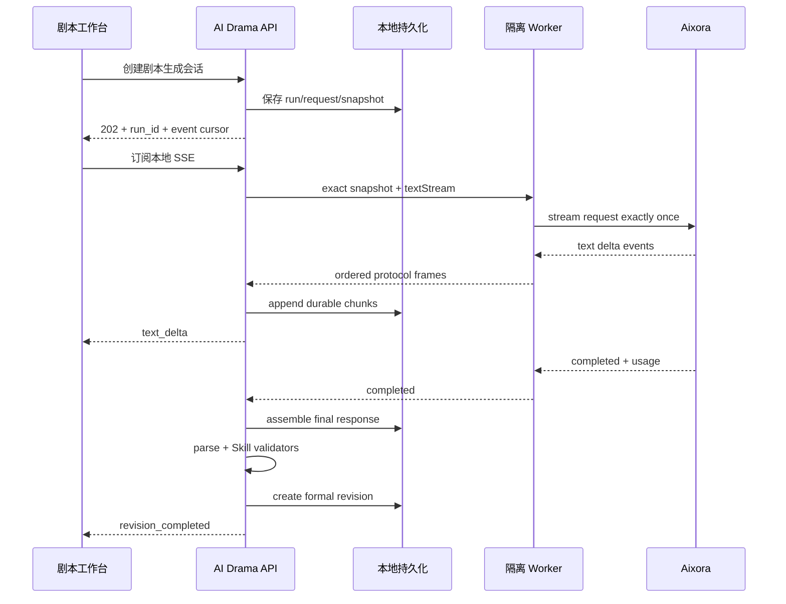

# 剧本正文流式生成与 Aixora 响应兼容设计

日期：2026-07-19

分支：`fix/aixora-message-input-normalization`

状态：`PROPOSED — 等待书面批准`

实施状态：`false`

## 1. 背景与已确认事实

当前“保存并生成剧本”链路使用真实的剧本 Skill，而不是浏览器直接拼接一段普通 Prompt：

```text
ai-drama-script-adaptation-skill@v0.6.1-rc2.4
→ RuntimeRequest
→ 项目 script_adaptation 模型解析
→ M6 ExecutionSnapshot
→ Supplier textRequest
→ parse_script_response
→ Skill validators
→ 正式剧本 revision
```

当前前端通过同步 `POST /api/chapters/{chapter_id}/script/generate` 等待整次调用结束。Worker 也只支持“一次请求、一次最终 JSON”协议；Aixora 适配器明确发送 `stream: false`。因此即使 Provider 正常生成，用户也只能在几十秒后一次性看到结果或错误。

2026-07-19 最新真实调用证据表明：

- 请求使用最新 Aixora supplier version 和 `gpt-5.6-sol`；
- Aixora 成功处理并计费，约 45 秒，产生 1,824 个输出 Token；
- AI Drama 最终记录 `PROVIDER_RESPONSE_MALFORMED`；
- 失败记录没有 `evidence_object_id`，无法确认成功响应的实际字段形状。

因此，“Provider 调用成功”和“AI Drama 成功取得剧本正文”是两个不同结果。当前阻断位于响应归一化阶段，而不是模型绑定、代码未生效或 Provider 未收到请求。

## 2. 产品决策

采用已确认方案：**剧本正文在页面中央主编辑区流式出现**。

用户点击“保存并生成剧本”后：

1. 保存原文新 revision（如有未保存修改）；
2. 保存所选项目剧本模型绑定（如有修改）；
3. 创建持久化剧本生成会话；
4. 页面立即切换到“剧本”标签；
5. 中央剧本区逐段追加模型返回的正文；
6. 流结束后执行现有解析与 Skill validators；
7. 只有解析及校验完成后，才创建正式剧本 revision。

原文继续保存在“原文”标签，不被流式内容覆盖。右侧栏只负责展示模型、目标时长、生成状态和错误恢复，不承载剧本正文。

## 3. 页面交互合同

### 3.1 生成前

- 主按钮：`保存并生成剧本`。
- 前置校验保持现有语义：原文非空、原文已保存、模型可解析、目标时长有效。
- 生成请求只能使用项目已解析的 supplier/model/config/current credential；浏览器不得提交 Base URL、密钥或任意 Provider 参数。

### 3.2 建立会话

创建成功后立即切换到“剧本”标签，而不是等待 Provider 完成。

中央区域显示：

```text
正在生成剧本 · 已接收 0 字 · 00:00
```

收到正文增量后，剧本区按原顺序持续追加。视觉上使用轻量输入光标表示仍在生成，不使用覆盖正文的全屏 loading。

页面只展示规范化后的 assistant 正文，不展示 reasoning、SSE 协议、JSON 包装或 Provider 元数据。剧本 Skill 已要求只返回 Markdown；流式链路以第一个非空 Markdown 标题作为可展示正文起点。如果 Provider 违反合同并返回 JSON 包装，后端先缓冲并在完成后交给兼容 parser，不能把半截 JSON 显示成剧本。

### 3.3 流式草稿

- 流式正文标记为 `实时草稿`；
- 生成期间正文只读，避免用户编辑和 Provider 增量互相覆盖；
- 每收到一批增量，更新字数和耗时；
- 用户停留在正文末尾附近时自动跟随；用户主动向上滚动后停止自动滚动，并提供 `回到生成末尾`；
- 页面刷新或短暂断线后，使用游标重新订阅已持久化事件，不重新提交 Provider 请求；
- 切换标签或离开页面不取消后台生成。

### 3.4 收尾与正式版本

Provider 流结束后，页面状态依次变为：

```text
正在整理完整响应
→ 正在解析剧本
→ 正在执行 Skill 校验
→ 已生成剧本草稿
```

只有最终正文能够被 `parse_script_response` 解析时才写入剧本内容对象。保持现有 Skill validators；校验结果与正式 revision 一起展示。生成完成后的剧本可以继续使用现有“保存为新剧本版本”“确认剧本”“拒绝剧本”流程。

### 3.5 失败状态

失败不清空已经收到的正文。中央区域保留只读临时文本，并明确标记：

```text
生成中断 · 该内容尚未保存为正式剧本版本
```

错误文案按失败位置区分：

- Provider 未接受请求：`供应商请求失败`；
- Provider 已返回但没有可提取正文：`供应商已返回，但正文解析失败`；
- 浏览器连接中断但后台仍运行：`页面连接已中断，正在重新连接`；
- Worker/runtime 不可用：保留稳定错误码；
- Skill 解析失败：`剧本格式解析失败`；
- Skill 校验失败：`剧本已生成，但未通过必要校验`。

所有新生成或重试均可能再次计费，所以不得自动重新提交。用户点击“重新生成”时必须创建新会话和新 idempotency key。

Phase 1 不提供“历史 credential 重跑”或 Provider 级取消。用户可以离开页面，后台会话继续；后续若增加取消能力，必须明确 Provider 是否真正停止计费。

## 4. Aixora 响应兼容与诊断

### 4.1 先取得响应形状，不猜字段

当前失败发生在 Provider 返回成功之后。修复时必须先增加脱敏响应形状证据，至少记录：

- HTTP content type；
- HTTP 状态；
- 响应字节数；
- 顶层字段名；
- `status`、`object` 等非敏感类型信息；
- `output` 数量及每项的 `type`；
- 每个 content 项的 `type` 和可用文本字段名；
- usage 字段是否存在及字段名；
- 是否收到 stream/SSE 事件；
- 失败归一化阶段。

不得记录：正文内容、Authorization、API Key、Base URL query、签名 URL、credential、完整原始响应或私密生成结果。

失败也必须持久化 sanitized evidence；不能继续留下空 `evidence_object_id`。

### 4.2 非流式兼容边界

保留同步兼容路径用于 feature flag 回滚。Aixora `responseText` 只能解析经过测试证明的响应结构：

- 顶层非空 `output_text`；
- Responses `output[*].content[*]` 中经过确认的文本 content；
- 经 fixture 明确验证的 Aixora 包装层。

不得把 reasoning summary 当作最终剧本正文；不得在空正文后自动发起第二次付费请求；不得通过返回任意 JSON 字符串来绕过剧本解析。

### 4.3 流式事件兼容

Aixora/OpenAI Responses 风格流式适配只消费经过 fixture 验证的事件，例如文本 delta、完成、失败和 usage。未知事件可忽略但要计入脱敏事件类型摘要；协议缺少完成事件或正文为空时 fail closed。

## 5. 目标技术链路



## 6. Worker 与 Supplier 合同

### 6.1 版本升级

流式执行不能复用当前“进程退出后一次性读取 JSON”的 Worker protocol v1。引入版本化协议：

- `worker_protocol_version` 升级；
- `helper_api_version` 升级；
- supplier adapter 增加 `textStream` 能力；
- Worker 只通过 stdout 输出有序 NDJSON protocol frames；
- Python 校验每个 frame 的类型、顺序、大小、run identity 和递增 sequence。

历史 snapshot 继续使用其冻结的 v1 artifact，不从 current supplier code 重新编译。缺少对应 runtime 时保持 `SUPPLIER_RUNTIME_UNAVAILABLE`。

### 6.2 网络边界

Adapter 仍然不能访问原生 fetch、process、require、文件系统或环境变量。流式网络只能经过注入的 `helpers.http.stream`：

- 沿用公网解析、peer IP 复核、端口、重定向和 allowlist 规则；
- 校验模式统一抛出 `NETWORK_DISABLED_DURING_VALIDATION`；
- 限制单个 event、累计正文、累计响应和总执行时间；
- Worker 卡死、输出异常或协议越界时由 Python 终止；
- credential 只存在于该次冻结 snapshot 的 Worker payload。

### 6.3 帧类型

最小协议帧：

```text
started
text_delta(sequence, text)
usage(sequence, normalized_usage)
completed(sequence, sanitized_evidence)
failed(sequence, stable_error_code, sanitized_evidence)
```

正文 delta 可以保存，但不能进入日志或 Git。协议帧不得包含 Authorization、credential 或原始 Provider URL。Provider reasoning delta 既不能拼入剧本，也不能发送给浏览器。

## 7. 本地持久化与恢复

使用 additive migration，不删除现有同步字段和历史记录。

剧本生成会话必须在网络提交前持久化：

- public `run_id`；
- runtime run 与 supplier text run 的显式关联；
- source revision、Skill version/hash、ExecutionSnapshot；
- status：`prepared | submitting | streaming | finalizing | completed | failed | unknown_outcome`；
- 最后持久化 sequence；
- chunk object references；
- final response/result/evidence references；
- 稳定 error code。

正文 chunk 写入本地 object store，数据库只保存 object id、sequence、hash 和字节数。组装后的完整正文只有一个 canonical object；正式剧本 revision 仍由现有 runtime store 创建。

恢复规则：

- 浏览器重连：从 `after_sequence` 补发本地事件；
- 持久化 runner 领取 `prepared` 会话，HTTP 请求线程不直接承担长连接；
- API 重启：只恢复尚未提交的 `prepared` 会话及本地可重放事件，绝不自动重新 submit；
- `submitting` 后进程崩溃且无法证明 Provider 未接受时标记 `unknown_outcome`；
- Provider 连接在重启中丢失且没有可恢复句柄：标记稳定失败并保留部分草稿；
- malformed/duplicate/out-of-order Worker frame：fail closed，不第二次 submit；
- completed 会话重复读取只返回已有 revision。

## 8. API 合同

新增异步接口，保留现有同步接口作为回滚路径：

```text
POST /api/chapters/{chapter_id}/script/generations
→ 202 { run_id, status, last_sequence }

GET /api/script-generation-runs/{run_id}
→ 当前状态、累计字数、耗时、错误、正式 revision_id（如有）

GET /api/script-generation-runs/{run_id}/events?after_sequence=N
→ text/event-stream
```

SSE 是 AI Drama 本地 API 到浏览器的传输，不允许浏览器直接连接 Aixora。接口保持应用层 loopback-only，并沿用当前本地工作区的同源访问方式。

原同步 `POST /api/chapters/{chapter_id}/script/generate` 在 streaming feature flag 关闭时继续工作；开启后前端使用异步接口。不得让同一次点击同时调用同步和流式接口。

创建接口接收客户端生成的稳定 idempotency key。同一次点击因浏览器超时而重放时返回原会话；只有用户明确点击“重新生成”才创建新 key 和新会话。模型 binding/config/supplier/credential snapshot 在会话创建事务中冻结，之后不再读取 current 项目配置来猜测执行。

## 9. 前端状态模型

```text
idle
→ saving_source
→ saving_binding
→ starting
→ streaming
→ finalizing
→ validating
→ completed

任一执行态 → reconnecting | failed
```

UI 约束：

- `streaming` 时自动打开剧本标签，并在中央正文区渲染增量；
- 同一 run 只存在一个订阅控制器；组件卸载时关闭浏览器连接但不取消后台任务；
- reconnect 使用最后已应用 sequence，重复事件不得重复插入正文；
- `aria-live` 只播报阶段变化，不逐字朗读正文；
- 尊重 `prefers-reduced-motion`；
- 生成期间禁用确认、拒绝和手工保存正式版本；
- complete 后复用现有 ScriptTab revision/editor；
- failed 后部分草稿只读，并提供复制及显式重新生成入口。

## 10. Feature flag 与回滚

新增独立开关：

```text
AI_DRAMA_SCRIPT_STREAMING_ENABLED=false
```

默认测试、CI 和首次迁移后均为 false。关闭时：

- 前端继续调用现有同步接口；
- v1 Worker 和 `textRequest` 保持可用；
- 历史 run/revision 继续可读；
- 不删除流式会话和 chunks。

开启流式开关仍要求既有 `AI_DRAMA_M6_SUPPLIER_EXECUTION_ENABLED=true`。回滚只关闭流式开关，不切换项目模型、不删除 snapshot、不撤销 credential。

## 11. 测试计划与验收基准

### 11.1 响应解析与证据

- red test 复现“HTTP 200 且有 usage，但现有 parser 无正文”；
- fixture 覆盖经过确认的 Aixora Responses 包装；
- malformed 失败保存脱敏 shape evidence；
- evidence 不包含正文、密钥、Bearer、完整 URL 或签名 query；
- 无正文时不自动 retry。

### 11.2 Worker 和网络

- fake SSE Provider 按多个 delta 返回确定性剧本；
- text delta 顺序、重复、缺失、malformed、超限和 timeout；
- Worker stdout protocol framing；
- validation mode 零网络；
- selected credential/config 之外的信息不可见；
- exactly-once submit counter 始终为 1。

### 11.3 持久化和恢复

- 网络前已存在 run、request 和 snapshot；
- chunks 可按 sequence 重放；
- 浏览器断线重连无重复字符；
- API/Worker 重启不 resubmit；
- 完成后只创建一个正式 revision；
- 部分失败保留临时正文但不创建正式 revision；
- feature flag off 恢复旧同步链路。

### 11.4 Skill 与业务回归

- 生成仍加载 `ai-drama-script-adaptation-skill@v0.6.1-rc2.4`；
- source/canon/characters/production brief/目标时长继续进入 RuntimeRequest；
- `parse_script_response` 和声明的 validators 不被跳过；
- M1–M6 历史 revision、审批和后续分镜门保持兼容。

### 11.5 前端

- 点击一次只创建一个生成会话；
- 创建会话后立即切换剧本标签；
- 中央正文区按 sequence 追加文本；
- 状态、字数和耗时可见；
- 用户上滚后停止自动跟随；
- 刷新后恢复相同 run；
- 完成前确认/拒绝/正式保存不可用；
- 完成后进入现有剧本 revision 工作流；
- 失败后部分文本仍可见；
- 1440×1024、1180×800 和 768×1024 不出现横向页面溢出。

### 11.6 网络与真实调用边界

- 所有自动测试使用 fake Provider；
- 默认验证的真实文本请求数为 0；
- 真实 Aixora 验收只能由本地用户明确点击一次触发一次请求；
- Codex 不因解析失败自动追加真实调用；
- 真实验收前先用 fake fixture 完成 parser 与 streaming 全链路验证。

## 12. 非目标

本阶段不包括：

- 图片或视频流式生成 UI；
- 浏览器直连 Provider；
- 多用户协作编辑；
- Token 级撤销或 Provider 计费终止承诺；
- 自动重试、自动 fallback 或批量生成；
- 改写剧本 Skill、跳过 parser/validators；
- 将临时流式正文直接标记为已确认剧本；
- 从 Provider 历史记录恢复完整响应。

## 13. 实施门

本文件批准前不开始生产代码修改。批准后另行编写 TDD 实施计划，至少拆分为：

1. Aixora 脱敏响应形状证据与同步 parser 修复；
2. Worker/helper 流式协议；
3. 后端持久化会话、SSE 和恢复；
4. 剧本中央区域流式 UI；
5. fake Provider E2E、回归、feature flag 与一次显式真实验收。

实施不得把当前一次 Provider 成功记录当成 parser fixture；必须使用脱敏、可提交的人工 fixture 或 fake Provider fixture。
